## 🗂️ACL

- <span style="color:blue"><b>ACL(Access Control List) </b></span>

  - Router 내부 <span style="color:red"><b>정책을 통해 데이터를 Filtering</b></span> 해주는 역할
  - 정책에 따른 트래픽 필터링, 식별, 분류, 암호화, 변환 작업등을 수행 함 
  - ACL 정책은 항상 위에서 아래로 순차적으로 적용 됨

-  <span style="color:blue"><b>ACL 기본 동작</b></span>

  - 순차적인 동작

  - 조건에 명시되어 있는 정보와 전달받은 packet의 정보를 비교하여 지정된 Action을 수행 함

    > <b>Permit → 허용, 사용 됨</b>

    > <b>Deny → 거부, 사용되지 않음</b>>

  - 모든 조건에 해당되지 않으면 ALL Deny

    > 항상 조건의 마지막에 <span style="color:red"><b>기본값으로 “ALL Deny”</b></span>정책이 지정되어 있음

  - 정책 구성 후 필요한 위치에서 적용 함

- <span style="color:blue"><b>ACL 종류 </b></span>

  - Numbered 형 ACL

    > <span style="color:red"><b>숫자를 식별 값</b></span>으로 사용하는 ACL

    > 주로 특정 기능 수행을 위한 <span style="color:red"><b>트래픽 분류</b></span>를 목적으로 사용 됨

  - Named 형 ACL

    > 문자를 식별 값으로 사용하는 ACL

    > 방화벽의 보안정책 구성 및 복잡한 정책 구성을 할 때 사용 됨
    >
    > 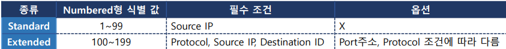

- <span style="color:blue"><b>ACL 적용 위치</b></span>

  - 정책에 맞춰 구성된 조건(ACL)과 실 트래픽을 필터링 할 지점 설정

  - 트래픽을 필터링 해야 할 인터페이스 

  - 종류 → Inbound, outbound 

  - Inbound

    > 인터페이스로 데이터가 유입됐을 때 정책 확인 후 전송

    > ACL확인 → Routing Table 확인(Routing) 

  - Outbound(default) 

    > 인터페이스로 데이터가 전달되기 직전에 정책 확인 후 전송

    > Routing Table 확인(Routing) → ACL확인

- <span style="color:blue"><b>ACL 설정 순서</b></span>

  - 조건에 맞는 정책 계획

    > 필요한 조건에 따라 미리 협의하여 정책에 대한 계획을 세움 

  - Access-list 정책 생성 

    > 계획에 따라 정책을 설정하여 List 생성

  -  ACL 적용

    > 생성한 ACL을 이용할 위치(interface …)에서 적용 

  - ACL 설정 확인

## 🗂️Standard ACL 

- <span style="color:blue"><b>Standard ACL</b></span>

  - ACL Number 1~99, 1300~1999 사용 

  - 필수 조건 → Source IP

  - Wildcard Mask를 이용하여 조건에 매치할 IP의 범위를 지정할 수 있음(생략 시 host를 의미함)

  - 특정 키워드를 이용해 범위 지정 가능

    > 모든 IP(0.0.0.0 255.255.255.255) = any

    > 특정 IP 하나(10.10.10.1 0.0.0.0) = host 10.10.10.1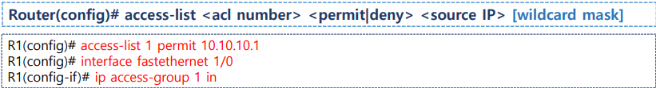

- <span style="color:blue"><b>Standard ACL 실습</b></span>

  - 구성도

  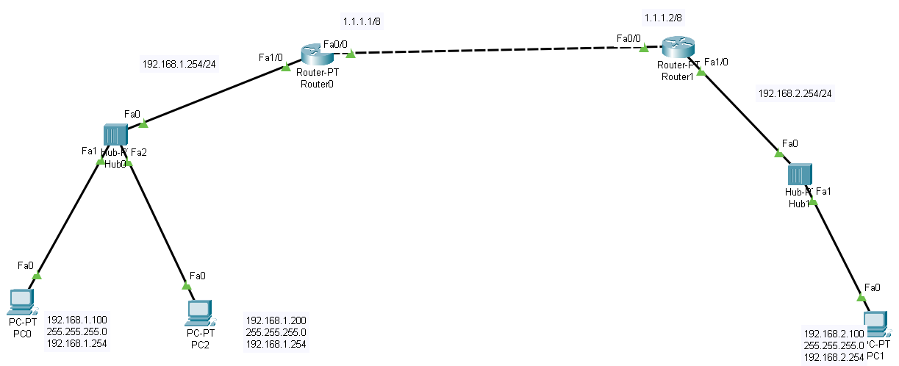

- 192.168.1.100 deny

  ```
  1~99
  src ip address 로 permit/deny
  ```

  - ACL 목록

    ```
    Router0#sh ip access-lists
    Router0(config)#access-list ?
      <1-99>     IP standard access list
      <100-199>  IP extended access list
    ```

  - ACL 생성후 테스트

    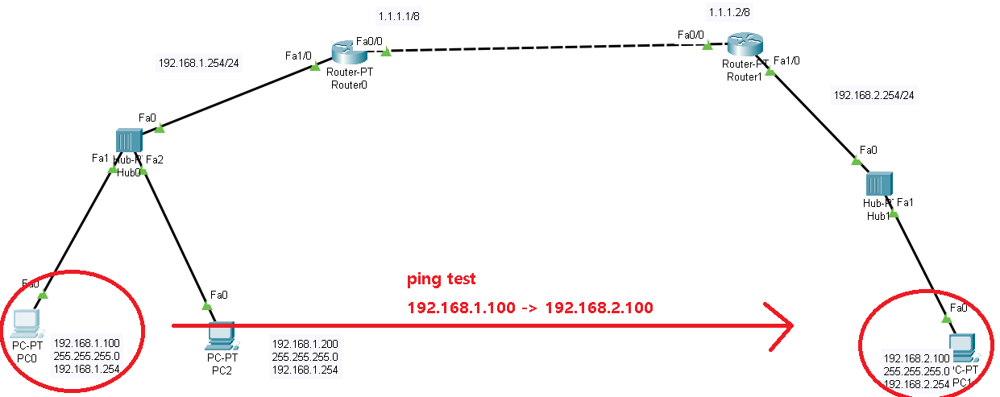
    
    ```
    Router0(config)#access-list 1 deny
    Router0(config)#access-list 1 deny 192.168.1.100 
    Router0#sh ip access-lists 
    Standard IP access list 1
        10 deny host 192.168.1.100
    ```

    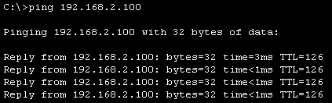
    
    > 아직 통신이 잘 된다.
    
  - ACL 을 인터페이스 적용 후 테스트

    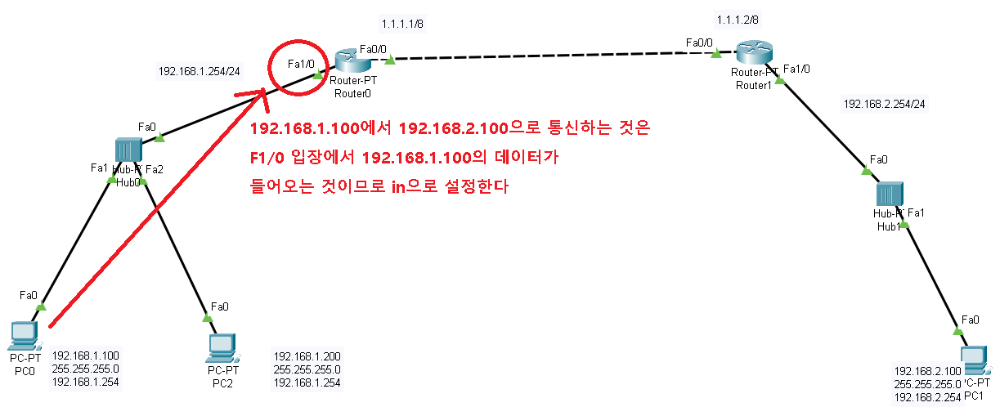
    
    ```
    ACL 적용할 interface로 접근
    Router0(config)#interface f1/0
    Router0(config-if)#ip access-group 1 in
    ```

    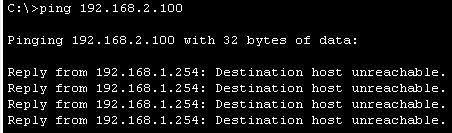

    > 통신이 안된다
    
  - 인터페이스 정보로 확인 

    ```
    Router0#sh ip int f1/0
    ```
    
    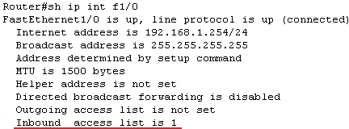
    
  - 다른 host에서 테스트

    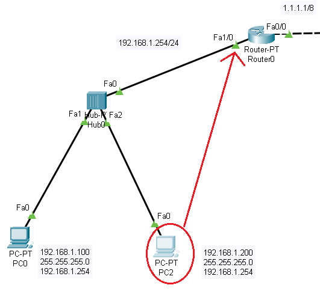
    
    ```
    ping 192.168.1.254
    ```
    
    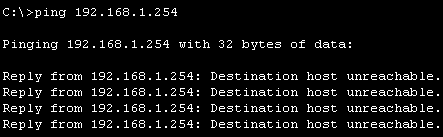

    > 모든 조건에 해당되지 않으면 ALL Deny 때문에

    > router에서 192.168.1.200을 차단하지 않았지만 통신이 안된다
    
  - ACL 제거 및 확인

    ```
    Router0(config-if)#no ip access-group 1 in
    Router0(config)#no ip access-list standard 1
    Router0#sh ip int f1/0
    ```

    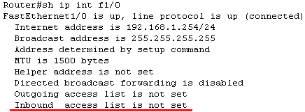

    

## 🗂️Extended ACL

- <span style="color:blue"><b>Extended ACL</b></span>
  - ACL Number 100~199, 2000~2699 사용
  - 필수 조건 → Protocol(IP헤더의 Protocol 필드와 비교할 값), Source IP, Destination IP

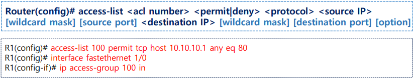

- <span style="color:blue"><b>Extended ACL 실습</b></span>

  - 실습 구성도

  - 조건 설정

    ```
    조건 1
    출발지 IP 주소가 192.168.1.100 인 host 만 http server(tcp 80) 
    목적지 IP 주소 : 192.168.2.150 에 접근하는 것을 허용 (permit)
    ```

  - ACL 작성 및 확인

    ```
    Router0(config)#access-list 102 permit tcp host 192.168.1.100 host 192.168.2.150 eq 80
    Router0#sh ip access-lists
    ```

    

  - ACL 적용 및 확인

    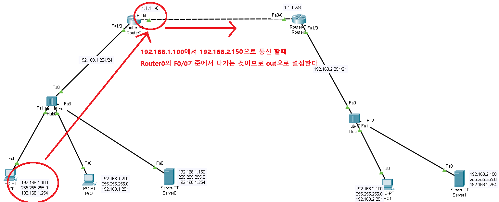

    ```
    해당 라우터 기준 외부로 나갈때 허용 하는 부분 적용 
    Router0(config-if)#ip access-group 102 out
    Router0#sh ip int f0/0
    ```

    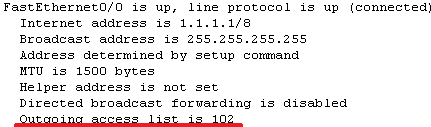

  - 통신 테스트

    > ping 테스트
    >
    > 192.168.1.100 -> 192.168.2.150
    >
    > 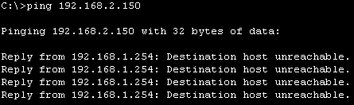

    > http 접속 테스트
    >
    > 192.168.1.100 -> 192.168.2.150

    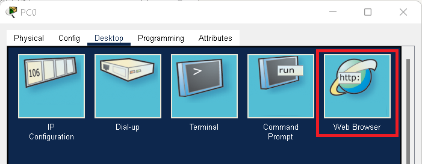

    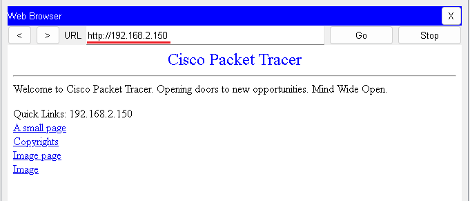

  - 조건 2 

    ```
    network 를 지정할때는 wildcard mask 
    192.168.1.0/24 (src) network 의 모든 호스트를  192.168.2.150(dst) 에  icmp(protocol) 를 허용 (permit)
    ```

  - ACL 작성 및 확인

    ```
    Router0(config)#access-list 101 permit icmp 192.168.1.0 0.0.0.255 host 192.168.2.150
    Router0(config)#do sh ip access-list
    ```

    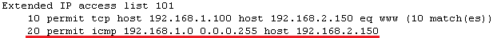

  - ping 테스트

    > 192.168.1.100 -> 192.168.2.150

    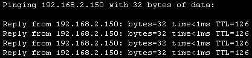

    > 192.168.1.100 -> 192.168.2.100

    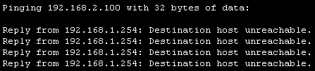

    > 

    

    


<br>

[맨 위로 이동하기](#){: .btn .btn--primary }{: .align-right}
