## 🗂️NAT

- <span style="color:blue"><b>NAT (Network Address Translation) </b></span>

  - 주소 변환 기술

  - 공인 IP 부족 현상을 완화하기 위해 제안된 기술

    > 사설 IP를 지정하여 intranet 내부에서만 임의의 IP를 사용할 수 있게 

    > 중복된 IP를 사용할 수 있으므로 사설 IP를 이용한 공용 네트워크 통신을 제한 함

    > intranet에서 공용 네트워크에 접근하기 위해 네트워크를 연결하는 Router에서 <span style="color:red"><b>사설 IP를 공인 IP로 변환</b></span> 시켜 내보내야 함

- <span style="color:blue"><b>NAT 사용 목적</b></span> 
  
  - IPv4 부족현상 완화
  - 공인 IP사용 비용 감소
  - 보안
  
- <span style="color:blue"><b>NAT 종류</b></span>

  - Static NAT

    > NAT Table의 변환 정보를 관리자가 직접 지정하고 관리 함 → 정보가 고정 됨

    > <span style="color:red"><b>사설 IP(1) : 공인 IP(1)</b></span>

    > Server에 Client가 접근할 수 있게 함

  - Dynamic NAT

    > NAT Table의 변환 정보를 장비가 직접 생성하고 관리 함 ＞ NAT 동작을 수행해야 하는 조건에 맞는 Packet을 전달받았을 때 변환 됨

    > <span style="color:red"><b>사설 IP(n) : 공인 IP(m) </b></span>→ 동시에 통신 가능한 장비가 공인 IP수로 제한 됨

    > 내부 호스트장비의 공용 네트워크 통신을 위해 사용 됨

  - NAT-PAT(Port Address Translation) 

    > 일반 Dynamic NAT의 한계를 극복 ＞ NAT동작이 수행될 때 Port주소를 변환정보 식별용으로 함께 사용 함

    > <span style="color:red"><b>사설 IP(n) : 공인 IP(1) </b></span>→ 하나의 공인 IP로 다수의 사설 IP를 이용한 통신이 지원 됨

## 🗂️Static NAT

-  <span style="color:blue"><b>Static NAT</b></span>
  - 공인 IP로 전달된 Client의 요청을 내부 Server로 전달할 수 있도록 목적지 주소를 변환하는 기능
  - Server에 할당된 사설 IP 하나당 공인 IP를 할당 → 1 : 1

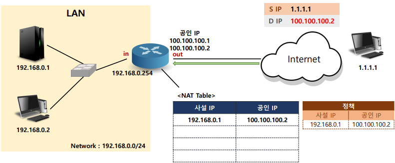

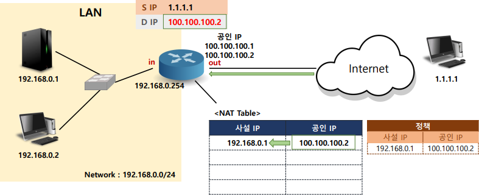

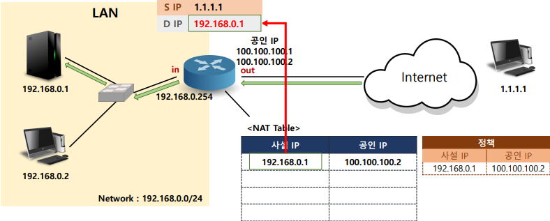

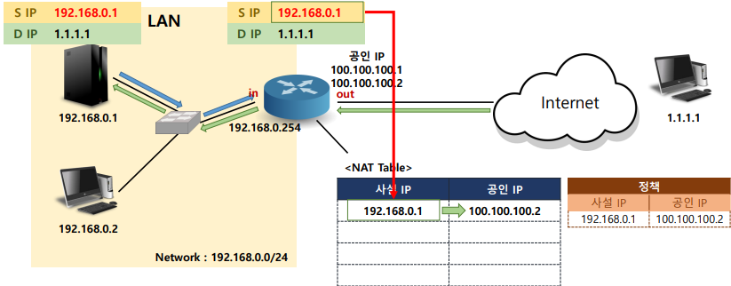

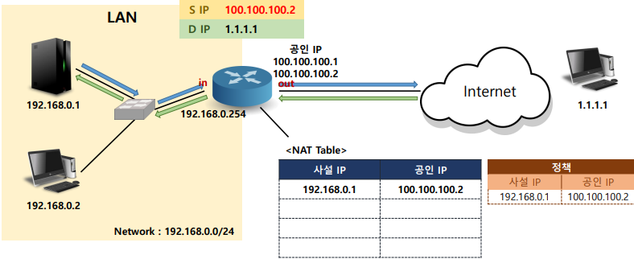

- <span style="color:blue"><b>Static NAT 설정</b></span>

  - NAT 정책 설정

    ```
    R1(config)# ip nat inside source static [사설 IP] [공인 IP]
    
    ```

  -  Interface 역할 결정

    > 사설 네트워크를 연결하는 인터페이스 → inside

    ```
    R1(config)# interface [inside interface]
    R1(config-if)# ip nat inside
    ```

    > 공용 네트워크를 연결하는 인터페이스 → outside

    ```
    R1(config)# interface [outside interface]
    R1(config-if)# ip nat outside
    ```

- <span style="color:blue"><b>NAT 정보 확인</b></span>

  - NAT Table 변환 정보 확인

    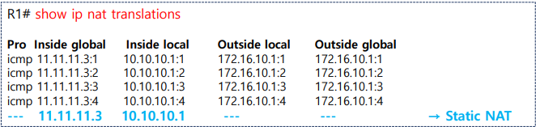

  - NAT 설정 정보 확인

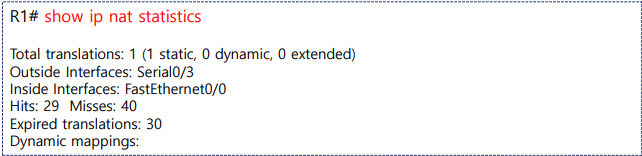

- <span style="color:blue"><b>static nat 실습</b></span>
  
  - 구성도
  
    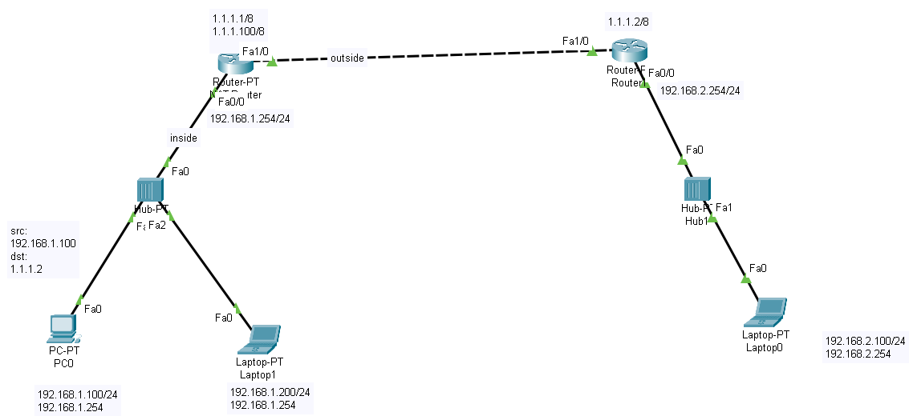
  
  - 출발지 IP 주소 변환
  
    > 해당 인터페이스에 inside , outside 를 지정
  
    ```
    NAT_Router(config)#int f1/0
    NAT_Router(config-if)#ip nat outside
    NAT_Router(config)#int f0/0
    NAT_Router(config-if)#ip nat inside
    ```
  
  - 정책 설정
  
    > 192.168.1.100->1.1.1.100으로 출발지 주소 변환
  
    ```
    NAT_Router(config)#ip nat inside source static 192.168.1.100 1.1.1.100
    ```
  
  - 설정 확인
  
    ```
    NAT_Router#sh ip nat translations
    ```
  
    
    
  - 설정 제거
  
    ```
    NAT_Router(config)#int f0/0
    NAT_Router(config-if)#no ip nat inside 
    
    NAT_Router(config-if)#int f1/0
    NAT_Router(config-if)#no ip nat outside 
    
    NAT_Router(config)#no ip nat inside source static 192.168.1.200 1.1.1.200
    NAT_Router(config)#no ip nat inside source static 192.168.1.100 1.1.1.100
    ```

## 🗂️Dynamic NAT

- <span style="color:blue"><b>Dynamic NAT</b></span>
  - 사설 네트워크 내부의 호스트 통신을 위해 사용 됨
  - 다수의 사설 IP의 지정된 개수의 공인 IP로 변환 → n : m (동시 통신 가능 → m대)

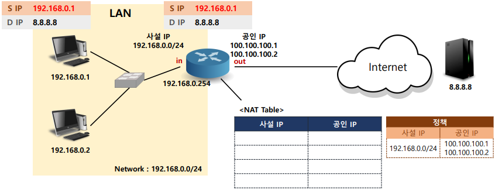

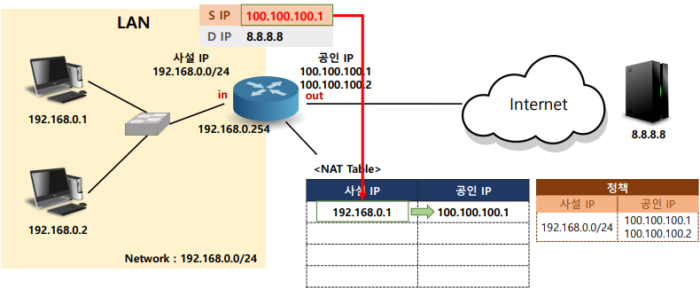

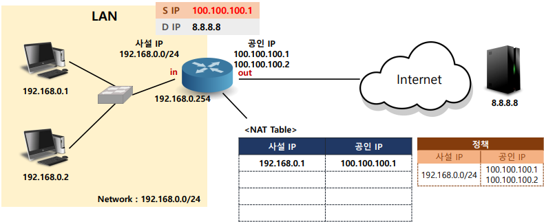

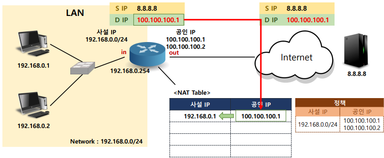

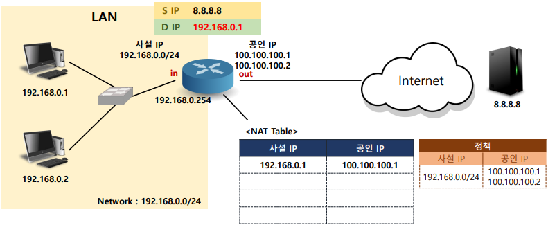

- <span style="color:blue"><b>Dynamic NAT 설정</b></span>

  -  조건 정책 설정

    > 사설 IP 네트워크 정보 → ACL

    ```
    R1(config)# access-list 1 permit [사설 IP] [wildcard mask]
    
    ```

    > 변환에 사용할 공인 IP 정보 → Pool

    ```
    R1(config)# ip nat pool [name] [start IP] [end IP] netmask [subnet mask]
    ```

  - NAT 정책 설정

    ```
    R1(config)# ip nat inside source list [ACL number] pool [pool name]
    
    ```

  -  Interface 역할 결정

    > 사설 네트워크를 연결하는 인터페이스 → inside

    ```
    R1(config)# interface [inside interface]
    R1(config-if)# ip nat inside
    ```

    > 공용 네트워크를 연결하는 인터페이스 → outside

    ```
    R1(config)# interface [outside interface]
    R1(config-if)# ip nat outside 
    ```

- <span style="color:blue"><b>Dynamic NAT 실습</b></span>

  - 구성도

  - 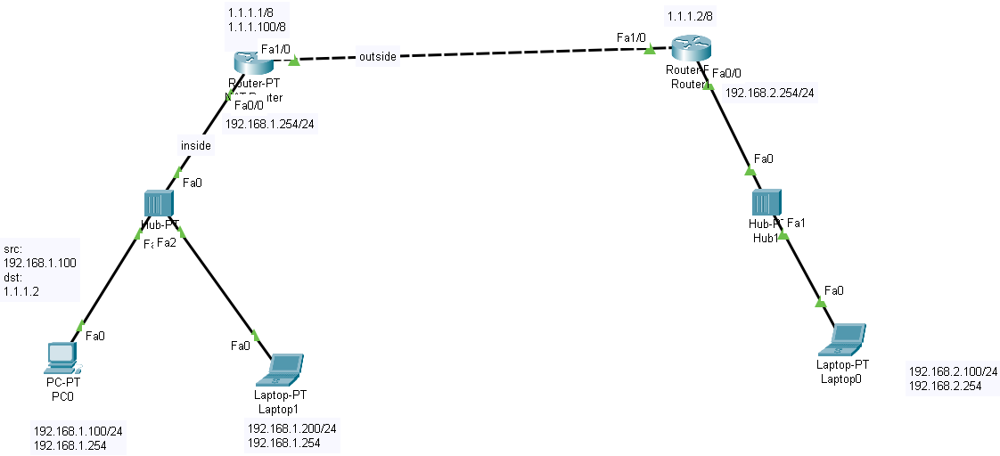

  - 기본 설정

    ```
    NAT_Router(config)#int f0/0
    NAT_Router(config-if)#ip nat inside 
    NAT_Router(config-if)#int f1/0
    NAT_Router(config-if)#ip nat outside
    ```

  - acl(standard) : inside 범위 설정

    ```
    NAT_Router(config)#access-list 1 permit 192.168.1.0 0.0.0.255
    ```

  - pool :  outside 범위 설정

    ```
    NAT_Router(config)#ip nat pool dynat 1.1.1.100 1.1.1.101 netmask 255.0.0.0
    ```

  - acl(inside) -> pool(outside) 로 변환

    ```
    NAT_Router(config)#ip nat inside source list 1 pool dynat
    ```

  - 설정 제거

    ```
    NAT_Router(config)#int f0/0
    NAT_Router(config-if)#no ip nat inside 
    NAT_Router(config-if)#int f2/0
    NAT_Router(config-if)#no ip nat inside 
    NAT_Router(config-if)#int f1/0
    NAT_Router(config-if)#no ip nat outside
    ```
  
    > access list 1번 제거 
  
    ```
    NAT_Router(config)#no ip access-list standard 1
    NAT_Router(config)#do sh ip access-lists
    ```
  
    > 삭제시 NAT 변환명령어 부터 해제 후 pool 제거
  
    ```
    NAT_Router(config)#no ip nat pool dynat 1.1.1.100 1.1.1.101 netmask 255.0.0.0
    %Pool dynat in use, cannot destroy
    NAT_Router(config)#no ip nat inside source list 1 pool dynat
    NAT_Router(config)#no ip nat pool dynat 1.1.1.100 1.1.1.101 netmask 255.0.0.0
    ```

## 🗂️NAT-PAT

- <span style="color:blue"><b>NAT-PAT(Port Address Translation)</b></span>
  - 사설 네트워크 내부의 호스트 통신을 위해 사용 됨
  - 다수의 사설 IP의 하나의 공인 IP로 변환 → n : 1
  - 일반 Dynamic NAT의 한계를 극복 > pool 갯수만 사용가능  
  - IP주소가 부족한 경우 통신이 되지 않는 클라이언트가 발생 ＞ NAT 수행시 Port주소를 변환정보 식별용(NAT Translation table)
  - 대표적인 사용예  사설 IP(n) : 공인 IP(1) → 하나의 공인 IP로 다수의 사설 IP를 이용한 통신이 지원 됨 inside ACL : outside interface  

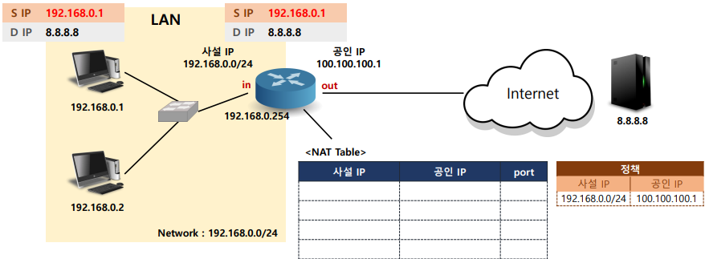

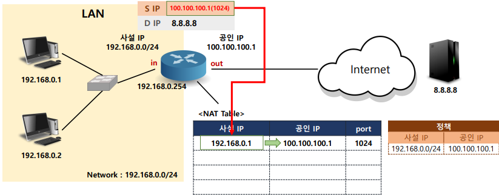

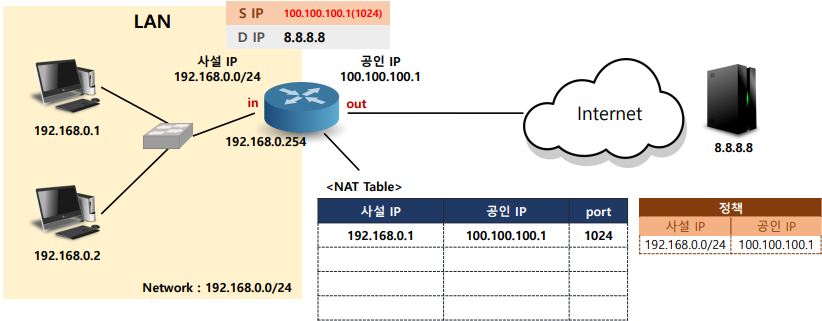

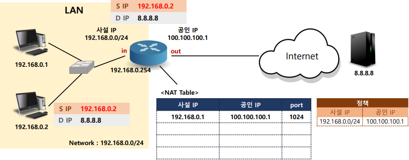

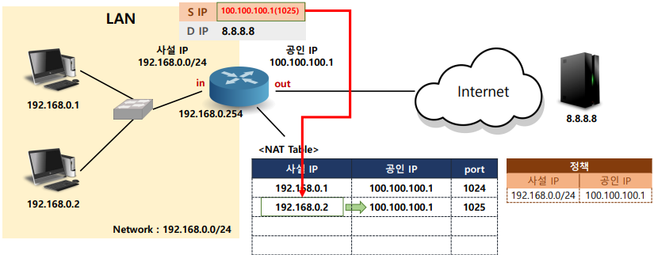

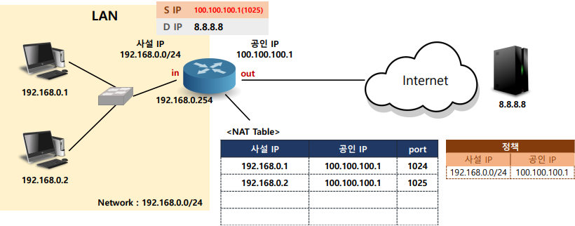

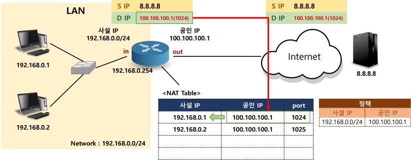

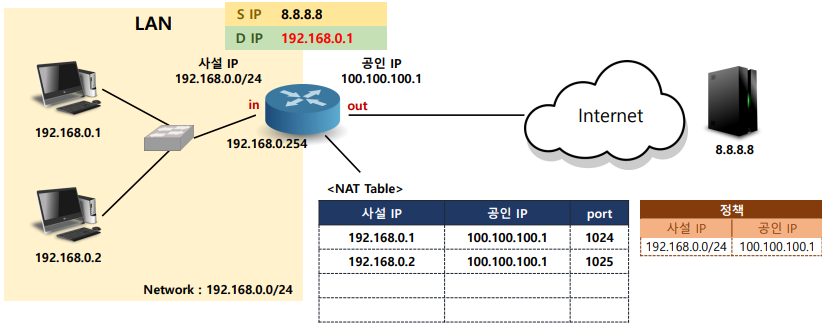

- <span style="color:blue"><b>NAT-PAT 설정</b></span>

  - 조건 정책 설정

    > 사설 IP 네트워크 정보 → ACL

    ```
    R1(config)# access-list 1 permit [사설 IP] [wildcard mask]
    
    ```

    > 변환에 사용할 공인 IP 정보 → Pool 

    ＞ NAT 정책 설정에서 interface로 지정할 경우 생략

    ```
    R1(config)# ip nat pool [name] [start IP] [end IP] netmask [subnet mask]
    ```

  - NAT 정책 설정(두개 중 하나만 설정) 

    > 공인 IP Pool 을 이용해 설정 할 경우

    ```
    R1(config)# ip nat inside source list [ACL number] pool [pool name] overload
    ```

  - 공인 IP가 설정된 Interface를 이용해 설정 할 경우

    ```
    R1(config)# ip nat inside source list [ACL number] interface [outside interface]
    ```

  - Interface 역할 결정

    > 사설 네트워크를 연결하는 인터페이스 → inside

    ```
    R1(config)# interface [inside interface]
    R1(config-if)# ip nat inside
    ```

    > 공용 네트워크를 연결하는 인터페이스 → outside

    ```
    R1(config)# interface [outside interface]
    R1(config-if)# ip nat outside
    ```

- <span style="color:blue"><b>NAT-PAT 실습</b></span>

  - 구성도

    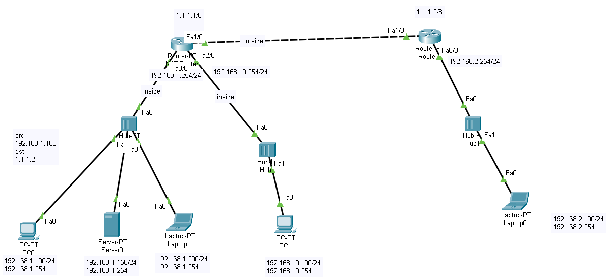

  - 기본설정

    > 인터페이스에 inside/outside

    ```
    NAT_Router(config)#int f0/0
    NAT_Router(config-if)#ip nat inside 
    NAT_Router(config-if)#int f1/0
    NAT_Router(config-if)#ip nat outside
    ```

  - acl(standard) : inside 범위 설정

    ```
    NAT_Router(config)#access-list 1 permit 192.168.1.0 0.0.0.255
    ```

  -  interface 지정 : ACL(inside) -> interface 의 주소 (outside) 로 변환

    ```
    NAT_Router(config)#ip nat inside source list 1 int f1/0 overload
    ```

  - 테스트

    ```
    192.168.1.100 -> ping 1.1.1.2
    192.168.1.150 -> ping 1.1.1.2
    192.168.1.200 -> ping 1.1.1.2
    ```

    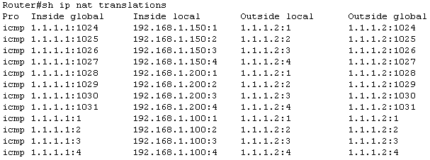


<br>

[맨 위로 이동하기](#){: .btn .btn--primary }{: .align-right}
