##  Zone Transfer

- Linux 환경에서 Zone Transfer(Zone 정보 동기화) 실습하기

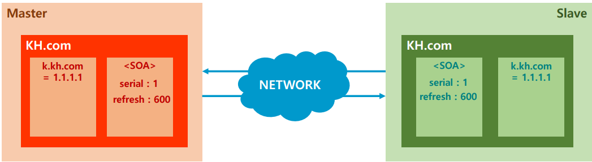

- 먼저 위의 그림 처럼 Master와 Slave 가 필요하므로 두대의 가상화 머신을 준비한다
- Master에서 데몬 상태 확인

```
[root@localhost ~]# systemctl restart named
[root@localhost ~]# systemctl status named
```

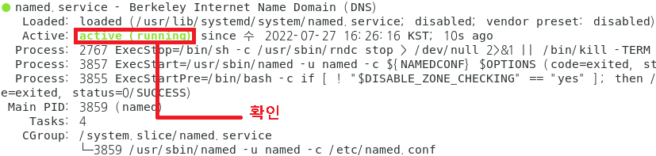

- Client(xp)  cmd창에서 nslookup 조회하기

```
C:\Documents and Settings\ktest>nslookup
> set type=a
> www.b00.kh
```

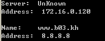

```
> set type=mx
> b00.kh
```

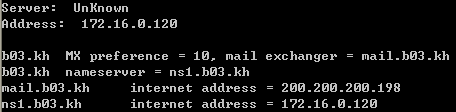

- 보조영역을 slave 주소로 지정한다

```
[root@localhost ~]# vi /etc/named.rfc1912.zones
```

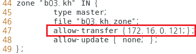

> 맨 끝으로 내려와서 위 사진같이 수정한다.

- slave(보조영역)에서 bind package 설치하기

  ```
  [root@localhost ~]# yum -y install bind*
  ```

  

- 전역 설정 파일 설정하기

  ```
  [root@localhost ~]# vi /etc/named.conf 
  ```

  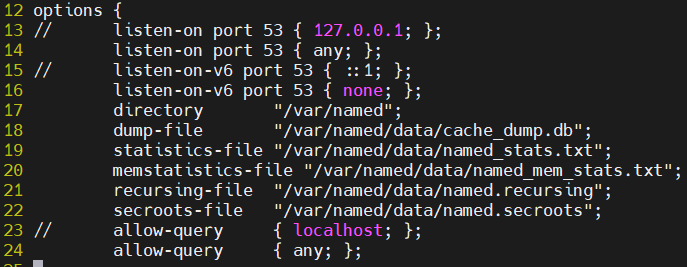

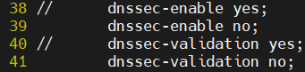

- Zone 정보 파일 수정하기

  ```
  [root@localhost ~]# vi /etc/named.rfc1912.zones
  ```

  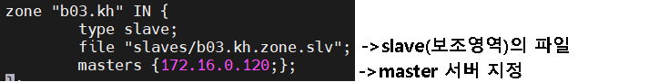

- master(주영역)와 slave(보조영역)에서 각각 데몬 재시작

  ```
  [root@localhost ~]# systemctl restart named
  ```

- slave(보조영역) 파일이 있는 디렉토리로 이동 후 파일 생성 확인

  ```
  [root@localhost slaves]# cd /var/named/slaves
  [root@localhost slaves]# systemctl restart named
  [root@localhost slaves]# ls
  ```

  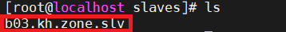

- Client(xp)에서 slave(보조영역) 점검

  ```
  C:\Documents and Settings\ktest>nslookup
  > server 172.16.0.121              -> nslookup 을 조회할 서버를 지정 : 보조영역서버 지정
  > set type=mx
  > b03.kh
  ```

  

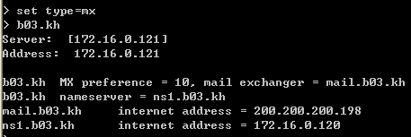

- master(주영역)에서 wireshark 설치하고 결과 확인

  ```
  [root@localhost ~]# yum -y install wireshark    ->설치
  [root@localhost ~]# wireshark                   ->실행
  ```

  

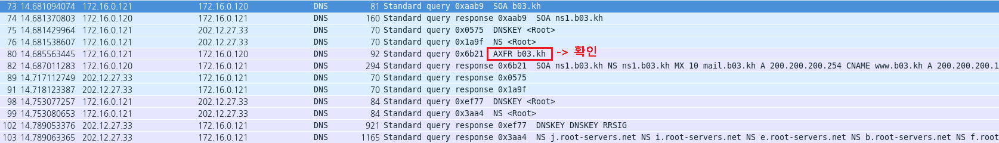

- slave(보조영역)에서 확인하기

  ```
  [root@localhost ~]# cat /var/named/slaves/b00.kh.zone.slv 
  -> 보조영역 파일 이 하드코딩(난독화) 되어 있어 정보가 보이지 않는다
  ```

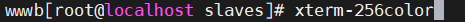

- 보조영역파일을 볼수있게 백업 cache_dump.db 파일로 백업

  ```
  [root@localhost ~]# rndc dumpdb -zones
  [root@localhost ~]# vi /var/named/data/cache_dump.db
  ```

  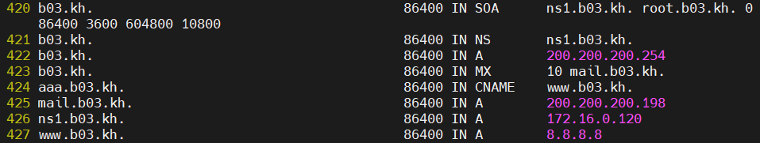

- ixfr 확인하기

  - master에서  RR 추가  > serial no 증가 > 데몬 재시작

  ```
  [root@localhost ~]# vi /var/named/b00.kh.zone
  ```

  

