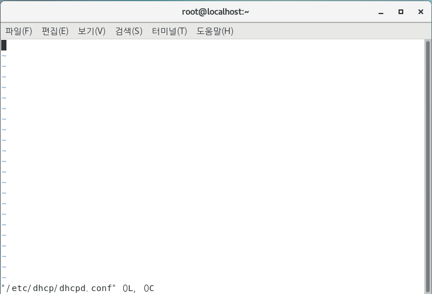
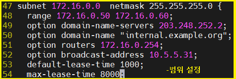
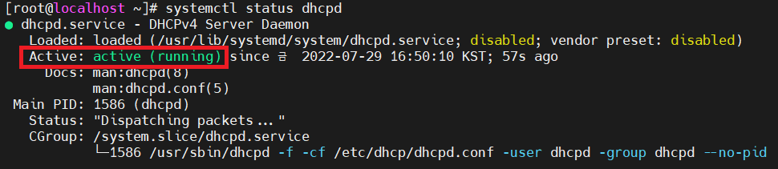
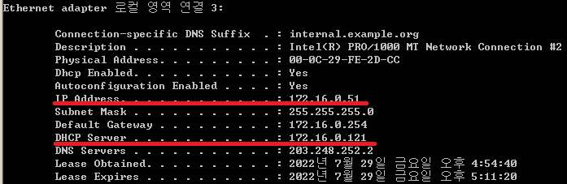

## Linux에서 DHCP 실습하기

- DHCP server -> Linux_minimal,  DHCP client -> xp 

- DHCP server 설치

  ```
  [root@localhost ~]# yum -y install dhcp
  ```
  
- DHCP 파일 설정하기

  ```
  [root@localhost ~]# vi /etc/dhcp/dhcpd.conf
  ```

  - 파일을 열어보면 비어있거나 별 내용이 없다

    

  - 샘플파일을 복사하여 설정파일을 생성 > 편집 

  - ```
    [root@localhost ~]# cp /usr/share/doc/dhcp-4.2.5/dhcpd.conf.example /etc/dhcp/dhcpd.conf
    cp: overwrite `/etc/dhcp/dhcpd.conf'? y
    [root@localhost ~]# vi /etc/dhcp/dhcpd.conf
    ```

    



- 설정 저장후 재시작 한뒤 확인

  ```
  [root@localhost ~]# systemctl restart dhcpd
  [root@localhost ~]# systemctl status dhcpd
  ```



- DHCP client(XP)에서 확인하기

  ```
  C:\Documents and Settings\ktest>ipconfig /release
  								ipconfig /renew
  								ipconfig /all
  ```

  



<br>

[맨 위로 이동하기](#){: .btn .btn--primary }{: .align-right}