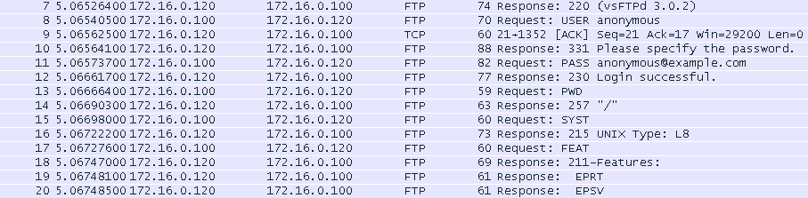

## Vsftpd 

- 환경구성 

  - xp -> client 
  - centos7 -> server

  

- xp
  - 알드라이브 설치


- centos7
  - 설치 및 설치 확인

```
[root@localhost ~]# yum -y install vsftpd
```

```
[root@localhost ~]# netstat -antup | grep 21
```


```
[root@localhost ~]# ps -ef | grep vsftpd
```


```
[root@localhost ~]# systemctl restart vsftpd
```

- client에서 익명으로 알드라이브로 접속 테스트


- wireshark 로 과정을 packet capture 하기
  - 3way-hand shake : TCP 21




- client에서 ktest로 알드라이브로 접속 테스트


- client에서 root로 접근


- root로 접근 가능하도록 수정하기

```
[root@localhost ~]# vi /etc/vsftpd/ftpusers
```


```
[root@localhost ~]# vi /etc/vsftpd/user_list
```


- 다시 접속 시도

  ```
  [root@localhost ~]# systemctl restart vsftpd
  ```


- File upload/download 하기
  - root와 ktest는 잘 되지만 익명으로 접속시 upload와 download가 거절 당한다


```
[root@localhost pub]# systemctl status vsftpd
```


```
[root@localhost pub]# vi /etc/vsftpd/vsftpd.conf
```


- 데몬 재시작후 확인

```
[root@localhost pub]# systemctl status vsftpd
```


- 폴더 권한 확인해보기

```
[root@localhost pub]# ls -ld /var/ftp/pub/
```


- 권한 주기

```
[root@localhost pub]# chmod o+w /var/ftp/pub/
또는 
[root@localhost pub]# chmod 757 /var/ftp/pub/
```

```
[root@localhost pub]# ls -ld /var/ftp/pub/
```


- 데몬 재시작후 확인

```
[root@localhost pub]# systemctl status vsftpd
```


- 익명사용자 접근 거부 하기

```
[root@localhost pub]# vi /etc/vsftpd/vsftpd.conf
```


- port 번호 변경하기

```
[root@localhost pub]# vi /etc/vsftpd/vsftpd.conf
```


- 일반 사용자 에 대한 chroot  기능 적용