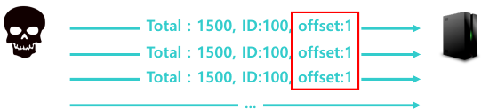
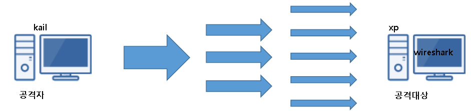
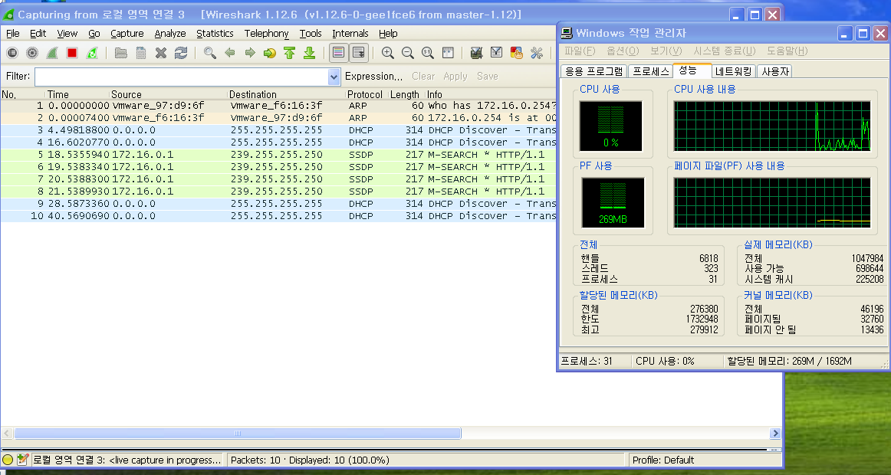
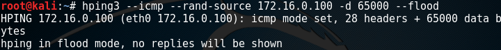
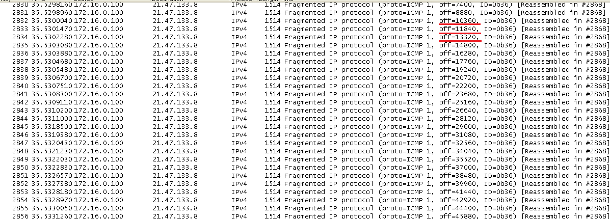
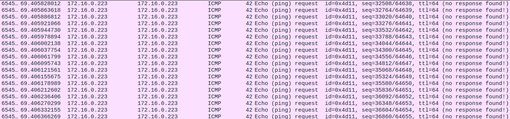
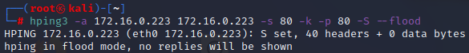
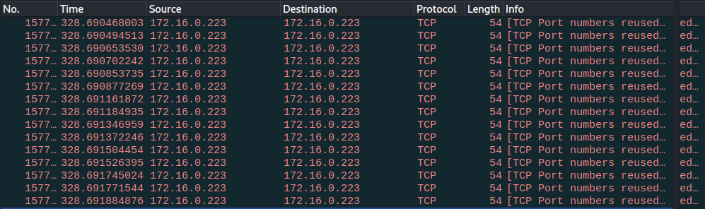

## DOS

- DoS (Denial of Service)
  - 서비스 거부 공격 - CIA Triad 에서 가용성(Availability)을 침해하는 공격 행위 - 시스템 또는 네트워크의 구조적인 취약점을 이용하여 공격 대상이 정상적인 서비스를 수행하지 못하도록 마비 시키는 공격
  - 기본적으로 공격의 형태가 1 vs 1 → 공격자(1) vs 공격대상(1)
- 공격 방식
  - 물리적인 파괴 - 시스템 리소스 공격 → CPU, Memory, Disk, 특정 Application ...
  - 네트워크 대역폭 공격 → 대역폭 고갈

- 단편화 조작 공격

  - 시스템의 단편화 된 데이터의 순서번호를 조작하여 재조합 과정의 오류를 발생시키는 공격

    > 현재 취약점이 패치 되었기 때문에 공격 안됨

  - 종류 → Bonk, Boink, Teardrop

  - Bonk

  - 단편화된 데이터의 순서번호를 같은 번호로 조작하여 재조합 과정의 오류를 발생시킴

    

  - Boink

  - Bonk공격의 변형

  - 단편화된 데이터의 순차적으로 전달하다가 중간부터 반복된 순차번호를 전달하여 오류를 발생 시킴

  - Teardrop

  - Boink공격의 변형

  - 단편화된 데이터의 순차적으로 전달하다가 중간부터 순서에 맞지 않는 순차번호를 전달하여 오류를 발생 시킴

## Ping of Death

- Ping of Death (죽음의 핑)
  - 시스템 리소스 공격 → 운영체제의 오작동 유발, 메모리 부하, CPU 부하 - 초기에 사용된 ICMP를 이용하는 DoS 공격  Windows95/NT, Linux 2.0.x Kernel의 취약점 → 현재는 공격되지 않음

- 공격 원리
  - MTU를 초과하는 비 정상으로 큰 "ICMP Echo Request“를 전달(단편화)하여 재조합 과정에서 시스템 충돌 또는 Buffer Overflow를 유발 함
  - 현재는 단편화 된 많은 양의 Echo Request를 전달하여 재 조합 과정에 부하를 유발시키는 형식으로 공격함 → ICMP Flooding

- ICMP Flooding 실습

  - 구성도

    

  - 공격전

    > 공격전 xp에서  와이어 샤크 실행 후 점유율을 확인 해본다

    

  - 공격

    > kali 에서 공격 실행

    ```
    root@kali:~# hping3 -- icmp --rand-source 172.16.0.100 -d 65000 --flood
    ```

    

  - 공격후

    > xp가 작동을 멈출 정도로 점유율이 상승한다

    .png)

    > 와이어샤크를 확인해보니 offset이 mtu를 초과할정도로 flooding 발생

    

  - 보안

    ICMP 패킷 필터링(차단) - 일정 시간 내 일정 개수 이상의 ICMP Packet이 들어올 경우 해당 출발지의 ICMP Message 차단  MAC / IP 주소로 차단 - 재조합 패킷의 전체 크기를 검사 - IP 패킷의 크기를 검사하여 65535이상의 패킷을 필터링 함

## LAND Attack

- Land Attack
  - 시스템 리소스 공격 → 메모리 부하, CPU 부하
  - Windows95/XP SP2/Server 2003, Linux 2.0.x Kernel 등의 취약점 → 현재는 공격되지 않음

- 공격 원리
  - 연결 요청 메시지의 Source를 공격대상의 주소로 변조하여 공격대상에 응답이 전달되게 함
  - 다량의 공격 패킷을 전달하여 부하를 유발시킴

- 공격

  ```
  # hping3 -a <공격대상IP> <공격대상IP> --icmp --flood
  # hping3 -a <공격대상IP> <공격대상IP> -s 80 -k -p 80 -S–flood
  ```

- 보안
  - 패킷의 출발지와 목적지 주소가 같을 경우 필터링하여 차단 함

- LAND Attack 실습

  - icmp

    ```
    kali (공격자) -> rh9 (공격대상자) 
    └─# hping3 -a 172.16.0.223 172.16.0.223 --icmp --flood
    ```

    

    

  - http

    ```
    kali (공격자) -> rh9 (공격대상자)
    └─# hping3 -a 172.16.0.223 172.16.0.223 -s 80 -k -p 80 -S --flood
    ```

    

    

    

<br>

[맨 위로 이동하기](#){: .btn .btn--primary }{: .align-right}