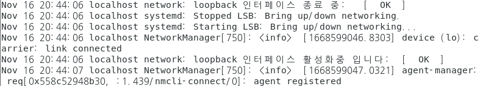

## 보안사고 정의

- 사이버 공격
  - 인터넷을 통해 이루어지는 외부의 인가되지 않은 공격
  - 인가되지 않은 공격에 의해, 내부의 중요 정보가 변조되거나 삭제되거나 유출되는 현상

- 사이버 공격 유형
  - 홈페이지 악성코드 유포

    > 많은 홈페이지 서버에 악성코드 혹은 악성 스크립트를 은닉하여 홈페이지 접속자에게 악성코드를 유포하는 유형

  - 홈페이지 변조

    > 홈페이지 서버를 공격하여 홈페이지에서 보여지는 화면을 공격 자의 이미지로 변조하는 유형

  - DDOS(Distribution Denial of Service)

    > 공격자가 감염시킨 수많은 좀비PC를 이용해, 다량의 패킷을 서 버 등의 특정 시스템으로 송신하여 서비스를 마비시키는 공격

  - 피싱(Pishing)

    > 지인 또는 유명 기업 등을 사칭한 메시지를 E-mail, 메신저, 문 자 등의 다양한 서비스를 통하여 공격 대상자에게 전송

    > 메시지를 받은 사용자는 신뢰된 송신자로 오인하여 가짜 사이트 에 접속하여 정보 유출 및 금전적 피해를 야기하는 공격 기법

  - 파밍(Parming)

    > 특정 Web Site에 악성코드를 삽입 후 해당 Site에 사용자의 접 속을 유도하는 공격기법

    > 사용자는 해당 Site에 접속 시, 악성코드가 실행/설치되는 방식

  - 스미싱(Smishing)

    > 피싱과 유사한 방식으로, 문자메시지를 이용해 특정 Site에 접 속을 유도하는 공격 기법

## LOG - Linux

- LOG
  - 감사 서비스를 통해 남겨지는 시스템의 동작 흔적
  - 시스템의 오류 및 동작 상태에 대한 정보를 남김
  - 차후 침투가 발생했을 때 공격자의 흔적을 추적하기 위한 필수 정보

- 로그 파일

  - 설명

    ```
    /var/log/message 리눅스 커널 로그 및 시스템 메시지
    /var/log/secure  보안 인증 관련 메시지
    /var/log/maillog 메일 로그(sendmail, pop에 의한 로그)
    /var/log/cron    crond에 의한 로그
    /var/log/boot.log 시스템 부팅 시에 뿌려지는 모든 메시지를 담고 있음
    /var/log/dmesg 부팅될 당시의 각종 메시지들을 저장
    /var/log/wtmp 시스템 전체 로그인 기록을 저장
    /var/run/utmp 현재 로그인 사용자에 대한 기록, 사용자 IP 저장
    /var/log/lastlog 계정의 최근 로그인 정보를 저장
    /var/log/xferlog ftp 로그
    /var/log/httpd/access_log 아파치(웹 서버)의 로그들을 기록
    /var/log/httpd/error_log 아파치(웹 서버)의 에러들을 저장
    /var/log/named.log 네임서버(DNS)의 로그
    ```

  - 로그파일 중 text 로 되어 있어서 읽히는 로그도 있고 명령어를 통해서만 확인 가능한 로그도 있다 

- Linux 로그 파일 종류(상세)

  <b>/var/log/wtmp</b>

  - 계정의 로그인 및 로그아웃 정보를 저장

  - 로그인, 로그아웃, shutdown, booting 정보 등

  - 바이너리 파일

    ```
    [root@localhost ~]# cat /var/log/wtmp
    ```

    

  - 확인 : last 명령으로 확인

    ```
    [root@localhost ~]# last
    ```

    

  

  <b>/var/run/utmp</b>

  - 현재 로그인한 계정의 상태 정보를 저장

  - 로그인 계정 이름, 터미널, 원격 로그인 주소, 로그인 시간 등

  - 바이너리(binary) 파일 : text 명령어로는 읽히지 않음 

  - 확인 : w, who, who am i, ... 등의 명령으로 확인

    ```
    [root@localhost ~]# w
    ```

    

    ```
    [root@localhost ~]# who
    ```

    

    ```
    [root@localhost ~]# who am i
    ```

    

  

  <b>/var/log/lastlog</b>

  - 계정의 최근 로그인 정보를 저장

  - 계정 이름, 터미널, 마지막 로그인 시간

  - 바이너리 파일 

  - 확인 : lastlog 명령으로 확인

    ```
    [root@localhost ~]# lastlog
    ```

    

  

  <b>/var/log/btmp</b>

  - 실패한 로그인 시도를 저장

  - 바이너리(실행) 파일

  - 확인 : lastb 명령으로 확인

    ```
    [root@localhost ~]# lastb
    ```

    

  - ktest 로그인 실패 후 확인

    ```
    [root@localhost ~]# lastb
    ```

    

  

  <b>/var/log/secure</b>

  - Telnet, SSH, FTP 등 원격 로그인의 인증 정보를 저장

  - 텍스트 파일

  - 확인 : vim, tail/head, cat 등으로 확인

    ```
    [root@localhost ~]# cat /var/log/secure | grep ssh
    ```

    

  

  <b>/var/log/boot.log</b>

  - 부팅 동작에서 서비스 데몬들의 실행 상태정보 저장

  

  <b>/var/log/cron</b>

  - crond 서비스 동작에서 예약 작업의 동작 상태 정보 확인

  - 텍스트 파일

  - 확인 : vim, tail/head, cat 등으로 확인

    ```
    [root@localhost ~]# tail /var/log/cron
    ```

    

  

  <b>/var/log/yum.log</b>

  

  

  <b>/var/log/sulog</b>

  - su : 사용자 전환

  - su 명령의 사용 내역 저장

  - 공격자가 일반 계정으로 접근한 후 su명령으로 관리자의 권한을 악용할 수 있으므로 불법적인 su명령 사용을 주기적으로 점검해야 함

  - 환경설정을 미리 해야 로그가 저장 됨

  - 텍스트 파일

  - 확인 : “su:session”으로 필터링해서 확인

  <b>실습) sulog 만들기</b>

  - 파일 수정

    ```
    # vim /etc/login.defs 
    ```

    

    ```
    # vim /etc/rsyslog.conf     --> 실제 로그를 기록하는 데몬의 설정파일
    ```

    

    ```
    # vim /etc/logrotate.d/syslog
    ```

    

  - 관련 데몬 재시작

    ```
    [root@localhost ~]# systemctl restart rsyslog
    ```

  -  su test

    ```
    [root@localhost ~]# su - ktest
    ```

  - sulog 확인

    ```
    [root@localhost ~]# cat /var/log/sulog 
    ```

    

  

  <b>history</b>

  - 각 사용자 별로 수행한 명령을 기록하는 파일

  - 사용자가 사용하는 쉘에 따라 .sh_history, .history, .bash_history 등의 파일로 기록

  - 해킹 피해 시스템 분석 시 불법 사용자 계정이나 root 계정의 history 파일을 분석하면,  공격자가 시스템에 접근한 후 수행한 명령어들을 확인할 수 있다는 점에서 매우 중요한 파일

  - 텍스트 파일

  - 확인 : vim, tail/head, cat 등으로 확인

    ```
    [root@localhost ~]# cat /root/.bash_history
    ```

    

    ```
    [root@localhost ~]# history
    ```

    

    ```
    [root@localhost ~]# history -c   --> 모든 history 삭제
    [root@localhost ~]# history
    ```

    

  <b>/var/log/messages</b>

  - 시스템 동작에 대한 전반적인 모든 이벤트가 저장 됨

  - 로그인, 장치 동작, 시스템 설정 오류, 파일 시스템, 네트워크 연결 정보 등이 저장 됨

  - 텍스트 파일

  - 확인 : 필터링을 하거나 실시간 로그 확인 방법을 많이 사용 함

    ```
    [root@KH-Linux~]# cat /var/log/messages | grep [패턴]
    [root@KH-Linux~]# tail -f /var/log/messages
    
    # systemctl restart network
    # tail -f /var/log/messages
    ```

    

    -1668599155665-77.png)

    

    

    

  <b>/var/log/httpd/access_log, /var/log/httpd/error_log</b>

  - 웹 서버의 접속, 오류에 대한 기록 확인

  - 웹 서버에서 취약한 CGI 프로그램에 공격 수행 시 그에 대한 공격 로그도 이들 로그파일에 기록 됨

  - 텍스트 파일

  - 확인 : vim, tail/head, cat 등으로 확인

    <b>access_log</b>

    ```
    # tail -f /var/log/httpd/access_log
    
    host에서 http://172.16.0.111 접속
    ```

    

    <b>error_log</b>

    ```
    1) 없는 페이지를 요청 할때 
    
    # tail -f /var/log/httpd/error_log
    
    host:]172.16.0.1
    http://172.16.0.111/1.php
    ```

    

    

    ```
    2) php 같은 WAS 의 문법문제가 생길때
    
    # vim /var/www/html/t.php
    <?php
    phpinfo();
    ?
    ```

    

    

    


