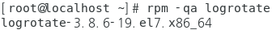
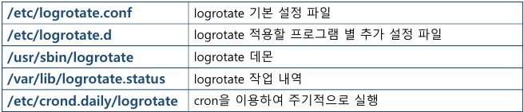
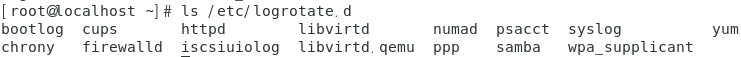
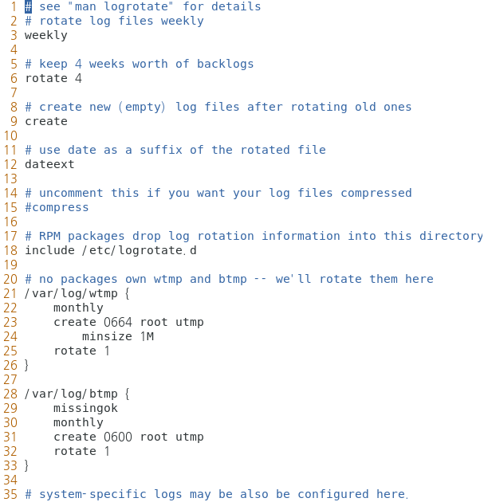
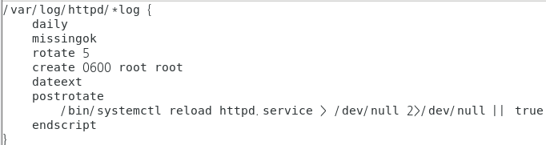
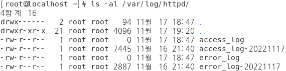
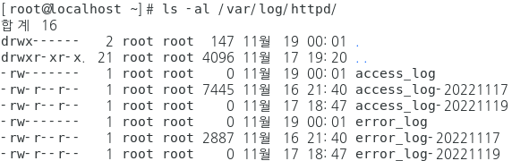
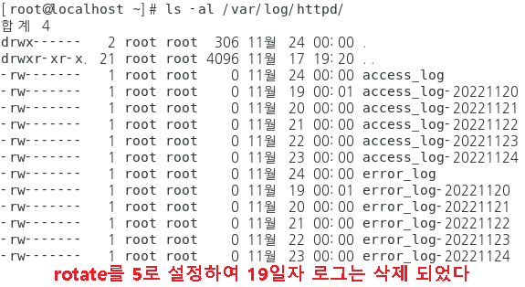
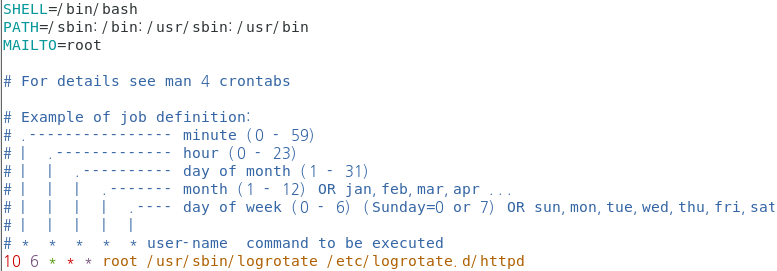
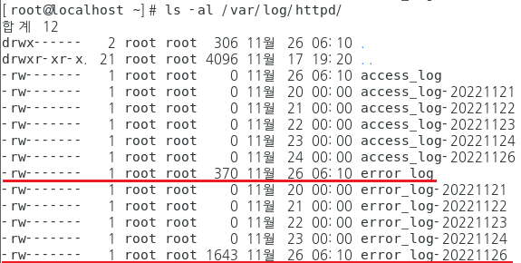

## logrotate

<b>logrotate</b>

- Linux 용 Log 관리 프로그램
- Log가 지속적으로 생성되면 서버에 부하가 발생될 가능성이 있음
- Log를 효율적으로 관리
  - 일정기간 후 이전 로그들을 압축하여 용량을 줄이거나,
  - 오래된 로그를 삭제해주는 등의 일련의 작업
  - 주기적으로 관리해 주는 프로그램

- Linux 설치 시 자동 설치되어 있음

  - 설치 여부 확인

    ```
    [root@localhost ~]# rpm -qa logrotate
    ```

    

- cron을 이용하여 주기적으로 작업을 수행

- logrotate 구성

  

#### 실습

<b>httpd 의 로그 파일을 주기적으로 관리</b>

- httpd 설치

  ```
  # yum -y install httpd
  # systemctl restart httpd
  ```

- logorotate 에서 지원하는 데몬의 목록

  ```
  # ls /etc/logrotate.d/
  ```

  

- 조건 확인

  ```
  # vim /etc/logrotate.conf
  ```

  

  ```
  daily     : rotate log files daily  (매일 로그파일 백업)
  missingok : 로그파일이 존재 X 에러일으키지 말것
  rotate 5  : 로그백업이 5회 초과시 로그파일을 삭제 
  create 0600 root root : rw------- 소유자 root , 소유그룹 root 
  dateext   : 각 로그 파일에는 생성일자 기록
  /bin/systemctl reload httpd.service > /dev/null 2> /dev/null || true 로그파일 생성후 httpd 새로고침 시작 , 오류발생시 메시지 출력하지 말것
  ```

- httpd 로그 관리파일을 백업 후 설정파일 수정

  ```
  # cp /etc/logrotate.d/httpd /root/httpd.logrotate
  
  # vim /etc/logrotate.d/httpd
  
  /var/log/httpd/*log {
      daily
      missingok
      rotate 5
      create 0600 root root
      dateext
      postrotate
          /bin/systemctl reload httpd.service > /dev/null 2>/dev/null || true
      endscript
  }
  ```



- 테스트 : 날짜를 강제로 증가시키고 날짜별 로그가 발생되는지 확인

  - 로그 파일 확인

    ```
    [root@localhost ~]# ls -al /var/log/httpd/
    ```

    

  - 날짜 변경

    ```
    [root@localhost ~]# date -s "2022-11-19 00:00:00"
    ```

  - logrotate 실행

    ```
    [root@localhost ~]# logrotate /etc/logrotate.d/httpd
    ```

  - 로그 파일 확인

    ```
    [root@localhost ~]# ls -al /var/log/httpd/
    ```

    

  - 24일 까지 날짜 변경하여 반복 후 확인

    

#### Crontab을 이용한 주기적 로그 관리

- /etc/crontab 에 /etc/logrotatae.d/httpd 를 등록

  ```
  # vim /etc/crontab
  
  10 6 * * * root  /usr/sbin/logrotate  /etc/logrotate.d/httpd
  ```

  

- 날짜와 시간 변경 

  ```
  [root@localhost ~]# date -s "2022-11-26 06:09:58"
  2022. 11. 26. (토) 06:09:58 KST
  [root@localhost ~]# date
  2022. 11. 26. (토) 06:10:02 KST
  ```

- 로그 확인

  ```
  [root@localhost ~]# ls -al /var/log/httpd/
  ```

  