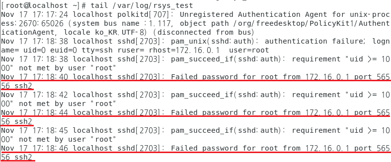
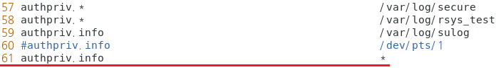
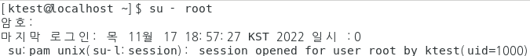

## rsyslog

- rsyslog

  - 시스템에 로그 메시지를 남기고 처리하는 프로그램과 설정파일을 모두 합쳐서 부르는 말로 logging Message Program 의 표준

  - Kernel 이나 System Util 에서 발생한 메시지를 rsyslogd Daemon이 전송

    > /etc/rsyslog.conf 파일에 정의된 정보에 의해 Message를 기록

    > /etc/rsyslog.conf 을 수정하여 로그의 저장 위치 및 파일 이름을 수정할 수 있음

  - UDP 514 Port 사용

    

#### 실습

- 설치확인

  ```
  [root@localhost ~]# systemctl status rsyslog
  ```

  

- 기존 secure 로그파일의 이름을 다른파일이름으로 생성되도록 추가 

  ```
  [root@localhost ~]# vi /etc/rsyslog.conf
  ```

  

- 로그 파일 확인

  ```
  [root@localhost ~]# ls -al /var/log/rsys_test
  ```

  

- rsyslog 데몬 재시작 후 확인

  ```
  [root@localhost ~]# systemctl restart rsyslog
  [root@localhost ~]# ls -al /var/log/rsys_test
  ```

  

- SSH 로그인 실패를 한 뒤 파일 확인

  

  ```
  [root@localhost ~]# tail /var/log/rsys_test
  ```

  

#### rsyslog 구조


- 메시지 종류

  

- 우선순위

  

  

#### 실습 rsyslog action 

<b>action  : 어디에 로그를 기록한것인가</b>

-  sulog 출력 관련 부분 설정

- rsyslog 다시 시작

  ```
  [root@localhost ~]# systemctl restart rsyslog
  [root@localhost ~]# ls -al /var/log/sulog 
  ```

  

- Console/Terminal  출력

  - ex) /dev/console

  - 터미널 2개 준비

    ```
    첫번째 터미널 
    [root@localhost ~]# tty
    /dev/pts/1
    
    두번째 터미널 
    [root@localhost ~]# tty
    /dev/pts/2
    ```

  - 파일 편집

    ```
    [root@localhost ~]# vim /etc/rsyslog.conf
    ```

    

  - rsyslog 재시작

    ```
    [root@localhost ~]# systemctl restart rsyslog
    ```

    

  - 다른 터미널에서 su 테스트

    

  - 첫번째 터미널에서 출력된 로그  확인

    

- 계정에 전송 : [계정 명]

  -  ex) root → root 계정에 알림 , * → 모든 계정에 알림

  - 계정 관련

    ```
    [root@localhost ~]# vim /etc/rsyslog.conf
    ```

    

  - rsyslog 재시작 

  - su 시도 후 확인

    

  - ktest 사용자에게만 로그 출력하도록 설정

    ```
    [root@localhost ~]# vim /etc/rsyslog.conf
    ```

    

  - 로그아웃 한뒤 ktest 로그인 하여 확인 (su 사용 X)

    

    

- Host에 전송 : @[host 명] 또는 @[IP Address]

  -  ex) @sun02 → sun02 host에 알림, @59.5.12.168 → 해당 IP에 알림

  - 구성도

    -1668679692471-35.png)

  - 시간동기화

    ```
    rsync server 120], rsync client 121]
    
    # rdate -s time.bora.net
    ```

  - 로그전송 설정

    ```
    rsync client 121]
    
    # vi /etc/rsyslog.conf
    ```

    

  - 로그 전송 받을 디렉터리 , 파일명에 구분할 날짜 표시

    ```
    rsync server 120]
    
    # vim /etc/rsyslog.conf
    ```

    

  - 디렉터리 생성

    ```
    rsync server 120]
    
    # mkdir /var/log/rsyslog
    ```

  - 재시작

    ```
    rsync server 120]
    
    # systemctl restart rsyslog
    ```

  - 로그 파일 생성 확인

    ```
    rsync server 120]
    
    # ls -al /var/log/rsyslog/
    ```

    

  - 로그 파일 읽기

    ```
    rsync server 120]
    
    # cat /var/log/rsyslog/127.0.0.1_messages_2022-11-17.log
    ```

    

  - 원격 클라이언트에서 로그를 발생

    ```
    rsync client 121]
    
    날짜 변경 시키고 rsyslog 재시작
    
    [root@localhost ~]# date -s "2022-11-18 00:00:00"
    2022. 11. 18. (금) 00:00:00 KST
    [root@localhost ~]# systemctl restart rsyslog
    ```

  - 전송된 로그 확인

    ```
    rsync server 120]
    
    # ls -al /var/log/rsyslog/
    ```

    

    

    

