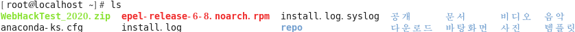
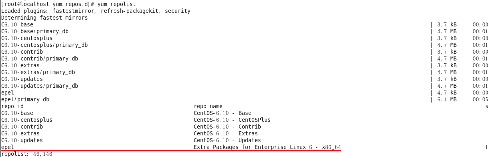
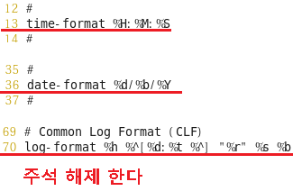
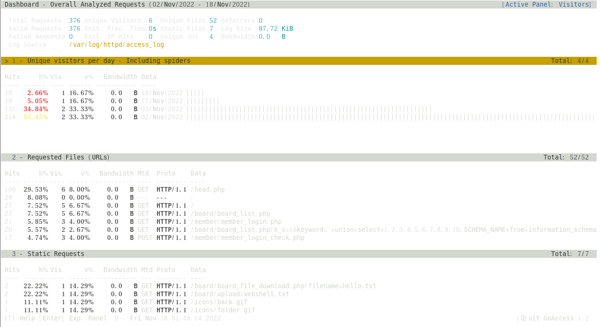
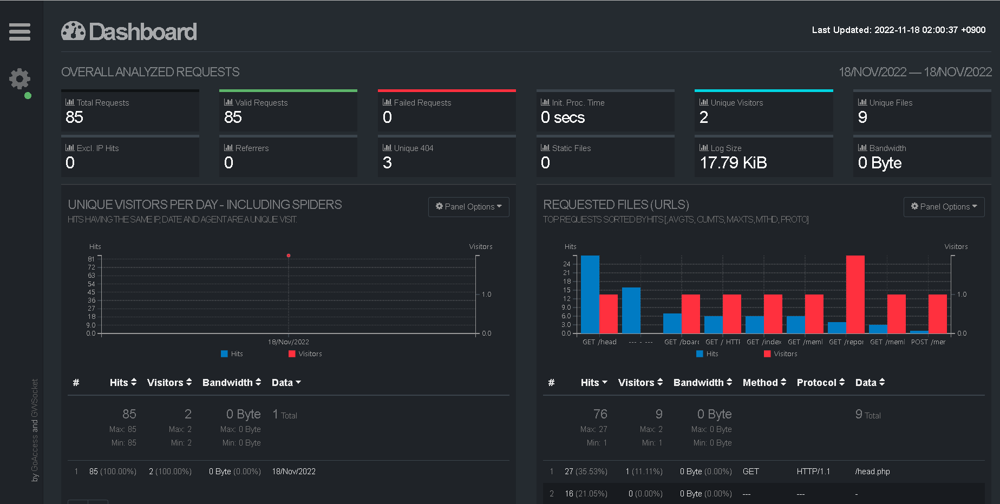

## GoAccess

- GoAccess
  - 오픈 소스 기반의 웹 서버 로그 분석 도구
  - 공식 홈페이지 : https://goaccess.io/

- 주요 특징
  - 다양한 웹 서버의 로그 포맷 지원
  - 웹 브라우저를 사용한 분석 화면 제공
  - 완벽한 실시간 분석

#### 설치

- 웹서버 동작 확인 , 인터넷 확인

- epel repository 파일 다운로드

  ```
  wget https://archives.fedoraproject.org/pub/archive/epel/6/x86_64/Packages/e/epel-release-6-8.noarch.rpm
  ```

- epel repository 파일 설치

  ```
  [root@localhost ~]# ls
  ```

  

  ```
  [root@localhost ~]# rpm -Uvh epel-release-6-8.noarch.rpm
  ```

- repository 점검

  ```
  [root@localhost ~]# yum clean all
  [root@localhost ~]# yum repolist
  ```

  

- goaccess package 설치

  ```
  [root@localhost ~]# yum -y install goaccess
  ```

- /etc/goaccess.conf 파일 수정

  ```
  [root@localhost ~]# vi /etc/goaccess.conf
  ```

  

- service httpd restart

#### 다양한 실행 방법

- 터미널 출력

  - 로그 포맷 설정 후 터미널을 사용하여 실시간 통계 표시

    > 로그 포맷은 환경 설정 파일에 설정 또는 명령어 실행 시 옵션으로 설정 가능

    ```
    -- httpd 접속로그를 활용 
    
    [root@localhost ~]# goaccess /var/log/httpd/access_log
    ```

    

- 정적 HTML 출력

  - 로그 파일의 내용을 구문 분석(파싱)하여 HTML 형식으로 저장, 웹 브라우저를 사용하여 통계 표시

    ```
    [root@localhost ~]# service httpd restart
    [root@localhost ~]# goaccess /var/log/httpd/access_log -o /var/www/html/report.html
    
    http://서버주소/report.html 
    ```

    

- 실시간 HTML 출력

  - 로그 파일을 구문 분석(파싱)하여 실시간 HTML 보고서에 통계 표

    ```
    [root@localhost ~]# goaccess /var/log/httpd/access_log -o /var/www/html/report.html --real-time-html
    
    http://서버주소/report.html 
    ```

    