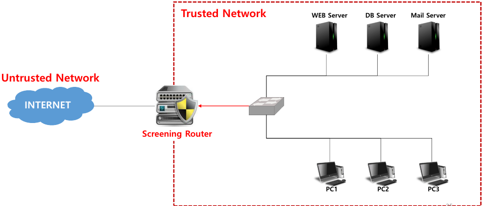
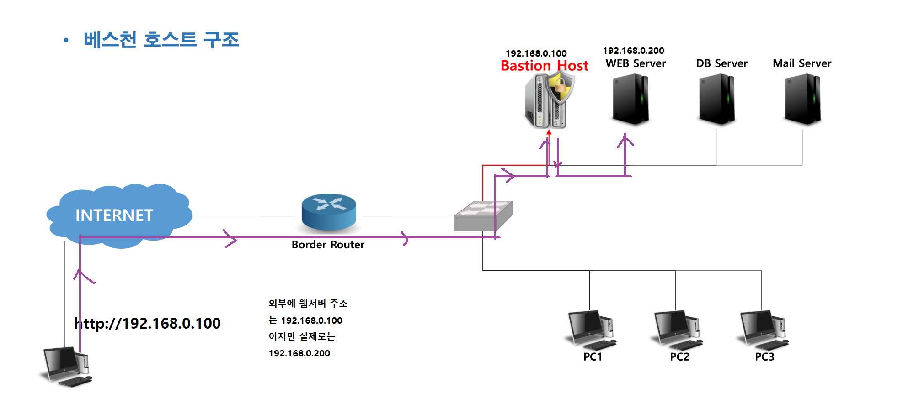
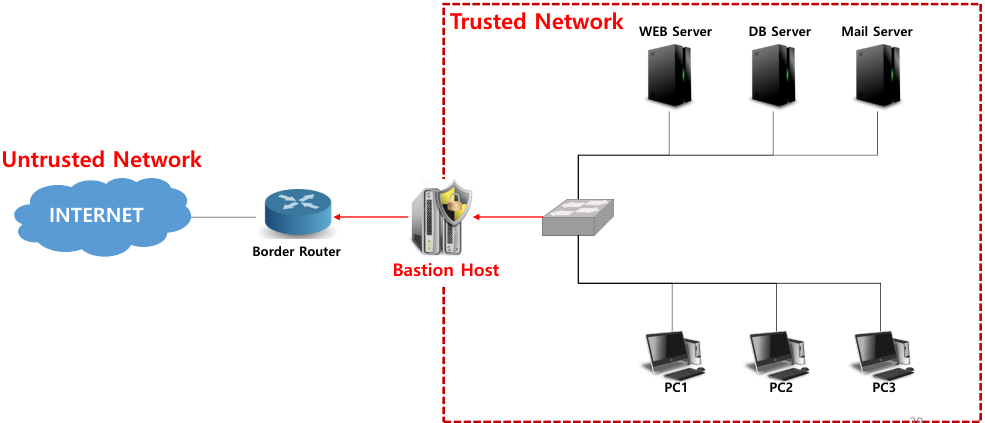
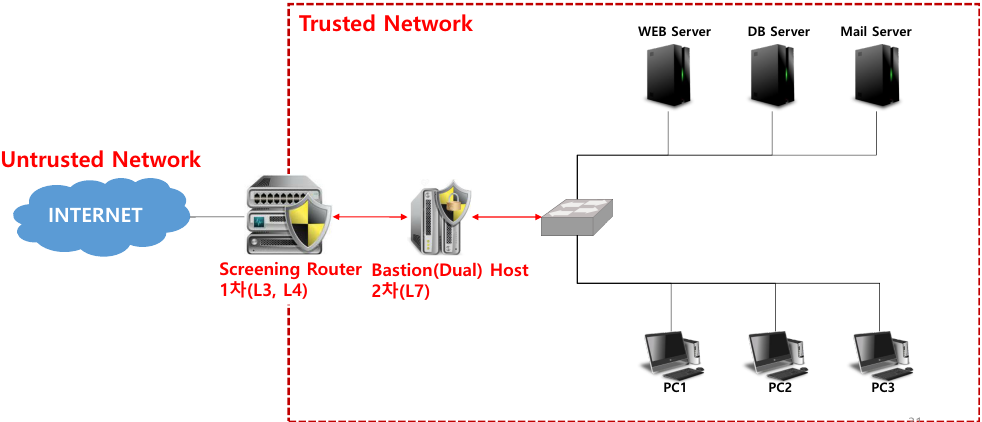

## 보안장비운용

- 보안 시스템(보안 솔루션)
  - 정보 보안의 내/외부 위협 요인들로부터 정보 자산(H/W, S/W, Data, Service …)을 보호하여 보안 사고를 피해를 최소화 하는 정책을 통한 기술적, 관리적 행위

- 방화벽(=F/W)
  - 원래 의미 → 화재가 더 이상 번지는 것을 막는 불 연재로 만든 벽
  - 보안 위협으로부터 불법적인 침입을 차단하여 보안 사고를 사전에 예방하는 Software 또는 Hardware
  - 방화벽을 기준으로 신뢰할 수 있는 영역(Trusted Network)과 신뢰할 수 없는 영역(Untrusted Network)을구분하여 정책에 해당하는 데이터를 제어 또는 통제(허용/거부)하는 동작을 수행 함

- 접근제어
  - 자산을 보호할 정책에 맞게 데이터를 필터링 하는 기능
  - 패킷 필터링, Proxy 필터링 
  - ex) iptables -t fitler -A INPUT -s 200.200.200.200 -p tcp --dport 80 -j DROP 

- 인증
  - 내부 네트워크에 접근할 수 있는 사용자, 메시지(protocol) 
  - ex) iptables -t fitler -A INPUT -s 200.200.200.200 -p tcp --dport 80 -j DROP  를 인증 함

- 모니터링 및 로깅(Logging)/감사추적(Auditing)
  - 모니터링 → 지속적으로 트래픽을 모니터링 하면서 유동적인 정책을 세울 수 있게 함
  - 로깅/감사추적 → 침해가 발생했을 때 역 추적의 정보를 남겨야 함
  - ex) iptables -t fitler -A INPUT -p icmp -j LOG --log-prefix "ICMP LOG"

- NAT
  - 내부 네트워크의 주소를 외부에 노출시키지 않음
  - 내부 네트워크로의 직접적인 접근을 차단 함
  - ex)  iptables -t nat -A POSTROUTTING -s 192.168.100.0/24 -o ens32 -j MASQUERADE  iptables -t nat -A PREROUTRING -d 200.200.200.111 -j DNAT --to-destination 192.168.111.111

- VPN
  - 방화벽에서 다른 방화벽 또는 호스트까지 전달되는 트래픽을 암호화해서 전달 함

## 보안 시스템 종류

- 방화벽(Firewall)
  - 침입 차단 시스템
  - 신뢰하지 않는 외부 네트워크와 신뢰하는 내부 네트워크 사이를 지나는 패킷을 미리 정한 정책(규칙) 에 따라 차단하거나 보내주는 기능을 하는 하드웨어 또는 소프트웨어
  - 보안에서 가장 기본적인 솔루션
  - ex) iptables  , windows 방화벽

- IDS(Intrusion Detection System)
  - 침입 탐지 시스템
  - 네트워크를 통한 공격을 탐지하기 위한 장비이며, 방화벽이 차단하지 못한 해킹이나 악성코드의 활동을 탐지
  - 설치 위치와 목적에 따라 호스트 기반이나 네트워크 기반으로 설치

- IPS(Intrusion Prevention System) 
  - 침입 차단 시스템
  - IDS + Firewall과 같은 네트워크 기반의 솔루션을 논리적으로 결합한 시스템
  - 방화벽(Firewall)의 단순한 룰 셋 적용을 통한 차단으로 실질적인 공격의 차단율이 낮다는 점을 보완하기 위해 개발
  - 비정상적인 트래픽(공격)에 대해 능동적인 분석과 차단을 수행

- Web Filter 
  - 웹 브라우저의 통신 내역을 감시하여 위험성 높은 내용을 차단
  - 위험한 사이트 접속 차단 및 위험한 컨텐츠 차단
  - ex) 점심시간외에는 업무 사이트 외에는 접속 불가 

- WAF(Web Application Firewall) 
  - 웹 방화벽
  - ex) WAPPLES

- VPN(Virtual Private Network)
  - 가상 사설망
  - 인터넷(공용망)을 전용선처럼 사용할 수 있도록 제공하는 서비스
  - 본사와 지사 간에 전용망을 설치한 것과 같은 효과를 거둘 수 있으며, 기존 사설망의 고비용 부담을 해소하기 위해 사용(비용 절감)
  - 터널링 + 암호화

- Anti DDoS Solution
  - DDoS 공격 탐지/차단

- Anti SPAM Solution
  - 스팸 탐지/차단 또는 스팸 필터 솔루션

- Anti Virus Wall
  - 악성코드 탐지/차단 솔루션

- Load Balancing

  - 부하 분산 

  - SLB(Server Load Balancing) / NLB(Network Load Balancing)

  - 동작 방식 : 라운드 로빈, 가중치 라운드 로빈, ...

  - ex) LVS(Linux Virtual Server)

    리눅스를 이용해서 고 가용성 확보를 위해 로드 밸런싱을 운영하는 시스템

- UTM(Unified Threat Management)
  - 통합 위협 관리
  - 하나의 장비에서 여러 보안 기능을 통합적으로 제공하여 다양하고 복잡해진 공격에 대
  -  Firewall / WebFilter / WAF / VPN / IDS / IPS / Antivirus / AntiSpyware / AntiSPAM / Wireless Security / ...

- PMS(Patch Management System)
  - 패치 관리 시스템
  - 조직 내에서 최신의 패치를 적용시키는 것이 중요
  - 보안 솔루션 강제 설치 / 불법 소프트웨어 차단 / 하드웨어 자산 관리 등을 수행

- NAC(Network Access Control)

  - IP 관리 시스템에서 발전한 솔루션

  - 네트워크에 연결된 단말의 여러 가지 정보를 수집하고

    정책 : 지정된 네트워크의 사용자는 모두 방화벽을 사용해야한다 .

    사용자가임의로 방화벽을 내리면 강제로 자동으로 올라감

## 보안 시스템 운용 기술

#### 방화벽의 분류(기술적)

- Packet Filter Firewall
  - OSI 7 Layer의 Network, Transport에서 동작 함
  - 데이터의 출발지 및 목적지 IP/PORT 정보를 이용하여 정책을 구성 함

- Application Layer Gateway(=ALG)

  - 7계층
  - ex) WAPPLES (WAF)… 

- Circuit Gateway

- Stateful Inspection

  - OSI 7 Layer의 Network, Transport에서 동작 함

  - 필터링 속도를 개선 함

    > 방화벽에서 상태 추적 테이블을 생성하여 L3, L4정보를 기억하여 정책 검사를 한 번만 수행 함

    > 동적으로 보안 정책을 수정하며 실제 접속 상태를 감시하여 통신 상태에 따라 허용/거부를 수행 함

  - ex) iptables -t filter -A INPUT -m state --state NEW,ESTABLISHED -m tcp -p tcp --dport 80 -j ACCEPT

- Dynamic Packet Filtering

- Hybrid 방식

  - 대부분의 Firewall 채택 방식
  - **Packet Filtering + Application Gateway** 방식 등의 혼합
  - 사용자의 편의성과 기업 환경에 따라 유연성 있게 방화벽을 구성할 수 있지만, 관리사 복잡한 단점이 있다.

## 보안 시스템 구축 형태

- 스크리닝 라우터(=Screening Router)
  - 기존의 Router에 패킷 필터링 기능을 이용하는 방화벽 구축 형태

  - 특징

    > 정상적인 내부/외부 사용자는 패킷 필터링 라우터의 존재를 인식하지 않고 서비스를 이용 함

    > 패킷 필터링 기반으로 동작 함

    > 내부 네트워크와 외부 네트워크를 분리 함

  - 단점

    > 실패한 접속에 대한 로깅과 감사 추적이 어려움

    > 패킷 필터링 규칙에 대한 검증이 어려움

    > 외부 네트워크에서 공격자에 의해 공격 당하거나 고장 등의 문제가 발생할 경우 보안상 치명적 임

- 스크리닝 라우터 구조

  

- 베스천 호스트(=Bastion Host Architecture = Single Homed Host 구조)
  - 내부 네트워크의 하나의 시스템을 proxy로 운영하며 특정 서비스에 대해서만 필터링 하는 방식

  - 특징

    > 내부/외부 네트워크를 분리하지 않음

    > 접근제어, 프록시, 인증, 로깅 등의 방화벽 기본 기능을 수행

    > 윈도우 NT또는 유닉스 등의 운영체제에 설치하여 사용

    > 설치되는 운영체제에는 일반 사용자 계정이 없어야 하며, 방화벽 기능 외의 유틸리티는 모두 삭제

    >대용량의 모니터링과 로깅이 가능해야 하며, IP 포워딩 및 소스 라우팅 기능이 없어야 함

  - 단점

    > 운영체제에 운영되기 때문에 강력한 보안 정책이 가능하나 방화벽이 손상될 경우 네트워크에 대한 무조건 적인 전송이 가능 함

    > 방화벽으로 원격 로그인 정보가 노출되어 공격자가 방화벽에 대한 제어권을 탈취한 경우 내부 네트워크가 위험해 짐

    > 2계층 공격 등을 통한 방화벽 우회 공격에 취약

- 베스천 호스트 구조

  

- 듀얼 홈드 호스트(=Dual Homed Host Architecture = Dual Home Gateway)

  - Bastion Host 구조에서 네트워크 카드를 하나 더 장착하여 내부/외부 네트워크를 분리 시키는 형태

  - 특징

    > 두 개의 인터페이스를 가지는 Beastion Host

    > 응용 서비스 종류에 좀더 종속적이기 때문에 스크린 라우터보다 안전

    > Application Layer 공격 방어 가능

    > 로깅 및 감사 추적이 용이 함

    > 설치 및 유지보수 쉬움

  - 단점

    > 제공되는 서비스가 증가할수록 proxy 소프트웨어 가격 상승 

    > 게이트웨이가 손상되면 내부 네트워크 보호 불가

    > 방화벽으로 원격 로그인 정보가 노출되어 공격자가 방화벽에 대한 제어권을 탈취한 경우 내부 네트워크가 위험해 짐

- 듀얼 홈드 호스트 구조

  

- 스크린드 호스트 구조

  

- 스크린드 서브넷 구조

  -1667810548446-9.png)

## 방화벽의 분류(장비)

- Software 기반 Firewall

  - 일반적인 호스트 PC에 설치하는 소프트웨어형태의 프로그램

  - Open Source Software Firewall 

    > IPTABLES, IPFIRE, PFSENSE, ENDIAN, MONOWALL, SMOOTHWALL …

- Hardware 기반 Firewall
  - 네트워크 장비 기반으로 자체적으로 보안 기능을 수행하도록 제작된 하드웨어

## IDS(=Intrusion Detection System)

- IDS(=Intrusion Detection System)

  - 침입 탐지 시스템

  - 시스템에 대한 인가되지 않은 행위와 비 정상적인 행동을 탐지

  - 탐지된 불법 행위를 구별하여 실시간으로 침입탐지

  - 정상 트래픽의 흐름을 간섭하지 않고 단지 감시하는 기능을 제공 함 

    > 원본 데이터를 복사하여 검사 

    ＞ 물리적 장비 → tap 

    ＞ SW기능 → port mirroring

  - IDS의 주요 기능 → 보안상의 위협 찾기

- 지식 기반 탐지(=Misuse Detection IDS)
  - 부정 오류(False Negative) → 미탐 가능성이 높음
  - 오용 침입 탐지
  - Signature 기반으로 비정상적인 트래픽을 탐지
  - 오 탐 가능성이 낮으며 백신처럼 트로이목마, 백도어 등의 공격도 탐지 가능
  - signature가 없는 공격에 대한 대응이 불가능

- 행위 기반 탐지(=Anomaly Detection IDS)
  - 긍정 오류(False Positive) → 오탐 가능성이 높음
  - 비정상 행위 탐지
  - 정상적인 상황의 트래픽에 위배되는 급격한 변화가 발견되면 위협으로 판단하는 탐지 기법
  - 정량적 분석, 통계적 분석 기법을 사용
  - 관리자가 상황에 따른 프로필을 제작할 수 있으며 IDS장비 자체가 인공지능(학습능력)을 지원 함
  - zero-day Attack에 대해 탐지 가능

- N-IDS(=Network IDS)
  - 해당 네트워크를 모니터링
  - NIC가 **Promiscuous** 모드로 동작해야 함

- H-IDS(=Host IDS)
  - N-IDS와 다른 점 → 자신이 실행되는 호스트 시스템만을 보호
  - **non-Promiscuous** 모드로도 작동 함

- D-IDS
  - SK쉴더스 보안관제1팀 관제실에 ManageIDS 가 있음
  - 고객사 1에 probe 1
  - 고객사 2에 probe 2