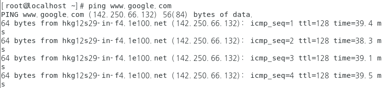
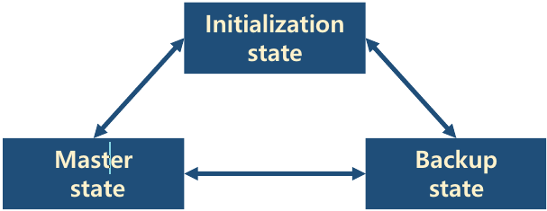

## 이중화

- 원인
  - 프레임을 전달할 수 있는 경로가 2개 이상 발생 함 → 2이상의 port에서 같은 목적지를 학습

- 해결책
  - 최적의 경로만 활성화하고 다른 경로를 막아 놓았다가 장애가 발생하였을 때 백업 경로를 사용 함
  - 최적의 경로와 경로의 문제를 주기적으로 Data를 주고 받아서 판단 함

## STP

- STP (Spanning Tree Protocol)
  - Switch를 이중화 하였을 때 발생하는 Loop 문제를 해결하기 위해 사용 됨
  - Switch에서 기본으로 동작 함
  - 목적지에 대한 경로가 2개 이상일 때 한 경로 남겨두고 다른 경로를 끊어서 Loop를 방지 함
  - 사용중인 경로의 장애를 감지했을 때 백업 경로를 활성화 하여 가용성을 보장 함
  - 신장 트리(Spanning Tree) 알고리즘을 사용하여 Loop 방지를 위한 최적의 경로를 구함


## PVST

- PVST(Per VLAN Spanning Tree)
  - STP가 기본적으로 VLAN 수와 상관없이 동작함으로 특정 루트 브릿지에 트래픽이 몰리며, 특정 브릿지는 사용되지 않고 낭비되는 문제점이 발생 
  - 각 VLAN 별로 Spanning Tree 동작함으로 써 VLAN 별 최적 경로 및 부하 분산 효과 발생
  - 각 VLAN 별로 루트 스위치를 따로 지정

#### 실습

- 구성도

  

- 각 Switch 별 VLAN 설정

  ```
  DSW1(config)#vlan 10
  DSW1(config)#vlan 20
  
  ASW1(config)#vlan 10
  ASW1(config)#vlan 20
  
  ASW2(config)#vlan 10
  ASW2(config)#vlan 20
  
  ASW3(config)#vlan 10
  ASW3(config)#vlan 20
  
  ASW4(config)#vlan 10
  ASW4(config)#vlan 20
  ```

- DSW1 - SVI 에 주소 입력

  ```
  DSW1(config)#int vlan 10
  DSW1(config-if)#ip address 10.10.10.254 255.255.255.0 
  DSW1(config-if)#no sh
  
  DSW1(config)#int vlan 20
  DSW1(config-if)#ip address 10.10.20.254 255.255.255.0
  DSW1(config-if)#no sh
  ```

  

- ASW3,4 에  PC1~4 까지 연결된 인터페이스에 ACCESS port 설정

  ```
  ASW3(config)#int f0/21
  ASW3(config-if)#switchport mode access 
  ASW3(config-if)#switchport access vlan 10
  
  ASW3(config)#int f0/22
  ASW3(config-if)#switchport mode access 
  ASW3(config-if)#switchport access vlan 20
  
  ASW4(config)#int f0/21
  ASW4(config-if)#switchport mode access 
  ASW4(config-if)#switchport access vlan 10
  
  ASW4(config)#int f0/22
  ASW4(config-if)#switchport mode access 
  ASW4(config-if)#switchport access vlan 20
  ```

- 각 ASW , DSW 에  Trunk  설정 

  ```
  ASW3(config)#int f0/2
  ASW3(config-if)#switchport mode trunk 
  ASW3(config-if)#switchport trunk allowed vlan 10,20
  
  ASW3(config)#int f0/3
  ASW3(config-if)#switchport mode trunk 
  ASW3(config-if)#switchport trunk allowed vlan 10,20
  
  ASW3(config)#int f0/12
  ASW3(config-if)#switchport mode trunk 
  ASW3(config-if)#switchport trunk allowed vlan 10,20
  
  
  ASW3(config)#int f0/3
  ASW3(config-if)#switchport mode trunk 
  ASW3(config-if)#switchport trunk allowed vlan 10,20
  
  ASW3(config)#int f0/4
  ASW3(config-if)#switchport mode trunk 
  ASW3(config-if)#switchport trunk allowed vlan 10,20
  
  ASW3(config)#int f0/11
  ASW3(config-if)#switchport mode trunk 
  ASW3(config-if)#switchport trunk allowed vlan 10,20
  
  
  ASW2(config)#int f0/4
  ASW2(config-if)#switchport mode trunk 
  ASW2(config-if)#switchport trunk allowed vlan 10,20
  
  ASW2(config)#int f0/12
  ASW2(config-if)#switchport mode trunk 
  ASW2(config-if)#switchport trunk allowed vlan 10,20
  
  ASW2(config)#int f0/1
  ASW2(config-if)#switchport mode trunk 
  ASW2(config-if)#switchport trunk allowed vlan 10,20
  
  ASW2(config)#int g0/2
  ASW2(config-if)#switchport mode trunk 
  ASW2(config-if)#switchport trunk allowed vlan 10,20
  
  
  ASW1(config)#int f0/2
  ASW1(config-if)#switchport mode trunk 
  ASW1(config-if)#switchport trunk allowed vlan 10,20
  
  ASW1(config-if)#int f0/11
  ASW1(config-if)#switchport  mode trunk 
  ASW1(config-if)#switchport trunk allowed vlan 10,20
  
  ASW1(config-if)#int f0/1
  ASW1(config-if)#switchport mode trunk 
  ASW1(config-if)#switchport trunk allowed vlan 10,20
  
  ASW1(config)#int g0/1
  ASW1(config-if)#sw
  ASW1(config-if)#switchport mode trunk 
  ASW1(config-if)#switchport trunk allowed vlan 10,20
  
  ```

- VLAN 간 통신 을 확인

  - pc1 

    

    

  - pc2

    

    

-  L3(DSW) 에는 설정을 안했는 Trunk  가 되는 이유

  - DTP(Dynamic Trunking Protocol)

    ```
    DSW1#sh interfaces G0/1 switchport
    ```

    

    ```
    ASW1#sh interfaces g0/1 switchport 
    ```

    

- InterVLAN  설정 후 점검 

  - L3 switch 가 라우터가 되도록 설정

    ```
    PC1] -> PC4]
    ping 10.10.20.254 (O)
    ping 10.10.20.1   (X)
    ping 10.10.20.2   (X)
    ```

     

    

    

  - 라우팅 테이블 확인

    ```
    DSW1#sh ip route 
    ```

    

  - 라우터로 사용하도록 설정

    ```
    DSW1(config)#ip routing
    DSW1#sh ip route
    ```

    

  - 다시 통신 확인

    

    

- root switch(bridge) 를 확인

  ```
  ASW1#sh spanning-tree
  ```

  

  

  현재  Root ID =   Bridge ID  같은 switch가 root bridge  vlan 10, vlan 20 의 root bridge 가 같다

  ```
  ASW2#sh spanning-tree
  ```

  

  

- PVST 적용

  - VLAN 별 SpanningTree 를 관리하는 switch가 1개으로 VLAN 이 여러개인경우 root bridge 부하가 높다 

  - vlan 별 root bridge 를 별도로 관리 

  - ex)

    > vlan 10 의 root bridge asw1 

    > vlan 20 의 root bridge asw2

  - switch 별로 우선순위 적용하여 root bridge 를 변경

    ```
    ASW1(config)#spanning-tree vlan 10 priority 0
    ASW2(config)#spanning-tree vlan 20 priority 0
    ```

  - 바뀐 root bridge 확인

    ```
    ASW1#sh spanning-tree
    ```

    

    ```
    ASW2#sh spanning-tree
    ```

    

  - simulation mode 로 확인

    ```
    각 통신 해당 VLAN root bridge를 먼저 거치는것을 확인 > 부하분산 (Load Balancing)
    ```

    

- root switch  이중화

  - root bridge 공백시 대신할 swtich를 미리 지정

    ```
    ASW1(config)#spanning-tree vlan 10 root primary
    ASW2(config)#spanning-tree vlan 10 root secondary
    
    ASW2(config)#spanning-tree vlan 20 root primary
    ASW1(config)#spanning-tree vlan 20 root secondary
    ```

## Link 이중화

- Link Aggregation(=Trunk)
  - 여러 개의 물리적인 링크를 논리적인 하나의 링크로 사용하는 기술

  - 목적

    > 부하분산 → 속도 향상, 대역폭 증가

    > 장애 우회 ...

    > 서버와의 연동 → 티밍(Teaming), 본딩(Bonding), ...

  - 관련 용어 → Link 집성, 트렁킹, 이더채널(cisco), NIC Teaming, Bonding ...

  - 타 벤더에서는 Cisco에서 Trunk Port/Access Port를 Tagged Port/UnTagged Port라고 부름

- Port Tunkking 과 비교

  -1668420756875-30.png)

- Ether Channel

  - Cisco에서 지원하는 Link 이중화 기술

  - Link를 논리적으로 묶을 수 있음(LACP → 최대 8개, PAgP → 최대 16개)

    > 소속 내 모든 포트는 포트모드가 같아야 함

    > 소속 내 모든 포트는 대역폭과 전송 방식(Duplex)가 동일해야 함

    > 소속 내 포트는 SPAN이면 안 됨
    > 

- Ether Channel 설정 방식

  - Static(정적) 설정

    > 관리자가 모든 설정을 직접 함

  - Dynamic(동적) 설정

    > Protocol을 이용하여 협상을 통해 설정 함 → LACP, PAgP

  - Port Channel 설정 시 묶은 후에 변경할 경우 각각 설정하는 것이 아닌 묶은 포트채널에서 설정

#### L2 etherchannel

- 구성도

  

- 각 스위치별로 사용될 인터페이스 범위 입력 

  - 양쪽 스위치 동일

    ```
    Switch(config-if-range)#interface range f0/1-4
    ```

- etherchannel 협상시 사용할 프로토콜 지정 > 활성화

  - LAcP:Link Aggregation , 국제표준

  - PAgP:Port Aggregation , cisco 전용

  - 논리적인 포트 생성 메시지를 확인

    ```
    Switch(config-if-range)#channel-protocol lacp 
    Switch(config-if-range)#channel-group 1 mode active
    ```

    

  - 새로운 인터페이스 진입

    ```
    Switch(config)#interface port-channel 1
    ```

  - etherchannel 정보 확인

    ```
    Switch#sh etherchannel summary
    ```

    

- 양쪽 통신 테스트

  - 192.168.0.100] -> 192.168.0.200]

    

  - 하나가 끊어져도 통신이 된다

    

    

#### L3 etherchaanel

- 구성도

  

- 각 Switch별 SVI 를 설정

  ```
  L3_01(config)#interface vlan 1
  L3_01(config-if)#ip address 192.168.1.254 255.255.255.0
  L3_01(config-if)#no sh
  
  L3_02(config)#interface vlan 1
  L3_02(config-if)#ip address 192.168.2.254 255.255.255.0
  L3_02(config-if)#no sh
  ```

- Port-channel 인터페이스 설정 - 양쪽 모두 동일

  - 사용될 물리적 인터페이스의 범위 설정

    ```
    L3_01(config)#int range f0/1-4
    ```

  - etherchannel 협상시 사용할 프로토콜 설정 

    ```
    L3_01(config-if-range)#channel-protocol lacp
    ```

  - 활성화

    ```
    L3_01(config-if-range)#channel-group 1 moade active
    ```

  - 논리적 인터페이스 생성 메시지 확인

    

  - 논리적 인터페이스 진입

    ```
    L3_01(config-if-range)#int port-channel 1
    ```

  - 논리 채널 인터페이스 확인

    ```
    L3_01#sh etherchannel summary
    ```

    

- 스위치별 인터페이스에 주소를 입력

  ```
  L3_01(config)#interface port-channel 1
  L3_01(config-if)#no switchport 
  L3_01(config-if)#ip address 1.1.1.1 255.0.0.0
  L3_01(config-if)#no sh
  
  L3_02(config)#int port-channel 1
  L3_02(config-if)#no switchport 
  L3_02(config-if)#ip address 1.1.1.2 255.0.0.0
  L3_02(config-if)#no sh
  ```

- 라우터 선언 및 라우팅 테이블 설정

  ```
  L3_01(config)#ip routing
  L3_01(config)#do sh ip routing
  ```

  

  ```
  L3_02(config-if)#ip routing
  L3_02(config)#do sh ip ro
  ```

  

- 구간별 통신 체크

  - 192.168.1.100]-> 192.168.1.254]

    

  - 1.1.1.1]->1.1.1.2]

    

  - 192.168.2.100]-> 192.168.2.254]

    

  - 192.168.2.100]-> 192.168.2.100]

    

- 라우팅 테이블 설정 후 다시 통신 체크

  ```
  L3_01(config)#ip route 192.168.2.0 255.255.255.0 1.1.1.2
  L3_02(config)#ip route 192.168.1.0 255.255.255.0 1.1.1.1
  ```

  

#### Teaming

- 구성도

  -1668425850341-50.png)

- 어댑터 추가 인터페이스 기본 설정

  - ens32 (slave 인터페이스)

    ```
    [root@localhost network-scripts]# vi ./ifcfg-ens32
    ```

    

  - ens33 (slave 인터페이스)

    ```
    [root@localhost network-scripts]# vi ./ifcfg-ens32
    ```

    

  - NetworkManager 다시 시작후 적용된 내용 확인

    ```
    [root@localhost ~]# systemctl restart NetworkManager
    [root@localhost ~]# nmcli connection
    ```

    

- NetworkManager 상태 확인

  ```
  [root@localhost ~]# systemctl status NetworkManager
  ```

  

- 어댑터 및 인터페이스 확인

  ```
  [root@localhost ~]# ip link
  ```

  

  ```
  [root@localhost ~]# nmcli device status
  ```

  

- 설정 가능한 mode
  - activebackup  : 기본적으로 사용할 active port 를 선택 하고 나머지는 backup - fail over 감시   
  - loadbalance   : 트래픽 자체를 균등하게 분산  
  - LAcP          : 802.3ad Link Aggregation 
  - brodcast      : 모든 포트로 전송 
  - roundrobin    : 포트별로 packet 를 번갈아가면서 전송

- teaming 0 이라는 이름으로 master 인터페이스를 생성 

  ```
  [root@localhost ~]# nmcli con add con-name teaming0 type team ifname teaming0 config  '{ "runner":{"name":"activebackup","hwaddr_policy":"by_active"}, "link_wath":{"name":"ethtool","delay_up":2500,"delay_down":1000}, "ports":{"ens32":{"prio":-10,"sticky":true},"ens33":{"prio":100}}}'
  
  [root@localhost ~]# nmcli connection show
  ```

  

- ens32 , ens33 이름으로 slave 로 지정

  - ens32

    ```
    [root@localhost ~]#nmcli connection  add con-name teaming0-port1 type team-slave ifname ens32 master teaming0
    ```

    

  - ens33

    ```
    [root@localhost ~]#nmcli connection  add con-name teaming0-port2 type team-slave ifname ens33 master teaming0
    ```

    

    ```
    [root@localhost ~]# nmcli connection show
    ```

    

- teaming0 인터페이스에 주소 입력 

  ```
  # nmcli connection modify teaming0 ipv4.address 172.16.0.190/24 ipv4.gateway 172.16.0.254 ipv4.dns 203.248.252.2 ipv4.method manual connection.autoconnect yes
  ```

- slave > master 순으로 활성화

  ```
  [root@localhost ~]# nmcli connection up teaming0-port1
  ```

  

  ```
  [root@localhost ~]# nmcli connection up teaming0-port2
  ```

  

  ```
  [root@localhost ~]# nmcli connection up teaming0
  ```

  

  ```
  [root@localhost ~]# nmcli connection reload
  [root@localhost ~]# nmcli connection show 
  ```

  

- teaming 확인

  ```
  [root@localhost ~]# teamnl teaming0 ports
  ```

  

  ```
  [root@localhost ~]# teamdctl teaming0 state
  ```

  

  ```
  [root@localhost ~]# ifconfig teaming0
  ```

  

  ```
  [root@localhost ~]# ping www.google.com
  ```

  

- active-backup test

  - ping www.google.com 중간에 ens32 를 링크 끊는다

  - 다시 확인

    ```
    [root@localhost network-scripts]# teamdctl teaming0 state
    ```

    

## Gateway 이중화

- Router를 이용한 GW 이중화를 문제점
  - Host에 할당된 default-gateway정보를 관리자가 직접 변경해야 함

- Gateway 이중화

  - Router 장애를 대비하는 기술

  - 일반적인 Router를 이중화 했을 때 발생하는 취약점을 프로토콜로 해결 

  - Layer 3 Switch에서 지원 됨

    > FHRP(First Hop Redundancy Protocol) → HSRP/GLBP,/VRRP

#### FHRP(First Hop Redundancy Protocol)

- FHRP의 기본 동작 방식

  - 이중화 그룹을 생성하여 그룹을 대표하는 가상의 Interface를 생성함

  - 그룹 인터페이스에 호스트에 할당할 gateway IP를 할당 → V-IP(Virtual IP)

  - 이중화 그룹에서 주/보조 장비를GARP 결정하여 주 장비로 결정된 물리적인 Interface의 MAC을 전파 함

  - 주 장비의 장애가 발생했을 때를 이용하여 새로운 주 장비(이전 보조 장비)의 MAC을 전파 함

    > 호스트에 설정된 default-gateway IP는 그대로 유지되면서 MAC만 변경됨 

    > MAC주소의 변경에 의해 gateway의 경로가 변경 됨

- FHRP (First Hop Redundancy Protocol) 종류

  - HSRP(Hot Standby Router Protocol)

    > cisco에서 개발한 Gateway 이중화 프로토콜

  - GLBP(Gateway Load Balancing Protocol)

    > cisco에서 개발

    > 이중화보다는 부하분산(load-balancing)을 목적으로 사용되는 프로토콜

  - VRRP(Virtual Router Redundancy Protocol)

    > IEEE에서 표준으로 제정한 프로토콜

#### VRRP

- VRRP(Virtual Router Redundancy Protocol)

  - RFC 2338에 정의된 표준 프로토콜 

  - 특징 

    > Multicast 주소 → 224.0.0.8

    > hello time → 1초, hold time → 3초

    > 주 → master, 보조 → backup

- VRRP 상태변화
  - Init → 이중화 동작의 준비 상태
  - Backup → init 다음 상태 또는 보조 장비 상태
  - Master → 주 장비 역할을 수행하는 상태

- VRRP Track
  - Tracking → 상태를 추적하는 행위

  - 주 역할을 수행하는 Master 장비의 Uplink에 대한 장애를 반영하는 기능 

  - 동작 순서

    > 다양한 조건을 이용하여 Tracking 수행 정책을 설정 함

    > Tracking 정책에 일치하는 상황이 발생하면 Master 장비의 우선순위를 자동으로 Backup 장비보다 낮게 감소 함 → 우선순위 값 계산을 주의 해야 함

    > 협상에 의해 Backup 장비가 Master로 변경 됨

  - Preempt설정을 함께 사용 함

- VRRP Preempt

  - 장비의 장애가 복구되면 기존의 역할을 복구하는 기능

    > Master 장비의 장애가 발생하면 Backup 장비가 Master가 됨

    > 기존 Master 장비의 장애가 복구 되어도 변경된 역할이 복구되지 않음

  - Preempt 기능이 수행되면 초기 우선순위 값으로 자동 설정되어 기존의 역할을 되돌려 받게 됨

#### 실습

- 구성도

  

- pc 주소 입력하면서 wireshark로 gARP 확인

  ```
  PC1> ip 10.10.10.100 255.255.255.0 10.10.10.254
  PC1> sh
  ```

  

  

- 각 라우터에 인터페이스 설정

  ```
  R1(config)#int f0/0
  R1(config-if)#ip address 172.16.0.201 255.255.255.0
  R1(config-if)#no sh
  
  R1(config)#int f0/1
  R1(config-if)#ip address 10.10.10.201 255.255.255.0
  R1(config-if)#no sh
  
  R2(config)#int f0/0
  R2(config-if)#ip address 172.16.0.202 255.255.255.0
  R2(config-if)#no sh
  
  R2(config)#it f0/1
  R2(config-if)#ip address 10.10.10.202 255.255.255.0
  R2(config-if)#no sh
  ```


- 구간별 통신 체크

  - PC1> ping 10.10.10.201

    

  - PC1> ping 10.10.10.202

    

  - R1#ping 172.16.0.254

    

  - R2#ping 172.16.0.254

    

- VRRP

  Master 설정

  - Virtual IP Adddress

    ```
    R1(config)#int f0/1
    R1(config-if)#vrrp 1 ip 10.10.10.254
    ```

  - 우선순위 설정

    ```
    R1(config-if)#vrrp 1 priority 120
    ```

  - 5초 마다 체크

    ```
    R1(config-if)#vrrp 1 timers advertise 5
    ```

  - Tracking 정책 : Uplink 모니터링

    ```
    R1(config)#track 1 interface fastEthernet 0/1 line-protocol
    ```

  - Tracking 중 문제발생시 우선순위 를 감소

    ```
    R1(config-if)#vrrp 1 track 1 decrement 30
    ```

  - 최소 5초후에 변경과정 활성화

    ```
    R1(config-if)#vrrp 1 preempt delay minimum 5
    ```

  - master-backup 간 인증키

    ```
    R1(config-if)#vrrp 1 authentication md5 key-string 0 aaa
    ```

  Backup 설정

  - Virtual IP Adddress

    ```
    R2(config)#int f0/1
    R2(config-if)#vrrp 1 ip 10.10.10.254
    ```

  - 우선순위를 Master 보다 낮게 설정

    ```
    R2(config-if)#vrrp 1 priority 100
    ```

  - Master의 타이머값 그대로 사용

    ```
    R2(config-if)#vrrp 1 timers learn
    ```

  - 인증키 설정

    ```
    R2(config-if)#vrrp 1 authentication md5 key-string 0 aaa 
    ```

- 구간별 통신 체크

  - 10.10.10.100 → 10.10.10.254

    

  - arp 캐시 확인

    

- VRRP 정보 확인

  - R1

    ```
    R1# sh vrrp all
    ```

    

  - R2

    ```
    R2# sh vrrp all
    ```

    

- inside link 변화 확인

  - 링크가 끊어지는 경우 G/W 의 변화

  - Master 로 가는 링크를 임시 삭제

    

  - gARP가 발생한다

    

  - ping 테스트 후 arp 체크

    ```
    PC1> ping 10.10.10.254
    ```

    

    ```
    PC1> arp
    ```

    

- uplink의 변화(outside 쪽 link)

  - VRRP 확인

    ```
    # sh vrrp brief
    ```

    

    

  - NAT-PAT 설정

    ```
    Master : R1
    
    R1(config)#access-list 1 permit 10.10.10.0 0.0.0.255
    R1(config)#int f0/0
    R1(config-if)#ip nat outside
    R1(config-if)#int f0/1
    R1(config-if)#ip nat inside
    R1(config)#ip nat inside source list 1 interface f0/0 overload
    
    Backup : R2
    
    Backup:R2]
    R2(config)#access-list 1 permit 10.10.10.0 0.0.0.255
    R2(config)#int f0/0
    R2(config-if)#ip nat outside
    R2(config-if)#int f0/1
    R2(config-if)#ip nat inside
    R2(config-if)#exit
    R2(config)#ip nat inside source list 1 interface f0/0 overload
    ```

  - 통신 체크

    ```
    PC1> ping 8.8.8.8
    ```

    

  - 통신이 안되는 이유 -> default route 설정을 하지 않았기 때문이다

  - default route 설정 

    ```
    R1(config)#ip route 0.0.0.0 0.0.0.0 172.16.0.254
    R2(config)#ip route 0.0.0.0 0.0.0.0 172.16.0.254
    ```

  - 다시 통신 체크

    ```
    PC1> ping 8.8.8.8
    ```

    

- Master의 interface를 shutdown

  - R1

    

  - R2

    

  - PC1> ping 8.8.8.8

    

- Master의 interface 를 no shutdown

  - R1

    

  - R2

    

    

    

    

