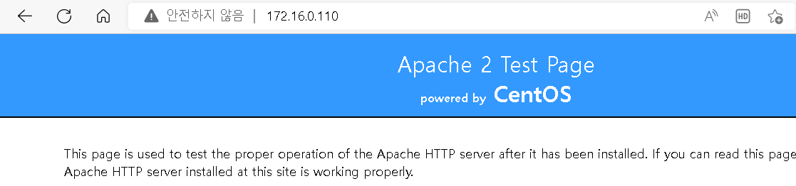
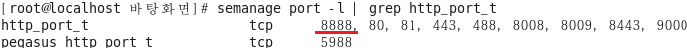

## SELlinux

- SELinux(Security-Enhanced Linux = 보안 강화 리눅스)
  - 미국의 NSA(National Security Agency)에서 개발한 보안이 강화된 Linux Kernel Module
  - 미국 국방부 스타일의 강제적 접근 제어(MAC)를 포함한 접근 제어 보안 정책을 지원하는 매커니즘을 제공하는 리눅스 커널 보안 모듈
  - 사용자, 프로그램, 프로세스 그리고 이들의 동작 대상인 파일과 디바이스를 포함한 시스템 전체, 즉, 모든 주체와 객체에 대한 접근 허가(access permissions)를 기술
  - SELinux는 매우 정밀한 상세 설정을 포함하여 어떠한 활동을 시스템이 개별 사용자, 프로세스, 데몬에 허용할 것인지를 잠재적으로 제어할 수 있음
  - 시스템 또는 데몬(프로세스)가 버그(취약점)에 의해 공격 당하여 공격자에게 권한이 탈취당할 경우 해당 사용자의 권한이 미치는 모든 파일 들에 접근이 가능하여 위험해지게 됨

    > → SELinux 적용

- SELinux 특징
  - 기존 접근 통제 규칙보다 먼저 동작하므로 SELinux 의 보안 정책에 맞지 않을 경우 차단

  - 보안의 기본 rule은 Deny All

  - 서버 보안 상 상당히 유리하지만 적용이 단순하지 않고 복잡 함

    > SELinux가 시행(Enforcing) 상태 시 예외적인 규칙을 설정하지 않으면 모두 차단해 버리기 때문에 기존의 서비스 설정에도 서비스에 접근이 불가능한 상황 발생(대부분의 사용자들이 기능을 종료하는 방법으로 해결)

    > 특정 서비스가 SELinux에 의해 동작하지 않을 경우 SELinux를 종료하기 보다 서비스에 대한 SELinux
    > 설정을 수정하여 서비스를 구동시키는 것을 권장

  - SELinux가 실행되면 리눅스 user 및 SELinux user가 각각 존재하며 리눅스 user는 SELinux user에 매핑됨

  - 활성화 되는 프로세스를 Subject(주체)라고 하며, 주체를 통해 액세스되는 파일, 소켓, 파이프 또는 네트워크 인터페이스와 같은 리소스를 Object(객체) 라고 함

- 설정파일

  ```
  [root@localhost 바탕화면]# vi /etc/sysconfig/selinux
  ```

  

- 활성화 하기

  - 설정 파일 수정

    

  - 재시작 후 확인

    ```
    [root@localhost 바탕화면]# reboot
    [root@localhost 바탕화면]# sestatus
    ```

    

    ```
    [root@localhost 바탕화면]# getenforce
    ```

    

  - 재시작 안하고 임시로 변경

    > 임시로 변경은 가능하나 재시작후 기본값으로 돌아온다

    ```
    [root@localhost 바탕화면]# setenforce -h
    ```

    

    ```
    [root@localhost 바탕화면]# setenforce 0
    [root@localhost 바탕화면]# getenforce
    ```

    

    ```
    [root@localhost 바탕화면]# setenforce 1
    [root@localhost 바탕화면]# getenforce
    ```

    

- 관련 패키지 설치

  - SELinux(setools-console Package)

    > SELinux 정책을 분석 및 질의, 감사 로그 모니터링 보고, 파일 컨텍스트 관리를 위한 여러 도구 및 라이브 러리를 제공

    > seaudit-report, sechecker, sediff, seinfo, sesearch 등의 도구 포함

    ```
    # yum install setools-console
    ```

    

  - semanage

    > SELinux 의 보안 정책을 조회하고 추가/변경/삭제할 수 있는 명령행 기반의 유틸리티

    > policycoreutils-python 패키지 설치 후 사용

    ```
    # yum install policycoreutils-python
    ```

    

  - SELinux Security Context

    > SELinux 는 모든 프로세스와 객체 마다 보안 컨텍스트(= 보안 레이블 = 보안 태그) 정보를 부여하여 관리

    > 접근 권한을 확인하는데 사용됨

  - 

- 주체에 대한 컨텍스트

  - 주체 : 파일 ,프로세스 ...

  - 파일에 대한 보안태(보안컨텍스트) 확인

    ```
    [root@localhost ~]# mkdir /root/selinuxtest
    [root@localhost ~]# cd /root/selinuxtest/
    [root@localhost selinuxtest]# touch testfile
    [root@localhost selinuxtest]# ls -R /root/selinuxtest/
    ```

    

    ```
    [root@localhost selinuxtest]# mkdir /root/selinuxtest/testdir
    [root@localhost selinuxtest]# ls -Z
    ```

    

  - 프로세스에 대한 보안태그(보안컨텍스트) 확인

    ```
    # rpm -qa | grep httpd
    ```

    

    ```
    [root@localhost selinuxtest]# ps -ZC httpd
    ```

    

    > 보이지 않으면 서비스/데몬 재시작후 확

    ```
    [root@localhost selinuxtest]# service httpd restart
    [root@localhost selinuxtest]# ps -ZC httpd
    ```

    

  - 

- Security Context 형식

  

  - 사용자(user) 

    > SELinux 사용자 ID

    > 시스템의 사용자와는 별도의 SELinux 사용자이며 역할이나 레벨과 연계하여 접근 권한을 관리하는데 사용됨

    > SELinux 사용자가 사용할 수 있는 하나 이상의 역할과 연관 될 수 있음

    > SELinux 사용자에게 제약 조건과 경계를 추가 할 수 있음

    > 일반적으로 마지막에 '_u'로 표시 됨

    > SELinux 정책을 통해 SELinux 사용자에 매핑 됨

    ```
    [root@localhost selinuxtest]# seinfo -u
    ```

    

    ```
    시스템 계정과  SELinux 사용자가 어떻게 연결되어 있는지 조회 
    
    [root@localhost selinuxtest]# semanage login -l
    ```

    

  - 역할(Role)

    > 객체와 주체의 역할을 지정

    > TE(Type Enforcement) 도메인에 대한 액세스를 추가로 제어하기 위해 SELinux는 역할 기반 액세스 제어 (RBAC)를 사용

    > SELinux 사용자가 액세스 할 수 있는 하나 이상의 유형과 연관 될 수 있음 

    > 사용자 역할이 접근할 수 있는 영역들은 정책 설정 파일에 의해서 미리 정의되어 있음 

    > 일반적으로 마지막에 '_r'로 표시 됨

    ```
    [root@localhost selinuxtest]# seinfo -r
    ```

    

    ```
    각 SELINUX user 에 연결된 role
    
    [root@localhost selinuxtest]# seinfo -uunconfined_u -x
    ```

    

  - 유형(Type or Domain)

    > TE(Type Enforcement)의 속성 중 하나로 프로세스의 도메인이나 파일의 타입을 지정하고 이를 기반 으로 접근 통제를 수행

    > 실제 접근 권한이 결정되는 항목

    > 영역(domain) → 프로세스 등의 주체에 적용

    ​	> 모든 프로세스는 영역 내에서 동작하게 되며, 영역은 프로세스에게 어떠한 접근을 가질 것인가를 결정

    > 유형(type) → 디렉토리, 파일, 소켓 등의 객체에 적용

    ​	> 그 객체에 어떤 주체가 접근할 수 있는지를 결정

    > 영역과 유형의 보안 속성은 일반적으로 마지막 '_t'로 표시 됨

    ```
    타입과 도메인의 목록 확인 
    
    [root@localhost selinuxtest]# seinfo -t
    ```

    

  - 

- 파일 제어

  - 웹서버 동작 여부 확인

    

  - 웹서버에 파일 추가후 다시 확인

    ```
    # echo "SELinux TEST" > /var/www/html/setest.html
    ```

    

  - 새로 추가된 파일에 대한 보안 컨텍스트를 확인

    ```
    [root@localhost selinuxtest]# ls -Z /var/www/html/setest.html
    ```

    

    ```
    상위 디렉터리에서 상속
    
    [root@localhost selinuxtest]# ls -Z /var/www/html
    ```

    

  - 주체가 객체에 어떻게 접근하고 있는지 확인

    ```
    프로세스의 정책 확인 
    
    [root@localhost selinuxtest]# ps -ZC httpd
    ```

    

    ```
    프로세스가 파일에 어떤 허용정책 있는지 확인
    
    [root@localhost selinuxtest]# sesearch -A -t httpd_sys_content_t -s httpd_t -d
    ```

    

  - 기존 정책 대신 비어있는 정책 포함

    ```
    /var/www/html/setest.html 에 적용된  httpd_sys_content_t  를 삭제 -> 다른 비어있는 정책과 연결 
    
    [root@localhost selinuxtest]# chcon -t admin_home_t /var/www/html/setest.html
    [root@localhost selinuxtest]# ls -Z /var/www/html/setest.html
    ```

    

    ```
    연결된 정책에 항목이 없음 (비어있음) 
    
    [root@localhost selinuxtest]# sesearch -A -t admin_home_t -s httpd_t -d
    ```

    

    ```
    다시 브라우저로 테스트
    ```

    

  - 원상복구

    ```
    복구시에 이렇게 복구된다 
    
    [root@localhost selinuxtest]# matchpathcon /var/www/html/setest.html
    ```

    

    ```
    실제 보안 컨텍스트 복구 시도
    
    [root@localhost selinuxtest]# restorecon /var/www/html/setest.html
    [root@localhost selinuxtest]# ls -Z /var/www/html/setest.html
    ```

    

- 포트 제어

  - httpd 기본포트

    ```
    [root@localhost selinuxtest]# netstat -antup | grep httpd
    ```

    

    ```
    [root@localhost selinuxtest]# grep Listen /etc/httpd/conf/httpd.conf
    ```

    

  - 포트번호 TCP 8888 로 변경하여 서비스 테스트

    ```
    # vim /etc/httpd/conf/httpd.conf
    ```

    

    ```
    # service httpd restart 
    ```

    

    ```
    SELINUX 원상복원 : bool 값을 수정 
    
    [root@localhost selinuxtest]# setenforce 1
    [root@localhost selinuxtest]# getenforce
    ```

    

  - 특정 포트에 대한 정책 확인

    ```
    TCP 80
    [root@localhost selinuxtest]# seinfo --portcon=80
    ```

    

  - 특정 타입에서 사용 가능한 포트 번호 확인

    ```
    [root@localhost selinuxtest]# semanage port -l | grep http_port_t
    ```

    

  - 사용가능한 다른포트 확인

    ```
    tcp 9000 테스트
    
    # vim /etc/httpd/conf/httpd.conf
    ```

    

    ```
    [root@localhost selinuxtest]# service httpd restart
    ```

    

  - 특정한 프로토콜이 사용하는 정책 및 포트 번호 확인

    ```
    [root@localhost selinuxtest]# semanage port -l | grep http
    ```

    

    ```
    [root@localhost selinuxtest]# semanage port -l | grep ssh
    ```

    

    ```
    [root@localhost selinuxtest]# semanage port -l | grep ftp
    ```

    

  - 객체: 포트(=socket)   에 대한 주체(프로세스)의 접근 정책

    ```
    [root@localhost selinuxtest]# sesearch -A -t http_port_t -s httpd_t -d
    ```

    

    ```
    [root@localhost selinuxtest]# sesearch -A -t http_cache_port_t -s httpd_t -d
    ```

    

    ```
    이름이 없음
    
    [root@localhost selinuxtest]# sesearch -A -t pegasus_http__port_t -s httpd_t -d
    ```

    

    ```
    연결된 포트 X 
    
    [root@localhost selinuxtest]# sesearch -A -t pegasus_http_port_t -s httpd_t -d
    
    [root@localhost selinuxtest]# sesearch -A -t pegasus_https_port_t -s httpd_t -d
    ```

  - 포트 추가후 서비스 확인

    ```
    TCP 8888 변경하여 서비스 재시작 오류 확인
    ```

    

    ```
    http_port_t 에 허용 포트 추가 
    
    [root@localhost selinuxtest]# semanage port -a -t http_port_t -p tcp 8888
    
    추가 확인
    [root@localhost selinuxtest]# semanage port -l | grep http_port_t
    ```

    

    ```
    [root@localhost selinuxtest]# service httpd restart
    ```

    

## SELinux Logging

- SELinux Log
  - 기본 로그 저장 파일 : /var/log/audit/audit.log 

  - vim /var/log/audit/audit.log

    

  - 로그 관리를 위한 추가 유틸리티

    > audit2why

    > ausearch

    > setroubleshoot-server 패키지(sealert)

    ```
    [root@localhost selinuxtest]# cd /var/log/audit/
    [root@localhost audit]# vim ./audit.log
    ```

  - 로그관리 패키지 설치 후 서비스 시작

    > setroubleshoot-server 패키지

    ​	> python 으로 만들어진 유틸리티로 어려운 SELinux AVC 메시지를 알기 쉽게 번역해 주고 처리 방안도 제시해 주는 유틸리티

    ​	> messagebus 데몬 필요(기본 데몬으로 패키지 설치 후 재 시작만 해주면 됨)

    ```
    [root@localhost audit]# yum -y install setroubleshoot-server
    [root@localhost audit]# service messagebus restart
    ```

  - 테스트를 위한 에러 발생을 유도

    ```
    터미널1)
    
    # tail -f /var/log/audit/audit.log
    ```

    ```
    터미널2)
    
    /var/www/html/setest.html 에 적용된  httpd_sys_content_t  를 삭제 -> 다른 비어있는 정책과 연결 
    [root@localhost selinuxtest]# chcon -t admin_home_t /var/www/html/setest.html
    [root@localhost selinuxtest]# ls -Z /var/www/html/setest.html
    ```

    

    ```
    웹서버 포트 번호
    
    터미널1)
    로그 기록 확인 > 아직 보이는 것 이 없음
    
    host)
    http://웹서버:8888/setest.html
    ```

    

    ```
    터미널 1)
    ```

    

    ```
    터미널 2)
    # cat /var/log/messages
    ```

    

    ```
    [root@localhost ~]# sealert -l 1fc23662-db19-403d-9fe7-63868d4e1d42
    ```

    

    

## SELNUX Boolean

- SELinux Boolean
  - SELinux가 적용될 경우 특정 데몬의 서비스가 SELinux에 의해서 거부되며, 설정을 변경하지 않으면 해당 서비스 이용에 상당한 제약을 받게 됨

  - SELinux 정책 작성에 대한 지식 없이 런타임에 SELinux 정책의 일부를 변경할 수 있게 함

  - 이 경우 정책을 다시 로드하거나 다시 컴파일하지 않고도 서비스 액세스 허용 등의 변경 작업 수행

  - Bool 값 확인

    ```
    [root@localhost ~]# getsebool -a
    ```

    

  - 기능 설명

    ```
    [root@localhost ~]# semanage boolean -l
    ```

    

  - 특정 정책 조회

    ```
    [root@localhost ~]# getsebool httpd_can_sendmail
    ```

    

  - 조회된 정책을 켜고 싶으면 on , 1, true

    ```
    [root@localhost ~]# setsebool httpd_can_sendmail true
    [root@localhost ~]# getsebool httpd_can_sendmail
    ```

    

  - 조회된 정책을 끄고 싶으면 off, 0 , false

    ```
    [root@localhost ~]# setsebool httpd_can_sendmail false
    [root@localhost ~]# getsebool httpd_can_sendmail
    ```

    

    > 영구 적용 하는 경우 -P 옵션 사용할것

- httpd 프로세스가 php 페이지 이용 메일 보내기

  - php 설치

    ```
    yum -y install httpd php 
    ```

  - 리눅스내 다른 계정으로 매일 보내기 연습 

    ```
    httpd , php 설치 여부를 확인
    
    [root@localhost ~]# rpm -qa httpd
    [root@localhost ~]# rpm -qa php
    ```

    

  - 테스트 파일을 생성

    ```
    # vim /var/www/html/mail.php
    ```

    

  - 정책확인 후 다시 적용

    ```
    [root@localhost ~]# setsebool httpd_can_sendmail 1
    [root@localhost ~]# getsebool httpd_can_sendmail
    ```

    

  - 다시 원상복구

    ```
    [root@localhost ~]# setsebool httpd_can_sendmail 0
    [root@localhost ~]# getsebool httpd_can_sendmail
    ```

    

  - 해당 페이지를 열어서 관련 로그 확인

    

  - httpd 를 다시 실행하여 php  사용

    ```
    [root@localhost ~]# service httpd restart
    ```

  - 다시 페이지에 접속시도

    

  - 다시 로그 확인 

    ```
    [root@localhost ~]# tail /var/log/messages
    ```

    

  - 자세한 SELINUX 정보 확인

    ```
    [root@localhost ~]# sealert -l 4a8f9dc0-8551-4650-8258-0fd238854b34
    ```

    

  - 다시 SELNUX bool 수정후 확인

    ```
    [root@localhost 바탕화면]# setsebool -P httpd_can_sendmail=1
    ```

    

  - 메시지 확인

    ```
    [root@localhost ~]# cat /var/spool/mail/root
    ```

    

- ftp 접속제한

  

  - vsftpd 설치후 시작

    ```
    # yum -y install vsftpd
    # service vsftpd restart
    ```

  - host] 알드라이브로 일반 사용자 접속 확인

    

  - 접속 가능하도록 설정

    ```
    [root@localhost ~]# setsebool ftp_home_dir true
    [root@localhost ~]# getsebool ftp_home_dir
    ```

    

  - 다시 접속 시도

    

