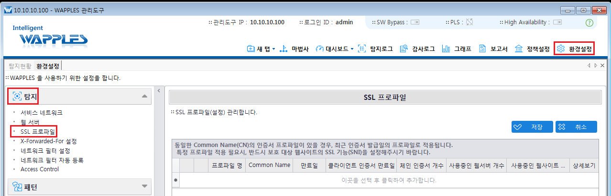
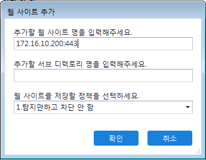

## WAPPLES

- WAPPLES
  - 펜타시큐리티 지능형 웹 애플리케이션 방화벽
  - 웹 서버 앞 단에 위치하여 외부로부터 들어오는 HTTP/HTTPS 프로토콜 트래픽 감시
  - 방화벽(Firewall)에서 차단하지 못하는 유해 트래픽이 웹 서버에 도달하지 못하도록 차단
  - 신뢰할 수 있는 웹 애플리케이션 운영 환경 제공
  - https://www.pentasecurity.co.kr/

- In-Line Mode 구성방식
  - 네트워크 방화벽 구성과 동일하게 전체 트래픽이 해당 보안장비를 통과해야만 목적지로 전송될 수있도록 구성하는 방식

  - 보안장비를 거쳐가는 모든 웹 트래픽을 분석하여 설정된 정책정보를 기반으로 허용 및 차단여부 결정

  - 유해 트래픽에 대한 차단율은 높지만 보안장비의 네트워크 성능에 따라서 네트워크 성능저하 또는 Fail-Over 등의 문제가 발생될 수 있음

    

- Proxy Mode 구성방식
  - In-Line Mode 구성과는 다르게 전체 트래픽 중 특정 트래픽만 보안장비를 통과하도록 구성하는 방식

  - WEB Proxy 서버와 동일하게 구성하고 웹 트래픽을 분석하여 설정된 정책정보를 기반으로 허용 및 차단 여부를 결정

    

#### 실습

- 실습 구성도

  

- 실습 환경 구성

  - VirtualBox 설치

    https://www.virtualbox.org/

  - extention pack 설치

    

  - VirtualBox 환경설정

    ```
    파일 > 환경 설정 > 입력 > 가상 머신 탭 > 호스트 키 조합 : ctrl + alt 
    ```

    

    ```
    도구 > 네트워크 > host only network > 만들기
    ```

    

  - 가상머신 준비

    
    
  - WAPPLES OVA import

    
    
    
    
  - 네트워크 설정

    > 어댑터1,2,3 사용하기 체크후 모두 NAT로 연결, 어댑터 종류 intel PRO/1000 MT Server로 통
    
    
    
    > 네트워크 어댑터1,2,3 다시 설정
    
    
    
  - 

    
    
    

  

  

#### SSL

- 접속테스트

  - https://

    

  - http://

    

- 회원가입후 게시판에 글 3개 작성

  

- 공격 테스트 -> https://

  - SQL injection : WAS 인증우회

    ```
    ID : ' or 1 # 
    PASS : 아무거나 
    ```

    

    

    

  - SQL injection : non-blind injection

    ```
    union 이용
    
    ' union select 1,u_id,3,4,u_pass,6,7,8,9,10.11 from member #
    ```

    

  - XSS

    ```
    <script>alert("XSS TEST");</script>
    ```

    

    

  - Direcotory Listing

    ```
    https://172.16.10.200/board/
    ```

    

- SSL을 인식하도록 프로파일을 등록

  - 환경설정

    ```
    환경설정 -> 탐지 -> SSL 프로파일
    ```

    

    

  - 웹서버에 등록 TCP 443

    

    

  - 정책 설정에 등록

    ```
    정책 설정 > 1. 탐지만 하고 차단 안함 > 웹사이트 추가
    172.16.10.201:443
    적용 > 저장 
    ```

    

    

  - 다시 공격 후 탐지로그 확인

    

  - 

    

- 