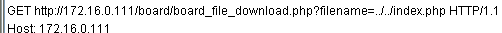

## File Download 취약점

- File Download 취약점

  - 웹 서버의 파일을 강제로 Download하는 취약점

  - Directory Traversal에 의해 다른 위치에 있는 파일도 다운로드 가능 

  - 적절하게 처리하지 못한 파일 확장자로 인해 발생하는 취약점 → 미등록 확장자

  - 부적절한 환경 설정에 의해 소스 코드 파일 또는 백업 파일 등이 다운로드 가능

    > 개발자의 편의상 사용하는 .inc, .txt, .bak 등의 확장자를 제어하지 않은 경우 다운로드 가능

  - 텍스트 형태나 파일 다운로드 형태로 반환 됨

- 피해 범위

  - 시스템의 중요 파일이 외부로 노출 됨

    > 소스코드

    > 중요 시스템 파일 및 설정 파일

- 보안
  - Directory Traversal에 해당하는 "../" 문자열을 적절하게 필터링
  - 다운로드 할 수 있는 디렉터리 및 확장자 제한
  - 업로드 된 파일만 다운로드 할 수 있게 적절히 필터링

```
[root@localhost html]# ls
```


#### 취약점 실습 1

- 172.16.0.111/db.sql

  

#### 취약점 실습 2

- 파일 업로드 과정을 웹프록시(paros)로 확인

  

  

- 업로드 된 파일 확인

  ```
  [root@localhost html]# ls -al /var/www/html/board/upload/
  
  - 퍼미션 때문에 업로드한 파일이 없다
  ```

  

- 파일 업로드 쪽 디렉터리 퍼미션을 777로 수정

  ```
  [root@localhost html]# chmod 777 /var/www/html/board/upload/
  [root@localhost html]# ls -ld /var/www/html/board/upload/
  ```

  

- 다시 업로드

  

  

- 게시판에서 파일 다운로드후 paros로 확인

  

  

- 웹서버 디렉터리 구조

  ```
  /var/www/html/index.php
  
  /var/www/html/member/member~~~.php
  
  /var/www/html/board/board~~~.php
  /var/www/html/board/upload/test.txt 
  
  ../../index.php
  ```

- paros 내용 변조

  ```
  GET http://172.16.0.111/board/board_file_download.php?filename=../../index.php HTTP/1.1
  Host: 172.16.0.111
  ```

  

- 다운로드된 파일 확인

  

  

- etc/passwd 파일 다운로드 해보기

  - paros에서 상대경로로 /etc/passwd 설정

    

  - 다운로드 및 확인

    

#### 방어 1

- Directory Traversal에 해당하는 "../" 문자열을 적절하게 필터링

  ```
  proxy 쪽에서 파일명이 전달될때 
  
  GET http://172.16.0.111/board/board_file_download.php?filename=hello.txt HTTP/1.1
  
  전달받은 페이지
  
  /var/www/html/board/board_file_download.php
  ```

- board_file_download.php 파일 수정

  ```
  # vim /var/www/html/board/board_file_download.php
  
  $file_name = str_replace("../","",$file_name);
  ```

  

- 다시 다운로드 시도

  

#### 방어 2

- 업로드된 파일만 다운로드 할수 있도록한다

- 주의점 : 디렉터리를 ls 해서 확인 X 

- 데이터베이스에 파일명이 저장된 것을 가지고 비교

- 실제로 DB 에는 있지만 파일이 존재 하지 않을수도 있다

- board 테이블의 파일 업로드 관련 정보 확인 

  ```
  mysql> use WebTest;
  mysql> desc board;
  ```

  

  ```
  mysql> select filename,filesize from board;
  ```

  

  

- DB에서 파일 확인

  ```
  mysql> select * from board where filename='hello.txt';
  ```

  

- proxy 쪽에서 파일명이 전달될때

  ```
  GET http://172.16.0.111/board/board_file_download.php?filename=hello.txt HTTP/1.1
  ```

- php 파일 수정

  ```
  # vim /var/www/html/board/board_file_download.php
  
  $strSQL = "select * from board where filename='{$file_name}'";
    $result = mysql_query($strSQL);
    $rs_row = mysql_fetch_array($result);
    echo $rs_row['filename']."<br>".$file_name
  
    if($rs_row['filename'] != $file_name)
    {
      echo "<script>alert('file not found');</script>";
      exit;
    }
  ```

  

- etc/passwd 다운로드 시도

  