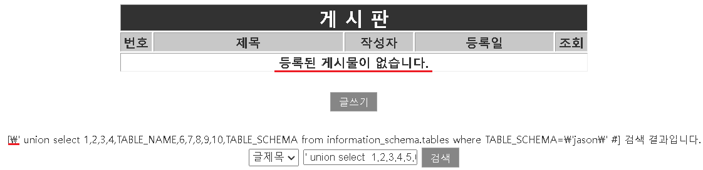

## sql injection : php.ini

- magic_quotes_gpc 옵션이 on이면, GPC(***GET, POST, COOKIE***)에서

  '(싱글 쿼터), "(더블 쿼터), \(백 슬래시), NULL을 자동적으로 백슬래시로 이스케이프 된다

  ```
  # vi /etc/php.ini
  ```

  

  ```
  # service httpd restart
  ```

- injection 다시 시도

  ```
  ' union select  1,2,3,4,5,6,7,8,9,10,flag from jason.Kh5fM #
  ```

  


## sql injection : mysql_real_escape_string()

- 설정전 로그인 테스트

  

  
  
  
  
- mysql query에서 특수 문자열을 이스케이프하기 위해

  - \x00, \n, \r, \, ', ", \x1a 문자에 백슬래시를 붙임

  ```
  # vi /var/www/html/member/member_login_check.php
  
  $strSQL = mysql_real_escape_string($strSQL);
  ```

  

- 로그인 창에서 테스트

  

  

  

## sql injection : 문자열 필터링

- injection 테스트

  ```
  ' union select 1,2,3,4,5,6,7,8,9,10,SCHEMA_NAME from information_schema.SCHEMATA #
  ```

  

- php 파일 수정

  ```
  $str = $_GET['contents'];
  str_replace("'", "\');
  if(eregi(" |/|\(|\)|\t|\||&|union|select|from|0x",$_GET[no])) exit("no hack");
  if(preg_match("/select|insert|delete|update|drop/i", $str) exit("no hack");
  
  /   /i : 비교시 대소문자 가리지 말것
  if(preg_match("/union|from|limit|information_schema/i", $key)) exit("no hack");
  ```
  
  ```
  # vi /var/www/html/board/board_list.php
  
  if(preg_match("/union|from|limit|information_schema/i", $key)) exit("no hack");
  ```
  
  

- 다시 테스트

  ```
  ' union select 1,2,3,4,5,6,7,8,9,10,SCHEMA_NAME from information_schema.SCHEMATA #
  ```

  