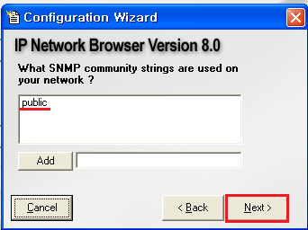
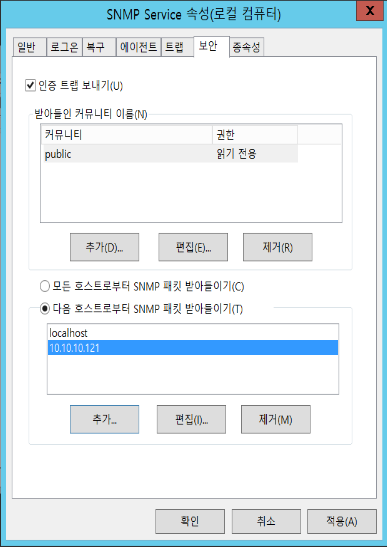

## SNMP(Simple/small  Network Management Protocol)

SNMP(Simple/small  Network Management Protocol)

- 간단한 네트워크 관리용 프로토콜

- UDP 161, 162 포트 사용

  - 관리 시스템(Manager)
    - Agent에 필요한 정보를 요청하는 역할
    - 162/udp
  - 에이전트(Agent)
    - Agent가 설치된 시스템의 정보나 네트워크 정보 등을 수집하여 MIB 형태로 보관, Manager에 전달해주는 역할 수행
    - 161/udp

- 네트워크 구성 관리

  ▪ 네트워크 상의 호스트 구조 파악

- 성능 관리

  ▪ 네트워크 사용량, 처리속도, 응답시간 등 성능 분석에 필요한 통계정보 확인

- 장비 관리 

  ▪ 시스템정보(CPU, MEMORY, DISK 사용량) 확인

- 보안 관리

   ▪ 정보의 제어 및 보호 기능

- Network Management System(NMS) 

  ▪ 관리하기 위한 시스템 

  ▪ Manager : 관리시스템 안에 탑재하여 관리용 메시지를 Agent에 요청

- Managed Device 

  ▪ agent 설치되어 관리되는 장비들 

  ▪ Hub, Router, Switch, Bridge, Host 등 

  ▪ Agent : Managed Device 안에 탑재되는 관리 모듈

- Management Information Base(MIB) 

  ▪ 관리 대상을 규격화한 정보 

  ▪ SNMP를 지원하는 모든 네트워크 장치는 MIB를 가짐

  ▪ 관리장치(네트워크 장치)의 특정 정보와 자원을 객체(Object)의 형태로 모아놓은 집합체 

  ▪ 시스템정보, 네트워크사용량, 네트워크 인터페이스정보 등 

  ▪ 관리하기 쉽도록 Tree 구조를 가짐

- SNMP 버전

  - Manager와 Agent간 SNMP 버전이 일치해야 한다.
  - 1 / 2c /

- Community String

  - 상호간에 설정한 Community String이 일치해야 한다.

- PDU(Protocol Data Unit)

  - 통신하기 위한 메시지 유형

## SNMP 실습

- SNMP 구성

  

#### snmp trap 설정

- 실행

  

- 설정

  

  

  

  

  

- scanning

  

  

#### Windows 2012 설정

- snmp 서비스 설치

  - 관리도구 > 서버 관리자

    

    

    

    

    

    

    

    

    

- 서비스 실행 후 snmp 확인

  

  

- community string, snmp Manager 주소 입력

  

  

  

  

- scanning 하여 확인

  

#### CentOS7 설정

- snmp package 설치

  ```
  # yum -y install net-snmp net-snmp-utils
  ```

- 설정 파일 백업

  ```
  # mv /etc/snmp/snmpd.conf /etc/snmp/snmpd.conf.bak
  ```

- 설정 파일 설정

  ```
  # vim /etc/snmp/snmpd.conf
  
  rocommunity      public 10.10.10.121
  trap2sink       10.10.10.121 public 162
  ```

  

- snmp 서비스 동작 확인

  ```
  [root@localhost ~]# systemctl restart snmpd
  [root@localhost ~]# systemctl status snmpd
  ```

  

- scanning 하여 확인

  

  

#### cisco router 설정

- snmp 사용

  ```
  R1(config)#snmp-server community public ro
  ```

- snmp 설정 확인

  ```
  R1#sh snmp community
  ```

  

- scanning 하여 확인

  

## snmp dictionary attack

- nmap 을 이용한 포트 점검

  ```
  # nmap -sU -p 161 10.10.10.254
  ```

  

- 사전파일 작성

  ```
  # vim /root/dict.txt
  
  public
  private
  test
  
  # onesixtyone -c dict.txt 10.10.10.254 -o 1.txt
  ```

  

- snmpwalk 를 이용한 정보 획득

  ```
  # snmpwalk -v 2c -c public 10.10.10.254
  ```

  

- snmp 접근 제어

  - NMS(manager) 역할이 있는 IP주소만 접근할수 있게 ACL 을 설정

    ```
    R1(config)#access-list 1 permit 10.10.10.115
    R1(config)#snmp-server community public ro 1
    ```

  - 접근 제어 되었는지 확인

    

- 차단방법
  - ACL
  - 방화벽, TCP Wrapper에서 차단
  - v3로 버전 업